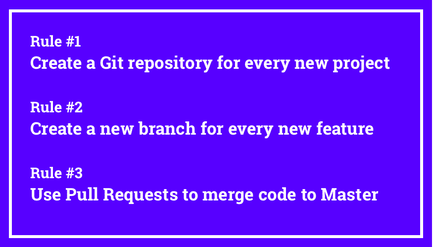
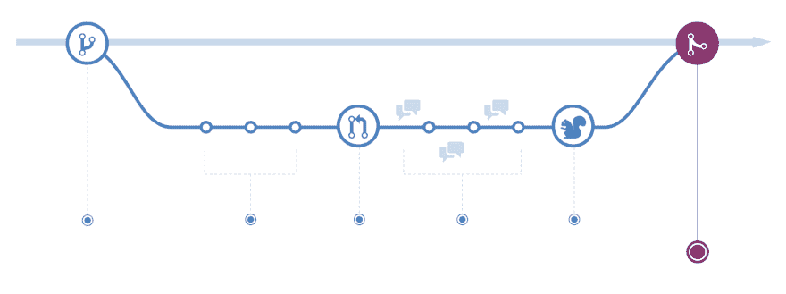

# 遵循这些简单的规则，你将成为 Git 和 GitHub 大师

> 原文：<https://dev.to/microverse/follow-these-simple-rules-and-youll-become-a-git-and-github-master-3odc>

在本文中，我不会讨论如何创建 GitHub 概要文件或者如何使用终端来提交 Git。相反，我将解释为什么每天使用 Git 和 GitHub 如此重要，尤其是对于那些正在学习编码的人。我还将分享和讨论成为 Git 和 GitHub 用户的三个简单规则。

### 为什么 Git 和 GitHub 这么重要？

如果你正在学习编程，你最重要的目标可能是最终找到一份软件开发人员的工作。在这种情况下，答案很简单:

学习 Git 和 GitHub 非常重要，因为 99%能雇佣你的公司都会使用 Git 和 GitHub。因此，学习如何使用 Git 和 GitHub 会让你更容易被雇佣，并帮助你从初级开发人员中脱颖而出。

资深开发人员之所以资深，并不是因为他们更了解给定语言的语法，而是因为他们有处理具有真实用户和业务目标的大型复杂项目的经验。

当你在学习编码时，很难获得那种体验。然而，获得真实世界经验的一个简单方法是使用真实世界项目中使用的工具和方法。Git 和 GitHub 就是这样的例子。

你可以做的其他事情是[远程结对编程](https://medium.freecodecamp.org/how-remote-pair-programming-works-and-why-it-can-change-your-life-cd7b767dc60f)，[贡献开源](https://codeburst.io/how-contributing-to-open-source-can-help-you-land-your-first-job-e300bd35c3a7)，以及[为你的作品集建立专业设计的网站](https://medium.freecodecamp.org/the-portfolio-hack-that-will-make-everyone-want-to-hire-you-58079cfed0b)。

即使你同意掌握 Git 和 GitHub 将有助于你找到工作，你可能仍然想知道:

“为什么 Git 和 Github 对公司如此重要？”

简而言之，Git 允许团队以异步的方式高效且有效地为同一个项目贡献代码。这使得团队能够更好地协作，从而允许他们解决更大更复杂的问题。

Git 是一个分布式版本控制系统，它还提供了恢复变更、创建代码分支、解决合并冲突等机制。这些都是非常有用的特性，可以解决每个软件团队每天都面临的特定和常见的问题。Git 是当今的主流解决方案。

另一方面，GitHub 是 Git 之上的一个附加层，为其他特定和常见的问题提供解决方案，如代码审查、拉请求、问题管理/bug 跟踪等等。

快速提示:尽管 Git 是大多数公司首选的版本控制解决方案，GitHub 也有一些强有力的竞争对手，如 GitLab 和 Bitbucket。但是，如果你知道如何使用 GitHub，那么使用 GitLab 或 Bitbucket 就不会有任何问题。

现在你知道了为什么掌握 Git 和 Github 如此重要，是时候告诉你在你还在学习编码的时候，要轻松成为一个专业的 Git 和 Github 用户需要遵循的三个简单规则了。

### 如何用 3 个简单规则掌握 Git 和 Github

补充一点，我是一所面向远程软件开发人员的学校 [Microverse](https://www.microverse.org/) 的创始人，在你找到工作之前，这所学校完全免费。作为我们为期 30 周的课程的一部分，我们不仅教学生如何编码，还为他们提供大量的指导和结构，让他们在课程中获得现实世界的经验。

为了成为专业的 Git 和 Github 用户，我们要求我们的学生做的一件事就是遵循下面的三条规则。在培训结束时，使用 Git、GitHub、分支、拉取请求和代码审查已经成为我们学生的第二天性。

在我继续讨论掌握 Git 和 Github 的三个简单规则之前，请考虑完成以下任务:

1.  **如果你还不熟悉 Git 或 GitHub**，你应该[完成这个来自 HubSpot](https://product.hubspot.com/blog/git-and-github-tutorial-for-beginners) 的精彩教程。
2.  **如果你不知道什么是 Github 流**，你应该[了解一下 GitHub 流](https://guides.github.com/introduction/flow/)，因为我们下面会用到它。

现在，事不宜迟，在学习如何编码的同时掌握 Git 和 Github 的三个简单规则…

*   规则#1 :为每个新项目创建一个 Git 存储库
*   规则#2 :为每个新特性创建一个新的分支
*   规则#3 :使用拉请求将代码合并到主模块

即使你正在做小而简单的项目，即使你是一个人在工作，每次编码时遵循这三条规则将会让你很快成为 Git 和 GitHub 的主用户。

让我们简单地分解一下每一条规则，这样你就会明白你应该做什么，以及为什么每条规则都很重要。

#### 规则 1:为每个新项目创建一个 Git 存储库

第一条规则很简单，但是养成习惯非常重要。每当你开始做一些新的东西——你的作品集，一个学习项目，一个编码挑战的解决方案，等等——你应该创建一个新的 Git 资源库，并把它推送到 GitHub。

拥有一个专用的 repo 是能够对您编写的每一行代码使用版本控制的第一步。一旦你加入一家公司并开始从事现实世界的项目，使用版本控制就是你的工作方式。早点学会这一点，并养成习惯。

*快速提示:如果使用终端变得很麻烦，让你不太可能在所有项目中使用 Git，那么考虑使用 [Github 桌面应用](https://desktop.github.com/)。

#### 规则 2:为每个新特性创建一个新的分支

假设您正在处理您的投资组合，您想要建立一个新的“联系我”部分/组件。为这个新特性创建一个专用的分支，给它一个有意义的名字(例如 *contact-me-section* )，并将所有代码提交给这个特定的分支。

如果你不知道什么是分支，回到我之前推荐的 [Github 流](https://guides.github.com/introduction/flow/)阅读。

使用分支允许您和您的团队成员以并行的方式处理不同的功能，同时保持每个功能的特定代码与其他功能相隔离。这使得不稳定的代码更难合并到主代码库中。

即使你是你的团队中唯一的人，一旦你加入一个真正的工作，习惯使用特性分支将使 Github 流程变得轻而易举。

#### 规则#3:使用拉请求将代码合并到主代码中

默认情况下，每个存储库都从一个主分支开始。**永远不要将变更直接推送到主分支**。相反，您应该使用如上所述的特性分支，并打开一个新的 Pull 请求来合并特性分支代码和主分支代码。

在实际工作中，有人会查看您的拉取请求，并在批准之前进行代码审查。GitHub 甚至会对你的代码进行自动化测试，并让你知道它是否有问题。如果您的代码和主分支中的代码有任何合并冲突，您也会收到通知。例如，如果另一个开发人员将更改推送到主分支，影响到您也修改过的文件，就会发生这种情况。

在你的代码被审查、测试和批准之后，你的审查者会竖起大拇指让你合并拉请求，或者他们会直接合并你的拉请求。

即使您是单独工作，也要习惯于创建拉请求，作为将您的更改合并到主分支的一种方式。顺便说一下，这是几乎每个开源项目使用的基本工作流程。如果你曾经贡献过一个(你应该！)，理解了这三条规则，你就真的很容易让自己的付出被接受，没有任何问题。

### 包装完毕

如果你仍然困惑，慢慢开始，记住三条规则。不要试图去想“如何”做事，而把注意力集中在“做什么”和“为什么”上，这对现在很重要。

一旦“是什么”和“为什么”清楚了，你就可以弄清楚该如何做事情了。一旦你重复这个过程 2-3 次，你就会变得非常容易和自然。

我根据我们教给全日制学生的东西定期发表新文章。我关注的是实用的技巧和窍门，它们会让你学得更快，同时帮助你建立强大的软技能，让你更容易被雇佣。如果你想保持联系，你可以在推特上关注我。