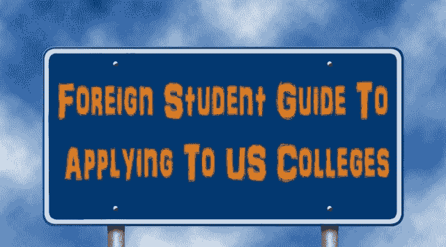

# 外国学生申请美国大学指南

> 原文：<https://dev.to/codyrhodes/foreign-student-guide-to-applying-to-us-colleges-4eb6>

## 非美国居民如何申请美国大学的指南

当面临如何申请大学的重要过程时，人们很容易被世界各地大学的许多表格、考试和琐碎要求所吓倒。即使有飙升的考试分数和无可挑剔的成绩单，在美国顺利轻松地申请大学仍然相当困难——即使对美国人来说也是如此。你可以想象一个外国人在同样的情况下，如果没有在线资源 EssayKitchen T1 的帮助，会遇到什么样的困难。

申请美国大学的外国学生必须完成任何其他学生的要求，以及一些额外的要求。也许减轻外国学生申请过程的最好方法是通过组织和指导。虽然这份指南肯定不会涵盖申请美国大学的所有考虑因素，但它肯定会有很大的帮助。

## 准备和期待

像生活中任何其他重要的努力一样，提前做好准备总是很重要的，这样才能预料到前进道路上可能出现的坎坷。在申请之前，缩小你想申请的大学名单。一旦完成，你可以使用互联网访问每个学院的主页，收集申请程序和要求——请记住，要求会因学校而异。现在你可以制定一个时间表来帮助你完成每一项任务和截止日期，以确保你为即将到来的事情做好准备。

## 与其余部分一致

作为一名外国学生，你必须完成所有其他学生必须完成的所有事情，外加额外的要求。几乎所有的大学申请都需要以下条件:

*   申请表
*   申请费
*   高中成绩单
*   入学考试成绩(SAT，ACT 等。)
*   推荐信
*   短文
*   采访
*   作品集或试听(如果申请艺术相关课程)

你也应该优先考虑你的清单，调整你的时间表，以确保你有足够的时间来完成每一项要求。请记住，外国学生有相当多的要考虑，因此必须留出足够的时间来完成常规要求和外国申请人所需的要求。之后，你可以使用[服务来定制一篇文章](https://customessayorder.com/),它会给你的大学学期带来一些新的想法。

## 一点额外的东西

在完成你的正常要求后，最好的开始是向你的高中辅导员要一份外国申请人需要的普通考试或要求的清单。该列表很可能包含以下内容:

*   托福或英语作为外语的考试(或其他水平测试)
*   签证(无论是工作签证还是学生签证)

## 资金支持

托福考试是针对那些想在英语为主要语言的地方工作或学习的外国人的英语水平考试。获得签证和适当的经济支持将决定你是否会被允许进入美国，以及在你逗留期间是否会得到适当的资助。一定要询问你的家人(无论是在国外还是在你的祖国)，因为他们可以在这些方面提供帮助。除了这些，仔细检查你申请的每所大学的具体要求。

## 忍耐是一种美德

最后，剩下要做的就是等待。毫无疑问，这种等待会给你时间对你选择的大学和你喜欢的项目做更多的研究。走出去，对校园生活、学生项目、[课程信息](https://www.pitchero.com/clubs/nickymose/news/hire-a-custom-essay-service-is-it-worth-it-2417269.html)等做一些调查。你所有的努力最终都会有回报的！