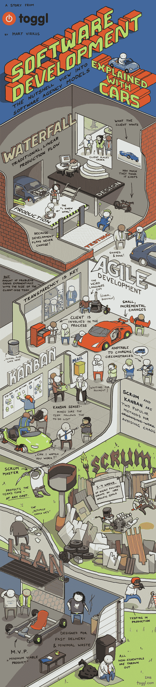

# 忘记敏捷和看板，首先理解你的用户想要什么

> 原文：<https://dev.to/prahladyeri/forget-agile-and-kanban-understand-what-your-user-wants-first-2pjn>

在过去美好的日子里(20 世纪 90 年代及之前)，他们曾经有一种叫做*瀑布模型*的软件开发。有几种变化，但总的来说，过去有四个主要步骤:

1.  **设计**(开发人员和测试人员理解用户的需求)
2.  编码(开发人员对他们的东西进行编码并使其可测试)
3.  **测试**(测试人员测试开发人员已经交付了什么，捕捉 bug，如果发现任何 bug，返回到步骤 2)
4.  **部署和维护** (DevOps 团队获取可交付成果并将其安装到用户的生产服务器上)。如果发现任何错误或问题，请返回步骤 1/2。

* * *

看起来简单明了，不是吗？但是唉！那些坐在硅谷 IT 公司里的干瘪的经理们认为这种简单的开发模式不能为他们赚钱！他们需要一些更神奇、更神秘的东西，一些他们可以硬塞给客户的东西，这些东西他们和客户都无法理解(因为只有当他们感到困惑和不知所措时，他们才会掏出很多钱)。

于是，行业中诞生了一些惊人的术语，如**敏捷**、 **Scrum** 和**看板**。营销人员学会了所有的交易技巧，*“哦，我们在软件开发中使用了成熟的看板技术，先生。我们伟大的方法，如 TDD 和 BDD(将在几年后变成另一个 XDD！)将确保您的产品会在截止日期内送达，先生"*。

事实上，所有这些流行语都是用来证明这些公司从轻信的客户身上搜刮的数百万美元是正当的。如果公司只是简单地说，“先生，我们将在大约 30 天内交付您的需求，这是估计和任务分解”，这并不能传达他们软件业务的严肃性和他们的雄心。

那些抛出诸如 TDD 和 BDD 之类的流行词汇的人应该停下来想一想，在他们之前做软件开发的编码人员没有测试他们的工作吗？像单元测试和调试这样的事情是以前从未发生过的火箭科学吗？

* * *

如果像看板和敏捷这样的东西真的有效，那么今天测试和交付类似质量的软件会比以前快得多，你不这样认为吗？但这真的发生了吗？

我们的前辈使用的是愁眉苦脸的代码编辑器，比如 turboc、vim、emacs 甚至记事本。然后是 Foxpro、Visual Basic 和 Visual C++的时代，他们仍然使用这些软件生产出一些伟大的软件。

有人会认为今天的现代软件基础设施像改进的打包系统(npm/pip/composer)、美妙的 ide(Intellij、PHPStorm、VSCode、Atom)等等。可能会加快开发速度，但那根本不会发生。

最近埃森哲对赫兹的惨败证明了这种敏捷/看板/TDD 开发模式并不尽如人意。埃森哲是一家顶尖的 IT 公司，拥有我刚刚提到的所有现代流程，但即使如此，他们也未能向赫兹交付一个简单的 web 开发项目。

我不是说瀑布模型是完美的，但现在发生的事情也不好。敏捷和 TDD 中也可能隐藏着一些好的东西，但是事实应该从神秘和魔法中分离出来，敏捷/看板/TDD 应该被降低到一个可以毫不费力地应用于软件开发的水平，而不是成为抽象的行话或咒语，它们本身没有任何用处。

最后，我想和你分享我最近在 [Toggl](https://toggl.com/developer-methods-infographic/) 上发现的这个极好的迷因，它描绘了这篇文章的精神和主旨:

