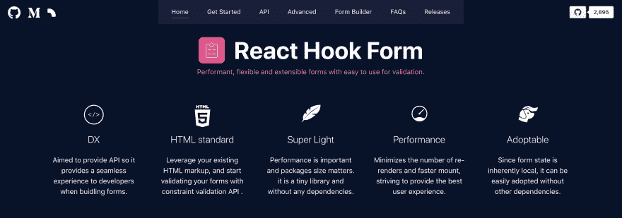

# 用 5kB 的钩子对表单验证作出反应

> 原文：<https://dev.to/bluebill1049/form-validation-with-hook-in-3kb-3d0l>

[](https://res.cloudinary.com/practicaldev/image/fetch/s--ERPGDapb--/c_limit%2Cf_auto%2Cfl_progressive%2Cq_auto%2Cw_880/https://miro.medium.com/max/5688/1%2Alo-U-rSPHCRTYV8Md5QgOQ.png)

TL；DR:引入一个新的 React 钩子库，用一种更简单、更干净的方法来处理表单验证(IMHO)。

在过去的几年里，我一直在处理表单，无论是单个表单提交还是多步漏斗。

最近 [React 16.8](https://reactjs.org/blog/2019/02/06/react-v16.8.0.html) 给我们带来了[钩子](https://reactjs.org/docs/hooks-intro.html)，在我看来这是 React team 已经交付的最大特性之一🌹(感谢 React 团队)。因此，我发现了一种编写表单验证的新方法，可能是一种更干净的方法。让我给你看看代码🔎

```
import React from 'react'
import useForm from 'react-hook-form'

function App() {
  const { register, handleSubmit, errors } = useForm() // initalise the hook
  const onSubmit = (data) => { console.log(data) } // submission when input are valid

  return (
    <form onSubmit={handleSubmit(onSubmit)}>
      <input name="firstname" ref={register} /> // register input

      <input name="lastname" ref={register({ required: true })} /> // register as required field
      {errors.lastname && 'Last name is required.'} // display error message when last name is not valid

      <input name="age" ref={register({ pattern: /\d+/ })} />  // register as input with pattern
      {errors.age && 'Please enter number for age.'} // display error message when age is not valid

      <input type="submit" />
    </form>
  )
} 
```

Enter fullscreen mode Exit fullscreen mode

从上面的例子可以看出，没有组件被导入。因此，这种方法不是让[在表单上控制输入/选择](https://reactjs.org/docs/forms.html)，而是利用[不受控制的表单输入](https://reactjs.org/docs/uncontrolled-components.html)，并将它们的[引用](https://reactjs.org/docs/refs-and-the-dom.html)注册到[反应钩子表单](https://github.com/bluebill1049/react-hook-form)。这使得钩子能够完全控制和洞察你的表单元素，因此也带来了很多其他的好处:

*   不需要外部组件来环绕输入，这使得钩子库小得多(5kb gzip)
*   因为它是不受控制的，你不再需要 onChange 和设置你的输入值，开始利用你现有的 HTML 标记。
*   由于组件的 ref 已经注册到钩子中，所以当出现错误时，可以很容易地访问它的 ref，并锚定到特定的字段。
*   更简单的 API，因为验证发生在注册级别。
*   对性能有很大帮助，因为输入变化不再触发重新渲染，查看性能比较[这里](http://react-hook-form.now.sh)。
*   简单的表单状态访问，因为 Hook 为每个输入保存了 refs。你可以很容易地查询它们的值。
*   支持浏览器内置验证❤️.

这些是我对使用 React 钩子形式的好处的总结，我认为使用这种方法，事情会简单得多。请查看网站上的[现场演示](https://react-hook-form.now.sh/)，我还建立了一个表单[生成器](https://react-hook-form.now.sh/builder)，它允许您创建表单，并将代码复制/粘贴到您的环境或代码沙盒中以测试它们。许多例子也出现在 [Github](https://github.com/bluebill1049/react-hook-form/tree/master/examples) 页面上。

[](https://res.cloudinary.com/practicaldev/image/fetch/s--KhQNEIWx--/c_limit%2Cf_auto%2Cfl_progressive%2Cq_auto%2Cw_880/https://thepracticaldev.s3.amazonaws.com/i/5zmi7vmw53o16uoabhov.jpg)

我真的希望这将使表单验证变得更容易，并随时在 [Github](https://github.com/bluebill1049/react-hook-form) 上给我留下问题或建议(如果您觉得有用，请留下星号🙏🏻).❤️感谢您的阅读。