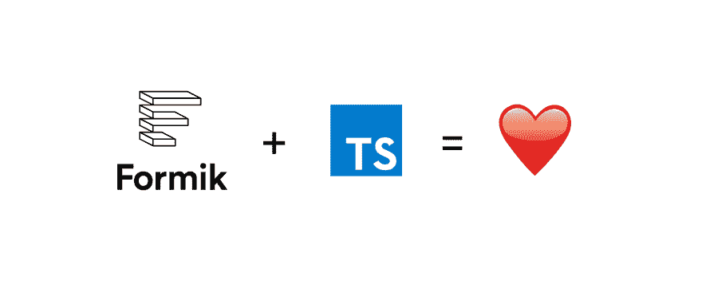

# 带有 Formik + TypeScript 的表单

> 原文：<https://dev.to/leonardomso/forms-with-formik-typescript-20p9>

[](https://res.cloudinary.com/practicaldev/image/fetch/s--EUuz5V9C--/c_limit%2Cf_auto%2Cfl_progressive%2Cq_auto%2Cw_880/https://cdn-images-1.medium.com/max/2560/1%2Ant8jD9-bjQvWWjMkf-gspw.jpeg)

React 开发人员最痛苦的话题之一就是如何构建漂亮的表单和干净的代码。有些人可能认为没有必要使用第三方库，但是在某些情况下，特别是当我们需要更复杂的表单时，这是需要的。首先，我们从 Redux 表单开始，很多人使用它很长时间了，但后来我们开始问自己，这是不是一个好主意，以及使用我们的 Redux 存储来管理表单状态的最佳方式。我们不需要在 Redux 存储中有表单状态，这根本不是一个好的做法。

然后，Formik 真的来为我们改变它，让我们的表单变得如此容易构建，我们的代码变得如此可读和编写得如此好，现在我们不必太担心它了。我们知道 Formik 代码是用 TypeScript 编写的，但是很多人仍然不知道如何正确地使用它。

因此，在本文中，我们将学习如何将 Formik 与 TypeScript 一起使用，因为最近许多开发人员已经开始使用它，让我们投入到这场宣传中，看看我们如何改进我们的表单。

### 首发

首先，让我们开始安装一些依赖项:

```
yarn add formik yup @types/yup 
```

Enter fullscreen mode Exit fullscreen mode

现在，我们将开始构建我们的表单，导入一些我们需要的东西:我们将导入传递我们的道具和表单处理程序的`withFormik` HOC，还将导入`FormikProps`。我们还将导入 yup 来验证我们的字段。

```
import { withFormik, FormikProps } from "formik";
import * as Yup from "yup"; 
```

Enter fullscreen mode Exit fullscreen mode

现在，为了开始构建我们的表单，我们需要首先定义一些接口。让我们定义一个名为`FormValues`的接口，它将定义表单中的所有值
:

```
interface FormValues {
    email: string;
    password: string;
} 
```

Enter fullscreen mode Exit fullscreen mode

我们还将定义其他名为`OtherProps`的接口，以防我们想要
传递其他道具给我们的组件。在我们的例子中，我们将传递一个名为`title`的属性
:

```
interface OtherProps {
    title?: string;
} 
```

Enter fullscreen mode Exit fullscreen mode

我们最后的接口将被称为`MyFormProps`，有了这个接口，我们可以为初始值定义一些属性，以防我们希望
有一些初始值。

```
interface MyFormProps {
    initialEmail?: string;
    initialPassword?: string;
} 
```

Enter fullscreen mode Exit fullscreen mode

现在，我们将编写名为`InnerForm`的组件，传递我们创建的接口
，并添加一些额外的代码:

```
const InnerForm = (props: OtherProps & FormikProps<FormValues>) => {
const {
    values,
    errors,
    touched,
    handleChange,
    handleBlur,
    handleSubmit,
    isSubmitting,
    title
} = props;

return (
    <Wrapper>
        <h1>{title}</h1>
        <form onSubmit={handleSubmit}>
            <InputWrapper>
                <Label>Email</Label>
                <Input
                    width={50}
                    type="email"
                    name="email"
                    onChange={handleChange}
                    onBlur={handleBlur}
                    value={values.email}
                />
            </InputWrapper>

            <InputWrapper>
                <Label>Password</Label>
                <Input
                    width={50}
                    type="password"
                    name="password"
                    onChange={handleChange}
                    onBlur={handleBlur}
                    value={values.password}
                />
            </InputWrapper>

            <button
                type="submit"
                disabled={
                    isSubmitting ||
                    !!(errors.email && touched.email) ||
                    !!(errors.password && touched.password)
                }
            >
                Sign In
            </button>
        </form>
    </Wrapper>
); 
```

Enter fullscreen mode Exit fullscreen mode

};

我们用`OtherProps`传递了我们的道具，我们还将`FormValues`包装在了`FormikProps`中。剩下的代码很容易理解，现在我们将创建用`withFormik` HOC 包装的最终组件。

首先，让我们编写名为`App`的组件，并在 withFormik 内部传递`MyFormProps`和`FormValues`。

```
const App = withFormik<MyFormProps, FormValues>({ 
```

Enter fullscreen mode Exit fullscreen mode

...

现在，在我们包装的组件中，在我们的`mapPropsToValues`方法中，如果我们
想要传递一个初始值给我们的一个字段，我们可以，或者我们可以只传递给
一个空字符串。

```
mapPropsToValues: props => ({
    email: props.initialEmail || "",
    password: props.initialPassword || "" 
```

Enter fullscreen mode Exit fullscreen mode

}),

我们将使用 yup 来验证我们的字段，因此在`mapPropsToValues`
方法之后，让我们放入以下代码:

```
validationSchema: Yup.object().shape({
    email: Yup.string()
        .email("Email not valid")
        .required("Email is required"),
    password: Yup.string().required("Password is required")
}), 
```

Enter fullscreen mode Exit fullscreen mode

现在，让我们编写`handleSubmit`函数，同时将`FormValues`传递给
来验证我们的道具。

```
handleSubmit({ email, password }: FormValues, { props, setSubmitting, setErrors }) {
    console.log(email, password);
} 
```

Enter fullscreen mode Exit fullscreen mode

非常简单，现在我们的整个`App`组件应该是这样的:

```
const App = withFormik<MyFormProps, FormValues>({
    mapPropsToValues: props => ({
        email: props.initialEmail || "",
        password: props.initialPassword || ""
    }),

    validationSchema: Yup.object().shape({
        email: Yup.string()
        .email("Email not valid")
        .required("Email is required"),
        password: Yup.string().required("Password is required")
    }),

    handleSubmit(
        { email, password }: FormValues,
        { props, setSubmitting, setErrors }
    ) {
        console.log(email, password);
    }
})(InnerForm); 
```

Enter fullscreen mode Exit fullscreen mode

你可以在这里找到这篇文章的所有代码。

## 结论

正如你所看到的，Formik 是一个非常有用的库，它让我们编写更好的表单，让我们的代码更具可读性。

这是一个如何将 Formik 与 TypeScript 一起使用的简单示例，但是您可以对它进行改进，并按照您想要的方式使用它。这里的目标是展示如何以最佳方式使用它，并让我们的代码具有强类型和更安全。