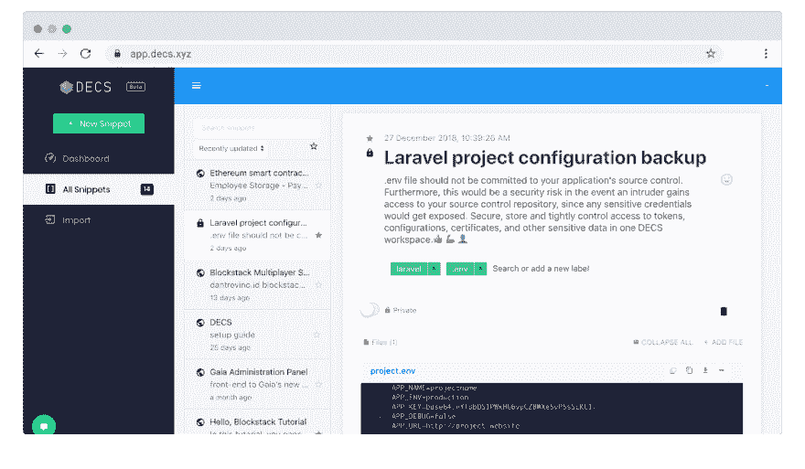

# 免费的分散代码片段管理器

> 原文：<https://dev.to/decs_dapp/free-decentralised-code-snippet-manager-1kna>

我们一直在编写可重用的代码，但是有多少人把它组织得井井有条，这样下次当我们想要重用时，它就能很快为我们所用了呢？

我们都在网上爬行寻找代码，但是有多少次我们痛苦地重复这些步骤，再次回到同一块代码上呢？

更多的时候，我们总是在深入的代码森林中寻找我们的代码片段，花费我们开发人员大量的时间来重新发明轮子。

我们如何更好地处理这种改造？提高生产率的方法很简单。

**保持追踪并保持有序**

DECS 分散式加密代码片段管理器建立在上述基础之上，它不仅仅是一个可搜索的编码日记。超级安全，而且免费！

为什么不去看看，看看作为一名程序员，使用 DECS 是否能提高你的工作效率呢？

编码快乐！

