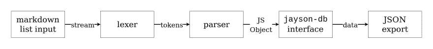

# 免费物品搜索-我个人的免费和开放资源列表

> 原文：<https://dev.to/foodogsquared/freebies-hunt-my-personal-list-of-free-and-open-resources-3m0d>

> TL；DR I 推出了免费赠品搜索(Freebies Hunt)网站(T1)，该网站列出了设计、通用编程、音乐、游戏开发、开放教育资源和许多我个人使用的其他免费和开源工具。哦，在前进的道路上还有一些挑战。

啊哈 ^ha 哈哈哈哈！4 月 fooooo^ooooooooooooo^oooooo！你搞砸了！你们完全毁了自己，因为你们走进了我的陷阱...让你访问我新推出的网站！

大家好！让我给你介绍一下 [Freebies Hunt](https://freebies-hunt.netlify.com) ，这是一个来自编程、音乐和数学(等等)的免费和/或开放资源和工具的美化资源列表。还建有[盖茨比](https://gatsbyjs.org/)。

## 灵感

这个想法的灵感之一是[牛逼](https://github.com/sindresorhus/awesome)，由[辛德雷·索胡斯](https://twitter.com/sindresorhus)的资源列表(也是有史以来最**牛逼**的项目之一)和 [Boomkrak](http://boomkrak.com/) 进行布局。

但主要的灵感来自于我所看到的免费和开放内容的状态。绝对令人惊讶的是，免费和开放的内容、工具和教育资源，如 [Visual Studio Code](https://code.visualstudio.com/) 、 [MuseScore](https://musescore.org/) 和[open StAX 教科书](https://openstax.org/)，在质量方面达到了与顶级产品竞争的高标准。所以我整理了一份清单。

我最初制作这个是为了庆祝开放教育周(从 3 月 4 日到 8 日)，主要是帮助发展中国家学生的免费质量工具，但由于困难和限制(我只是一个预算很低的学生，几乎总是有不稳定的互联网连接)，我没有做到这一点。😓

然而，这使我遇到更多的机会来学习，我会作出一些细节。另外，我把它变成了一个开放的内容列表。

## 个人经历和挑战

作为一个预算只有几百元 PHP(或 10 美元的 T2)和一堆你能在街机上找到的代币的学生，在我解决这个问题之前有一些障碍:

### 有限的免费数据库服务

很少会错过免费披萨的送货时间。虽然有慷慨的服务，如 [Firebase](https://firebase.google.com/) 和 [Heroku PostgreSQL](https://www.heroku.com/postgres) ，但我认为它对于这个简单的项目来说太大了。

像其他好的程序员一样，我创建了自己的数据库系统(当然是用 JSON)来满足我的特殊需求。

而结果就是这个名为 [`jayson-db`](https://github.com/foo-dogsquared/jayson-db) 的可憎之物，一个 JSON 数据库管理系统，内置了基于 [JSON 模式规范](http://json-schema.org/)的模式验证。不过，在最后，我可能应该使用[一个生产就绪的 JSON 数据库插件](https://github.com/typicode/lowdb)和[一个 JSON 模式验证器](https://www.npmjs.com/package/ajv)来代替。

我从创建自己的 DBMS(如果你可以称之为 DBMS)中得到的最大好处是，我可以将它用于其他项目。尽管如此，对我来说还是竖起大拇指。

### 易于创建和更新数据

现在我已经创建了自己的小型数据库系统。是时候获取一些数据并围绕这些数据构建一个模式了。幸运的是，当时我已经有了自己的资源列表，但问题是如何得到它。

我绝对不想通过查看降价清单并将其输入数据库系统来手动添加每个项目。所以我编了个程序来解析它。首先，我介绍了我的字符串解析解决方案:regexes！我知道这不是一劳永逸的解决方案，但我试过了，但没有成功——我真是太傻了。

所以我决定创建一个 lexer，并为我的 Markdown 列表定义了一点语法。这使我能够为我的数据创建一个一致的界面，并避免自己手动输入数据的容易出错的劳动。

一周后，当我在一个有效用例中创建我的第一个 lexer 时，我能够创建它了。当我顺利地创建了解析器之后，事情就一帆风顺了。

现在要输入数据，必须从一个带有特定语法子集的 Markdown 列表开始，通过 lex，解析它，`jayson-db`通过它，并将其导出为 JSON。然后瞧！你有数据！

问我:这样值得吗？我认为从生产的角度来看，绝对不行。只是为了避免使用支持有限的免费数据库服务？不...绝对可怕。付钱吧，该死的！物有所值(当然是选对了的话)。；p

不过就我个人而言，我认为这是值得的，尤其是作为一名试图学习和实施某些东西的学生。从这个案例中，我也意识到我不擅长设计程序，所以在这件事发生后，我决定从今年四月开始，花些时间回顾如何有效地设计一个程序。在看到这篇文章中关于学习如何平衡学习和创造有用产品的副业的讨论后，更是如此。

 [## 如何为副业寻找灵感

### 埃德温·克莱斯曼 3 月 20 日 192 分钟阅读

#sideprojects #ideas #tips #learning](/eekayonline/how-to-find-side-projects-4hkn)

### 选择合适的工具

好吧！API 已经生成并准备就绪。是时候找个地方生产它了。由于数据很少改变，网站基本上是一堆链接，我认为静态网站生成器是最好的工具。

我从 SSG 列表中选择了一个 SSG。即使我主要使用 Vue 作为我的前端框架，我还是选择了 Gatsby，因为我听说它更容易上手。

由于[盖茨比](https://gatsbyjs.org/)主要使用 [React](http://reactjs.org/) ，我花了一些时间熟悉 React。Vue 和 React 之间的基本概念非常明显(至少我是这么认为的)，所以我能够稍微平稳地过渡。如果你想开始使用的话，官方文档是*非常好的。*

接下来是工具本身:盖茨比。就像 React 的流程一样，我花了一些时间熟悉它，浏览了官方文档，并摆弄了我在 GitHub 上找到的[示例](https://github.com/jlengstorf/gatsby-with-unstructured-data/) [回购](https://github.com/jlengstorf/gatsby-with-unstructured-data/tree/using-gatsby-data-layer)。

我放弃了 GraphQL 的部分，因为我只想尽快完成它。此外，我的 API 不是 GraphQL，虽然我可以把它变成 GraphQL API，但我认为不值得这么麻烦。

在创建组件、设计样式、调试开发版本，以及令人沮丧地遇到生产版本的问题(并再次回到摆弄示例 repos)之后，我已经完成了。我花了一个月的时间来创建这个简单的项目，主要是从创建我自己版本的东西开始的(这总是很有趣)。

不管怎样，我的个人经历已经说得够多了(希望你不要介意)。让我们浏览一下网站本身。

## [网站本身](https://freebies-hunt.netlify.com)

它只是一个用 [Gatsby](https://gatsbyjs.org/) 搭建的静态网站，一个由 React 备份的静态站点生成器。当然，这个列表是由供你选择的类别组成的。该网站提供各种资源，比如游戏开发、音乐(作曲和理论)、数学、设计、研究和我个人使用(或者曾经使用)的开放教育资源(简称 OER)。

我还列出了我个人收听的博客、时事通讯、播客系列和 YouTube 频道，由于其质量好，我可以很容易地推荐给其他人。

还有其他一些东西，包括:

*   操作系统
*   社区(当然包括这个社区)
*   学生包(针对需要学生福利的同学)
*   练习网站(或编程卡塔)
*   ...还有很多我没提到的，进去吧！

## 源代码

本着免费和开放内容的精神，我把网站做成了开源的。可以在 GitHub 上访问回购。

##  [ foo-dogsquared ](https://github.com/foo-dogsquared) / [免费赠品-狩猎](https://github.com/foo-dogsquared/freebies-hunt)

### 这是我在网上从在线课程到开放教育资源找到的免费资料的集合。

<article class="markdown-body entry-content container-lg" itemprop="text">

# 免费赠品-狩猎

想找些免费的东西吗？我已经收集了一份已经积累了将近一年的免费清单，当然，没有比把它变成一个成熟的网站更好的分享方式了。

最近，总的来说，我真的对自由开放软件(或 FOSS)和开放内容产生了热情。随着一些产品与高端产品竞争，如 [MuseScore](https://musescore.org/) 、 [Visual Studio Code](https://code.visualstudio.com/) 和 [OpenStax](https://openstax.org/) ，我真的很高兴看到这些开放内容的未来。所以为什么不把它们捆绑在一起，编译成一个列表。

如果你想探索开放内容的世界，这里有一个适合你的入口。与其他资源列表相比，它并不完整，但我试图保持它的小(比如坐在 250 个资源上，哈哈)。

## 贡献的

想投稿…

</article>

[View on GitHub](https://github.com/foo-dogsquared/freebies-hunt)

如果你正在寻找一个 API(出于某种原因)，你可以通过 [npm](https://www.npmjs.com/package/freebies-hunt-api) 安装它。您也可以在单独的 GitHub repo 中访问它的源代码。

## [foo-dog squared](https://github.com/foo-dogsquared)/[freeies-hunt-API](https://github.com/foo-dogsquared/freebies-hunt-api)

### 免费赠品搜索作为一个 npm 包的免费赠品 API。

<article class="markdown-body entry-content container-lg" itemprop="text">

# 免费赠品-亨特-api

免费赠品搜索的数字免费赠品 API 作为一个 npm 包。这是我个人的数字免费清单，我觉得非常有用。当然，为什么不在 JSON 文件中共享呢。

这也是我的 JSON 数据库系统的生产用例， [`jayson-db`](https://github.com/foo-dogsquared/jayson-db) (并且通过创建我自己的小型数据库管理系统 thingamajig ~~也节省了一些钱，相对于我的预算来说，它很贵，好吗？~~)。还有，其实挺好玩的。

不管怎样，这也代表了我个人使用(或以前使用过)的工具和资源，尽管我承认至少现在还没有全部使用。如果你想给我反馈，不管是关于资源还是网站，请随意。只要确保建议的资源在法律上是免费的<g-emoji class="g-emoji" alias="eyes" fallback-src="https://github.githubassets.cimg/icons/emoji/unicode/1f440.png">👀</g-emoji>并且免费使用(尽可能免费如在自由言论，而不是免费啤酒)。还有…

</article>

[View on GitHub](https://github.com/foo-dogsquared/freebies-hunt-api)

如果你在寻找数据库，“数据库”只是一个简单的[降价列表](https://github.com/foo-dogsquared/freebies-hunt-api/blob/master/src/list.md) (lol)，所以至少你可以看到文字形式的免费赠品搜索。

作为一个开源项目，你可以自由地贡献你的代码或建议(设计、资源等)。).我很高兴欢迎你来改进这个项目。

如果你通读了整篇文章，我想感谢你花了一点时间通读。🙂它真的可以浓缩成“嘿！我创建了一个网站，里面有一系列免费开放的内容和资源。去看看！请评论、点赞、分享、订阅。Kthxbai！”你觉得我这样写的 project reveal 怎么样？

当然，不要忘记与他人分享这个网站，我希望你会发现这个项目和我一样有用。

一个开放内容爱好者的欢呼。☕