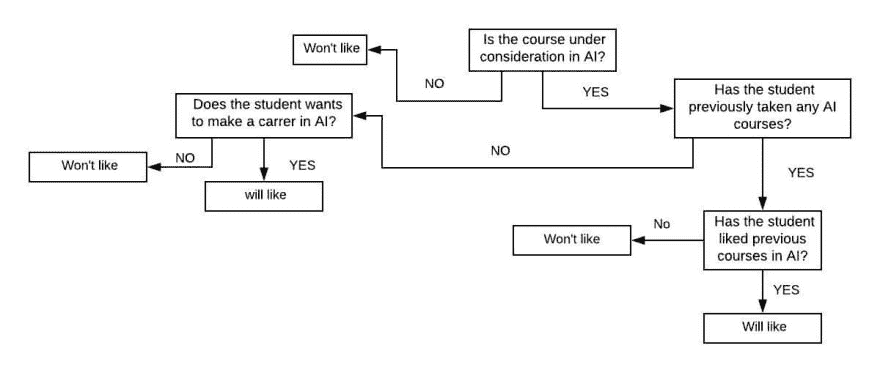

# 机器学习和决策树的友好介绍

> 原文：<https://dev.to/jaydeepborkar/friendly-introduction-to-machine-learning-and-decision-trees-2l45>

在原子层面上，机器学习是关于*根据过去预测*未来。例如，您可能希望预测哪个队将赢得即将到来的板球世界杯。你需要考虑各种因素来做预测，比如:球场类型，天气条件，旋转投球手的数量，命中率，球队在过去五场比赛中的记录，等等。简而言之，模型将通过从过去的数据中学习来对看不见的数据进行预测。

现在，学习到底意味着什么？我们说模特要学好是什么意思？

让我们举这个例子:

约翰正在学习线性代数课程，在课程结束时，他将参加一次考试，以了解他是否正确地“学习”了该主题。如果他考试成绩好，说明他学得好。而如果他失败了，说明他还没有把题目学好。

但是什么使得*考试合理*呢？如果线性代数考试中的问题是基于化学的，那么考试不会告诉约翰线性代数学得有多好，如果考试中的每个问题都来自约翰在线性代数课上经历的例子，那么这是对约翰学习的糟糕测试。因此，为了做一个合理的测试，问题应该是新的，但与课程中的例子有关。这是在测试约翰是否有概括的能力。泛化可能是机器学习的一个非常重要的部分。

让我们以一个面向计算机专业学生的课程推荐系统为例。它将预测一个特定的学生有多喜欢一门特定的课程。一个学生被给予一个课程子集，并且通过给他们一个从-2(最差)到+2(优秀)的等级来评估他们之前所选的课程。推荐系统的工作是预测某个特定的学生(比如约翰)会有多喜欢某门特定的课程(比如深度学习)。

现在我们可以对这个系统不公平:假设我们要求系统预测约翰有多喜欢能源科学课程。这是不公平的，因为这个系统甚至不知道什么是能源科学，也没有这门课的经验。另一方面，我们可以询问 John 有多喜欢他去年选修的自然语言处理课程，并给了+2 分(优秀)。在这种情况下，系统会告诉我们约翰会喜欢这门课程，但这不是对模型学习的真正测试，因为它只是回忆过去的经验。在前一种情况下，我们期望系统超越其经验进行归纳，这是不公平的。在后一种情况下，我们根本不期望它是一般化的。

我们的模型将要预测的对象被称为*例子*。在推荐系统中，示例将是学生/课程对，预测将是评级。我们被给予训练数据，我们的算法被期望学习这些数据。该训练数据是推荐系统的历史评级数据，推荐系统将使用该数据对测试数据进行预测。该系统将根据该训练数据创建归纳函数 f，该归纳函数 f 将把新的例子映射到相应的预测。该函数将接受两个参数(学生、课程)。

函数 *f* (约翰/机器学习)将预测约翰将喜欢机器学习，因为模型知道他过去上过自然语言处理课程，这是他喜欢的。这就是在模型中诱导智能的艺术。因此，该系统具有通用性。系统将对其进行预测的数据称为测试集。测试集应该永远是一个秘密。如果模型提前看到它，它就会作弊，做得比它应该做的更好。

**决策树模型的学习**

决策树是一个非常经典的学习模型，它采用“分而治之”的策略。决策树可以应用于各种学习问题，如回归、二元和多元分类、排序等。在我们的例子中，我们会考虑二进制分类。

假设你的目标是预测某个不知名的学生是否会喜欢某门不知名的课程。输出应该是简单的“是”或“否”。你可以问尽可能多的二进制问题来得到结果。

考虑这个例子:

**尤**:AI 在考虑课程吗？
**Ans** :是的

**你**:这个学生以前上过人工智能课程吗？
**Ans** :是的

你:这个学生喜欢以前的人工智能课程吗？
**Ans** :是的

你:这个学生想在人工智能领域发展吗？
**Ans** :是的

我预测这个学生会喜欢人工智能课程。

基于这些二元问题，我们将生成一个决策树。

如何检查一个模型的表现？

为了检验模型的表现有多准确，我们为它做了一个函数，我们通常称之为损失函数 *l* (y，y’)。不同的学习问题有不同形式的损失函数。对于回归，它是一个平方损失函数(y-y')^2，对于二元/多类分类，它是零/一损失函数。

**零/一损失** : *l* (y，y') = { 0，y=y' }
{ 1，否则}

其中 y 是实际值，y’是预测值。

预测时误差越小，模型越通用。

**为什么我们对于不同的学习问题会有不同的损失函数？为什么一开始我们会有不同的学习问题？**

以下是一些学习问题:

**回归**:根据过去的数据预测离散的未来值。下周日的降雨量。

**二进制分类**:非离散二进制值。例句:星期天到底会不会下雨？它会给 0 表示否，给 1 表示是。

**多类分类**:将一个实例放入多个类别中的一个。例如:如果某门课程属于计算机科学、地球科学或教育科学。

**排序**:将对象放入一组相关性中。示例:根据用户的查询排列搜索结果。

将学习问题分成不同类型的主要原因是为了测量误差。好的模型是做出“好的预测”的模型。好的预测意味着什么？不同类型的学习问题定义好的方式不同。例如:预测 0.5 厘米的降雨量要比预测 300 厘米的降雨量好得多。这不适用于多类分类。在那里，预测计算机科学而不是地球科学将是可怕的。在这里，我们甚至承担不起丝毫的错误。这就是为什么我们把问题分成不同的类别，因此它们有不同的损失函数。因此，一个好的模型是能够*概括*自身并且能够在看不见的数据上表现良好的模型。

请随时向我提供关于这篇文章的任何反馈和更正。在下一篇文章中，我打算讨论实现一个决策树分类器，并在学习中引入归纳偏差。你也可以在这里查看我之前关于自然语言处理的文章