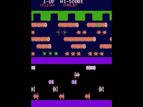

# 这可能是向外行人介绍编程的最好方法

> 原文：<https://dev.to/ycmjason/frogram---introduction-to-programming-16af>

## TL；速度三角形定位法(dead reckoning)

我创建了一个网站， [frogram](https://frogram.ycmjason.com/) ，旨在向任何之前没有编码经验的人介绍编程。

## 背景

我和安东尼·斯图尔特应邀在 T2 曼彻斯特大学为非 STEM 学生举办了一场“编程入门”研讨会。这是一个关于我们如何结束建造 [Frogram](https://frogram.ycmjason.com/) 的故事。

## 最初的想法

我和安东尼最初的想法是教授 Python 的基础知识；然后向参与者提出一些挑战，例如打印`hello world` 10 次，解二次方程等。

然而，我们发现这种方法有两个问题:

1.  挑战是没有回报的。对参与者来说没有动力去研究它们。他们为什么要打印`hello world` 10 次？他们解了二次方程，那又怎么样？
2.  这更像是“编程语言的 *Python 介绍”，而不是“T2 编程*介绍”，因为参与者可能会在语言问题上更加纠结，例如不正确的缩进、不正确的语法，而不是逻辑问题。

## 蛙人

为了让挑战更有回报，我们有这样的想法，让参与者通过编写一些代码来赢得青蛙过河游戏。代码将从本质上控制青蛙。显而易见，玩游戏比打印`hello world` 10 次要有收获得多。

## 蛙鸣语

我们发明了一种特定于蛙人的语言，以尽量减少修复语言问题所需的时间。我们想让语言尽可能的简洁和严格，这样它就能提供非常有用的错误信息。

例如，由于可用的谓词仅限于`isGoalUp|isRiverUp|is(Car|Log|Wall)(Up|Right|Down|Left)`，如果用户键入带有小写`d`的`isCardown`，生成的错误消息将会非常具体，比如:`Expected "Down", "Left", "Right", or "Up" but "d" found`。(感谢 [PEG.js](https://pegjs.org/) 提供了令人惊叹的解析器生成器！)

## Frogram-frog er x 程序

最后，结合蛙人和蛙人语言，我们有了最终的[蛙人](https://frogram.ycmjason.com/)！现在就去看看吧！任何反馈都将不胜感激。记得在 [github](https://github.com/ycmjason/frograming) 上启动它。更重要的是**把这个网站分享给你那些想学习编程的朋友**。而且更重要的是！