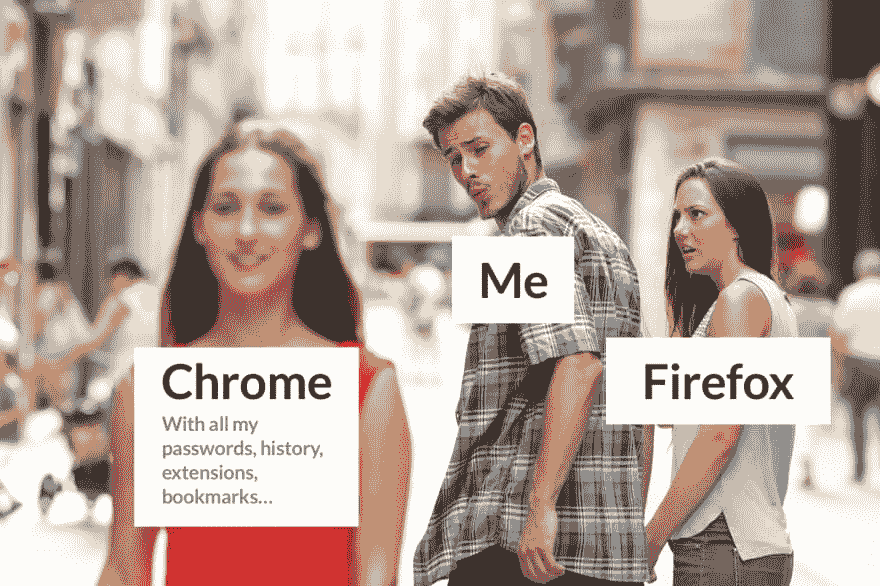
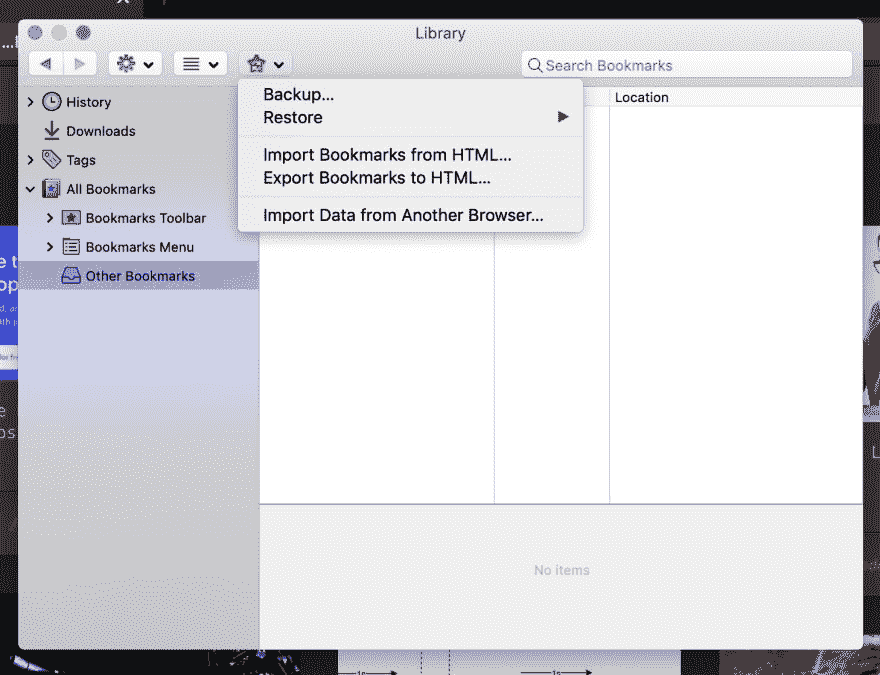
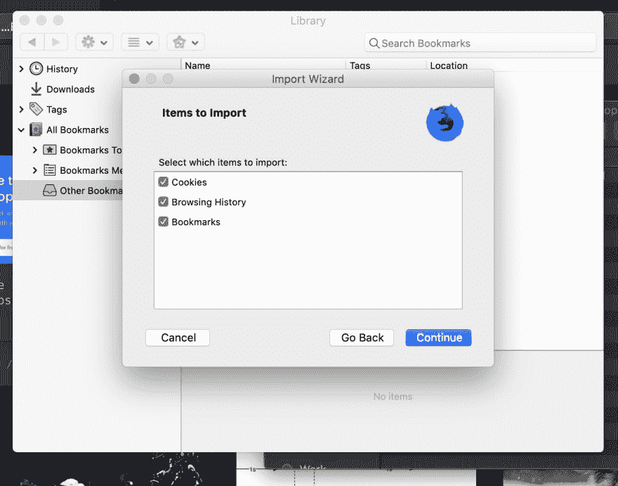
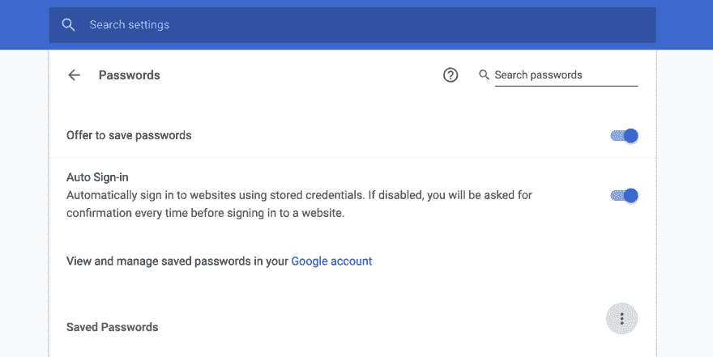

# 从 Chrome 到 Firefox Quantum，4 个简单步骤

> 原文：<https://dev.to/thebabscraig/from-chrome-to-firefox-quantum-in-4-easy-steps--5572>

## 书签、扩展、历史等等——如何拔掉 Chrome 的插头，直接进入 Firefox

我最近得到了 15 英寸的 2017 MacBook Pro，这是我过去 6 年来使用的 3 种不同 MacBook Airs 的彻底升级。这是一个奇妙的新世界，视网膜色彩、屏幕空间的巨大变化和更快的运行速度。但这不是对 MacBook Pro 的评论，这是一个关于在运行我通常的开发人员工作流(Chrome、Visual Studio 代码和 iTerm)的第二天早上，我的 MacBook Pro 开始发热，以至于风扇开始大声吹风的故事。我立即检查了活动监视器，你瞧，谷歌浏览器是罪魁祸首。我以前听说过 Chrome 有多喜欢占用内存，它似乎在争夺我所有的 16GB 内存。

这让我想起，出于各种原因，我曾几次试图戒掉 Chrome。首先，我发现火狐开发者版在开发者工具方面有更好的用户体验。我只是喜欢在 Firefox 中调试 web 应用程序的外观和感觉。我也有点怀念我小时候使用的浏览器，那时互联网对我来说是一个新的和令人兴奋的地方。我还了解到，新的 Quantum 浏览器比 Chrome 少用了 30%的内存，也许最重要的是，我喜欢 Firefox 对待用户隐私的方式，并避免积极收集数据和跟踪。

也就是说，我总是发现自己又回到了 Chrome，因为我在 Chrome 中保存了多年来作为日常浏览器使用的所有浏览器历史、书签、扩展和密码。每次我尝试的时候都会这样结束:

[](https://res.cloudinary.com/practicaldev/image/fetch/s--7meQ8FrK--/c_limit%2Cf_auto%2Cfl_progressive%2Cq_auto%2Cw_880/https://thepracticaldev.s3.amazonaws.com/i/4oph3bk2wy033zesdo4u.png)

不过，这一次，我向自己保证，我会跳起来，给火狐一个赢得我的公平机会。以下是我如何最终把所有东西从 Chrome 移植到 Firefox Developer Edition 的。如果你像我一样，想尝试一下 Firefox，看看它是否能坚持下去，那么按照下面的步骤做，你很快就可以开始运行了。除了最后一步，我还没有机会在另一台笔记本电脑上尝试，这些指令中的大多数都可以在任何操作系统的机器上运行。

让我们开始吧。

### 第一步:下载火狐

简单的部分-下载你的新浏览器。你可以在这里获得火狐量子开发者版[。按照指示和*火*它了。](https://www.mozilla.org/en-US/firefox/developer/)

### 第二步:书签&历史

让我们导入我们的书签和历史。这将确保你在 Firefox 中感觉更自在。在 url 字段中自动完成，你所有的网站只需点击一下，我们承诺有一天会访问的那些网站的书签😉。为此，点击工具栏中的堆叠书籍图标，选择`Bookmarks`向下滚动到`Show all Bookmarks`(或`cmd+shift+B`)并点击星形图标。选择`Import Data From Another Browser`，选择 Chrome。

[](https://res.cloudinary.com/practicaldev/image/fetch/s--E7QvZA99--/c_limit%2Cf_auto%2Cfl_progressive%2Cq_auto%2Cw_880/https://thepracticaldev.s3.amazonaws.com/i/xs47ire3dbclh77vrmph.png)

一定要退出 Chrome。你可能还想检查你的活动监视器，确保没有 Chrome 进程或助手在后台运行。现在，您可以选择要导入的项目。

[](https://res.cloudinary.com/practicaldev/image/fetch/s--3I8jxGlU--/c_limit%2Cf_auto%2Cfl_progressive%2Cq_auto%2Cw_880/https://thepracticaldev.s3.amazonaws.com/i/o78vrj699yt03hd541d9.png)

选择你想要的数据后，点击继续，让 Firefox 完成它的工作。一旦这个过程完成，你应该在 Firefox 中有你的 cookies，历史和书签。

### 第三步:扩展

接下来是我们的扩展。你可以在 Chrome 中打开扩展管理器，然后在 Firefox 浏览器中搜索你想要使用的扩展。我为我打算保留的每个 Chrome 扩展都找到了 Firefox 的对应版本。我还利用这个过程做了一些家务，并在我的扩展列表上添加了一个玛丽·近藤。你可能会惊讶于那些不再有用或不再“激发快乐”的扩展的数量😂。保持扩展轻便也是一个好主意，尤其是那些在后台运行的扩展。它们会增加浏览器的整体负载，并影响内存的消耗。你可以在这里找到 Firefox 的“附加组件”

### 第四步:密码和登录

这一步有点复杂，但我们已经走了这么远，我们可以做到。这个对我来说真的很大。我有几十种不同的密码，我开始依赖一个精心设计的系统，浏览器会处理其中一些，其余的我会记在脑子里，或者委托给社交登录。这被证明是我最后一次试图从 Chrome 迁移过来时的失败，因为我厌倦了不得不重置这么多帐户密码。

首先，将你的密码从谷歌导出到一个`.csv`文件中。这可以通过进入 Chrome 并进入你的设置来完成。点击自动填充部分的`passwords`，然后点击三点菜单按钮并选择`Export passwords`。请确保将该文件保存在本地。不要把它放在任何共享文件夹中。这是极其敏感的信息。

[](https://res.cloudinary.com/practicaldev/image/fetch/s--dleH6kM_--/c_limit%2Cf_auto%2Cfl_progressive%2Cq_auto%2Cw_880/https://thepracticaldev.s3.amazonaws.com/i/ts8xrgaj1u7x1c5u3473.png)

你将被要求输入你的计算机密码。这样做，选择目标本地文件夹(见上文)，保留文件类型为`.csv`，输入“密码”作为文件名。

接下来，您需要安装一个名为`ffpass`的命令行工具。你可以在这里找到 GitHub 回购[。](https://github.com/louisabraham/ffpass)

要安装这个工具，你需要 Python 3。如果没有版本三，可以通过运行:
来使用家酿

```
$ brew install python3 
```

Enter fullscreen mode Exit fullscreen mode

这也将安装 python 安装程序`pip3`。如果你的 MacBook 的设置和我的一样，你需要更改`python`和`pip`命令的命令行别名，以指向新安装的`python3`和`pip3`，而不是 python 和 pip 版本 2。*默认情况下随 MacBooks 一起提供。

为此，请打开您的`.bash_profile`并设置一些新的别名。

```
$ open ~/.bash_profile 
```

Enter fullscreen mode Exit fullscreen mode

在出现的文本文件中添加这两行。

```
alias python='python3'
alias pip='pip3' 
```

Enter fullscreen mode Exit fullscreen mode

现在我们可以通过运行:
来安装`ffpass`

```
pip install ffpass 
```

Enter fullscreen mode Exit fullscreen mode

安装应该不会花很长时间，但是一旦安装完成，我们现在可以将我们的`password.csv`文件的数据导入 Firefox。确保 Firefox 已关闭，然后输入以下命令。

```
ffpass import --from /path/to/passwords.csv -d /Users/YOUR_HOME_FOLDER_NAME_HERE/Library/Application\ Support/Firefox/Profiles/91ybe9eg.dev-edition-default 
```

Enter fullscreen mode Exit fullscreen mode

我们在这里做的是从我们的`passwords.csv`文件所在的路径导入，并写到 Firefox 可以查看和使用数据的位置。一旦该命令运行，请务必*永久删除*密码文件，因为这是敏感信息，不应该放在你的计算机上或与任何人共享。

就是这样！再次打开 Firefox，它应该感觉更像你习惯的浏览器。你仍然会注销大部分帐户，但表单自动填充数据应该让你只需点击一下就可以轻松地重新设置。我希望使用 Firefox 几个星期，看看我的感觉如何，更重要的是，我的电脑对它的感觉如何。到目前为止，我并没有真正想念 Chrome，即使在我的网络开发中，我也发现 Firefox 环境是一个受欢迎的变化。让我们看看进展如何。

你呢？你打算试试火狐量子吗？或者你已经试过了？下面评论里大家对比一下笔记吧！