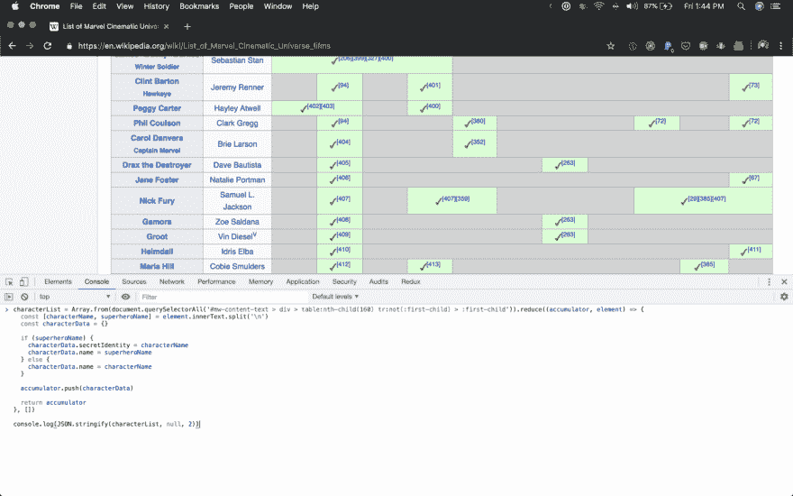
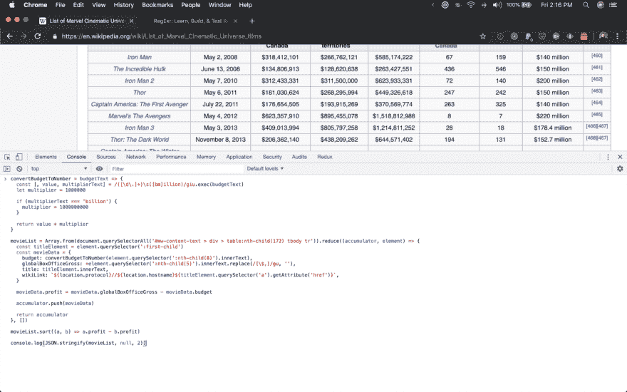
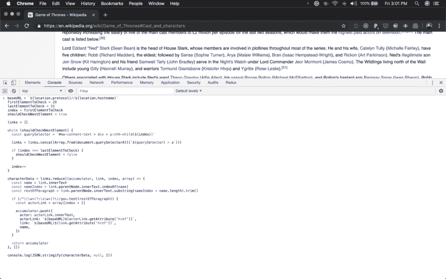

# 从 Devtools 到剪贴板

> 原文：<https://dev.to/trezy/from-devtools-to-the-clipboard-10ch>

## 你可以从 devtools 中把东西塞进你的剪贴板！

你是否曾经花了太多的时间在浏览器的 devtools 中编写一个聪明的小脚本来从页面中获取一些信息？也许你正试图从维基百科页面生成一个惊奇电影宇宙(MCU)中反复出现的角色列表，包括他们的名字和秘密身份…

[](https://res.cloudinary.com/practicaldev/image/fetch/s--1kZ4CVA6--/c_limit%2Cf_auto%2Cfl_progressive%2Cq_auto%2Cw_880/https://thepracticaldev.s3.amazonaws.com/i/3szspgl6xjarwganxy9e.png)

或者，也许您正试图获得一个按总利润排序的所有 MCU 电影的 JSON 表示…

[](https://res.cloudinary.com/practicaldev/image/fetch/s--zIdfc6rd--/c_limit%2Cf_auto%2Cfl_progressive%2Cq_auto%2Cw_880/https://thepracticaldev.s3.amazonaws.com/i/4hovmh42ugz7x19u2hwx.png)

或者也许你是一个真正的受虐狂，你想从 GoT wiki 页面的正文中提取《权力的游戏》( GoT)角色和演员的名字。

[](https://res.cloudinary.com/practicaldev/image/fetch/s--U9y5FLSO--/c_limit%2Cf_auto%2Cfl_progressive%2Cq_auto%2Cw_880/https://thepracticaldev.s3.amazonaws.com/i/ujr630gysoe9z3p93xwb.png)

* * *

## 反正。

这里的标准是将数据作为 JSON 记录到控制台，然后用光标手动选择所有文本。对于大型数据集来说，这不仅是一个噩梦般的任务，而且还可能有不完整的数据。长字符串(尤其是数据 URIs)被开发工具折叠成一个椭圆(…)。如果你想复制哪怕是很小的数据 URIs，这种方法会让你——我说得很微妙— *完全无所适从。*

## 好了，我们怎么做更好？

带`copy()`功能！恰好 Chrome、Firefox 和 Safari 的 devtools(不能用 Edge 测试)都提供了`copy()`功能，可以把你需要的任何东西塞进剪贴板！

̀緉̘it’s 魔术！ᶨ鲇♀鲎ಁ

如果你想把一个充满数据的对象塞到你的剪贴板中，只需把数据串成字符串并使用`copy()` :
就可以了

```
const bigDataSet = [ ... ]
const bigDataSetAsJSON = JSON.stringify(bigDataSet)

copy(bigDataSet) 
```

Enter fullscreen mode Exit fullscreen mode

现在，如果你粘贴到任何地方，你会发现你的剪贴板充满了 JSON 的美丽。

*Protip:* 如果你想要你的数据被样式化(用空格、换行符等等)，`JSON.stringify()`方法已经满足你了。例如，如果您希望输出使用 2 个空格作为缩进:

```
JSON.stringify(bigDataSet, null, 2) 
```

Enter fullscreen mode Exit fullscreen mode

要了解更多关于你能传入`JSON.stringify()`的信息，请查看 MDN 上的[文档。](https://developer.mozilla.org/en-US/docs/Web/JavaScript/Reference/Global_Objects/JSON/stringify)

* * *

## 哇，特雷兹！你真是聪明又神奇！

哦，我知道。不过，我很感激你这么说。如果你想修改本文开头例子中的任何代码，你可以在这里找到它们、这里的和这里的。