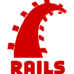
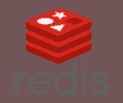
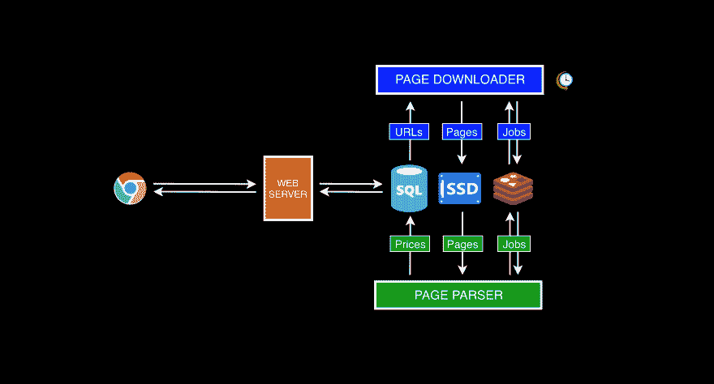
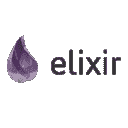

# 从 Rails 到 Elixir:了解你的应用

> 原文：<https://dev.to/jdcosta/from-rails-to-elixir-know-your-app-131m>

这是我从 Ruby on Rails 到 Elixir/Phoenix 的旅程系列文章的第一篇。
*\Part1 [从 Rails 到 Elixir:了解你的应用](https://dev.to/jdcosta/from-rails-to-elixir-know-your-app-131m/edit)*
*\Part-2 [从 Rails 到 Elixir: Safe 用 NOOP 部署重写](https://dev.to/jdcosta/from-rails-to-elixir-safe-rewrites-with-noop-deployments-40cb)*

在我作为软件工程师的职业生涯中，我做了很多 Ruby on Rails 的工作，**我非常喜欢它**，而且我不一定打算停止做它。

事实上，Rails 不仅是我专业项目的实际选择，也是我个人项目的选择。大多数时候，我会想出这个将改变世界的革命性的新想法(这一点毋庸置疑),我会迫不及待地去实现，因为我不想失去这种兴奋感。因为我通常很匆忙，所以对我来说，使用最现成的工具是很自然的，这些工具可以让我尽快地构建出我的大脑转储原型。

## 价格跟踪应用程序

这就是我所做的，再一次，当我决定要建立一个**价格跟踪应用程序**来兼容互联网上的任何在线商店。用户会将商品标记为收藏夹，然后在价格变化时收到电子邮件通知。

我希望人们能够使用浏览器扩展来保存项目，所以我立即看到满载 JavaScript 的卡车向我驶来；然后，我需要某种后端来存储这些信息，并定期抓取在线页面以获取最新价格。我还需要一些东西来帮助我发送电子邮件通知。

我的想法是这样的:它需要 HTML/CSS/JS 来显示至少一个简单的被跟踪项目的列表，一个从数据库中获取项目的 API，一个数据库，当然，可能还有一些用于抓取和通知的后台处理。因此...

|  |  |  |  |
| --- | --- | --- | --- |
|  |  |  |  |

###### *我一直觉得 Sidekiq 的 logo 很搞笑。

我得到了正确的技术堆栈！？我走了。

我构建了浏览器扩展，构建了通过两种方式获取商品的 API，构建了每两个小时唤醒一次并下载每个存储商品的 HTML 页面的后台工作器，构建了另一个解析所有这些 HTML 文档以搜索更新价格的后台工作器。我甚至构建了一个小型的“使用并丢弃”HTTP 代理存储库，以避免被我的抓取所注意到，但我将它保存到另一篇博客文章中。

我想在一周的空闲时间(大部分是晚上)编写代码后，我有了一个工作版本，因为 **Rails** ❤️.

## 发货生产💰

为了保持流畅和简单，我选择将它们都放在一个服务器上，这意味着 **PostgreSQL** 、 **Rails** 、 **Redis** 和 **Sidekiq** 共享一个 CPU 和 1.70GB 内存。

最初只使用 PostgreSQL 和 Rails 进行部署时一切顺利，后来我添加了 Sidekiq 和 Redis，但在部署过程中事情出乎意料地爆发了——我使用了 [Capistrano](https://capistranorb.com/) 。经过一个多小时的挫折后，我终于发现我的服务器在试图编译资源和生成 Rails 和 Sidekiq 的新副本时内存不足(T2)。

我不应该一开始就在生产服务器中编译资产，但这就是 Capistrano 默认的工作方式。我也可能花了一些时间试图找到一种以更有效的方式重新启动应用程序的方法，但我觉得我将与我强加给自己的技术作斗争。另外，在这个问题上花费的时间对我来说毫无价值。

因此，Google Cloud 的下一个产品是一个 3.75GB 的虚拟机，我认为现在已经足够了。顺便说一句，我使用谷歌云是因为我听说过它的好消息，加上我计划在稍后阶段使用[谷歌云功能](https://cloud.google.com/functions/),并且在同一个云提供商将消除网络传输成本。

目前为止一切都很好。我的应用在运行，我在以新的 JavaScript 框架发布的速度迭代😏我甚至成功说服一些朋友作为真实用户开始测试它。我很开心！

...直到我看到账单💰💰💰😐。

支付高达【24.27 美元/月(在撰写本文时)来维持一个低投入的副业项目完全是浪费金钱，甚至更是如此，因为服务器本身并没有做太多事情，而且大部分时间都处于静止状态。另一方面，我需要大量的内存来满足 Puma/Rails 和 Sidekiq 的基本内存需求。

对于一个致力于一个项目的创业公司来说，支付这么少的金额(按这些条款来说)是有意义的，因为开发速度形式的补偿性附加值是远远优越的。有一篇由 Rail 的创造者 [DHH](https://twitter.com/dhh) 写的有争议的文章，关于 Ruby 对公司来说足够快和便宜(我在一定程度上同意)。

但对我来说却不是这样，我没有烧钱，没有承诺任何期限，也没有工资要付，所以我准备降低开发速度来换取更便宜的基础设施。

## 了解你的 App

幸运的是，在过去的两年半时间里，我一直在对基于 Rails 的系统进行扩展和优化，这是我全职工作的一部分。我从**了解我的系统中学到了宝贵的经验，然后才考虑优化**通过监控每个工作流，寻找瓶颈，深入了解底层工作负载模式(它们是否基本同步，它们是否可以并发，谁依赖谁，等等)，并最终跟踪谁窃取了您的大部分 CPU 和内存资源。

这种获得的经验使我以一种缩小版本的系统来看待我的价格追踪器，其中诸如类和对象之类的特定部分以及它们如何彼此交互不再重要。相反，与我相关的是如何将系统划分为高层次的关注点，这些关注点如何表示，以及它们如何相互作用。

最后，我意识到我的价格追踪器可以分为四个独立的部分:

1 \ Web 服务器的工作是为用户提供一种管理商品列表的方式。这个组件只是一个标准的无状态 HTTP 服务器，其中每个请求都与其他请求 100%隔离。这一点非常重要，因为它告诉我们它们可以并发运行。因为它的主要工作是从数据库中插入和检索数据，所以它的大部分执行时间都花在等待 I/O 操作上。

2\页面下载程序**是一个后台进程，每两个小时唤醒一次，从数据库中收集项目 URL，并将相应的 HTML 页面下载到磁盘中。我再次看到了另一种可以并发运行的工作负载，因为下载之间没有共享状态。**

3.**页面解析器**是另一个后台进程，它从磁盘获取 HTML 页面，继续解析它们，然后在文本节点中导航，搜索更新的价格。不管它是否找到了很好的价格，最终的结果都会报告给数据库。与前面提到的服务类似，正在处理的不同页面之间没有共享状态，这意味着它们也可以并发运行。也许这个和其他的主要区别在于，由于文本搜索，它在 CPU 上的负担可能比内存要重一些。

4\为了简单起见，系统的**通知**部分没有表示出来，但是我计划将来写一篇关于它如何与当前拓扑集成的博文。

通过进行这种高层次的分析，我了解到所有四个组件都能够彼此独立地工作——这不是偶然发生的，因为它们一开始就被设计成并发工作。当解析器已经在处理第一批页面时，页面下载程序可以继续下载页面。Web 服务器也在一边，让用户管理他们的项目列表，而不会阻塞系统的其余部分。

我还了解到我的系统严重受限于 I/O，因为大多数下载需要几秒钟才能完成。我应该通过强迫 CPU 在等待时做其他有用的事情来利用 CPU 得到的空闲时间。

*如果你有兴趣了解更多关于并发工作负载的知识，我推荐这个精彩演讲的第一部分，由 [Golang](https://golang.org/) 的联合创始人 [Rob Pike](https://twitter.com/rob_pike) 主讲。*

[https://player.vimeo.com/video/49718712](https://player.vimeo.com/video/49718712)

如果我有一个流量相当大的真实应用程序，我也会花一些时间研究服务器和应用程序指标。了解你系统中的每一条热路径是很重要的，这样你就可以推理出哪些部分需要在考虑性能的情况下进行设计——这个概念在经济学中通常被描述为[帕累托原理](https://en.wikipedia.org/wiki/Pareto_principle)。

这就是为什么人们一直在谈论监控，它真的很重要，现在有很多选择可以实现，无论是在场所还是作为服务。我过去使用过 [New Relic](https://newrelic.com/) ，并从中获得了一些对我的平台非常有价值的见解。完全推荐。

## 做出决定

一旦我知道我需要 1)一个并发友好的工作环境；以及 2)将消耗非常低的存储器的运行时间；我觉得已经准备好为这项工作寻找合适的工具了。

2018 年，当这件事是并发的时候，你脑子里弹出来的是什么？嗯，我肯定这个问题的答案会因个人经历而异，但在我看来，它是[长生不老药](https://elixir-lang.org/)和[走](https://golang.org/)。

关于 Go，语法让我个人感到害怕，我对他们处理错误的方式感到不舒服。尽管他们使用[通信顺序进程](https://en.wikipedia.org/wiki/Communicating_sequential_processes) (CSP)优雅地处理并发事务，但是很容易出错，因为数据结构仍然是可变的。最重要的是，正如我在最近的播客中听到的，我不认为它能够为像我手中的问题提供足够高的抽象。

不过不要难过，其他人会有不同的观点👍。

|  |  |  |
| --- | --- | --- |
|  |  |  |

另一方面，长生不老药对我来说很熟悉。可能是因为语法让它看起来像 Ruby(这是个陷阱！)但是我也能在社区里找到相似之处。Elixir 的创造者 José Valim 是 Ruby 社区中的一名多产成员，也许这就是原因。

此外，因为它运行在 [BEAM](https://en.wikipedia.org/wiki/BEAM_(Erlang_virtual_machine)) (Erlang 的虚拟机)之上，所以并发原语被深深嵌入到语言中，而实际的编程模型 [Actor 模型](https://en.wikipedia.org/wiki/Actor_model)则完全是关于并发的。这感觉非常适合我的渴望并发的平台。你可以在这篇文章中了解更多关于[如何在这个领域大放异彩。](https://elixirschool.com/en/lessons/advanced/concurrency/)

一旦我开始深入研究长生不老药和生态系统，我开始觉得我正朝着正确的方向前进:

1\ **伟大的工具**。我需要一个网络框架，[凤凰](https://phoenixframework.org/)检查了所有的盒子；我需要一个能够与 Sidekiq 集成的 jobs 框架用于最初的迁移，而 [Exq](https://github.com/akira/exq) 就在那里；我需要一个 HTTP 客户端库，而这个库就在那里；我需要一个 HTML 解析器，而 floki 就在那里；最后，我需要部署装备，而[酒厂](https://github.com/bitwalker/distillery)看起来不错；所有这些包都被很好地记录和维护，就像我在 Ruby land 习惯的那样。

2\它有一个**稳定且不断增长的生态系统**，所以我并不担心可能会使用一个注定会在几年内消亡的被过度宣传的工具。Erlang 已经存在了 20 年，Elixir 正在通过让它更容易使用来释放它的潜力。甚至 Erlang 开发人员也对这种新语言感到兴奋，并因此参与到社区中来。这只能是一个积极的信号。

3\它根据我的**并发**需求检查所有的框。我将能够将我的工作负载分散到整个服务器上，并以并发的方式运行它们，最大限度地利用 CPU 和内存。我预见到数百甚至数千个下载会在一台机器上同时发生，而且不费吹灰之力。

4\伞状项目的固有概念允许我分离平台的不同关注点，而没有任何过度工程化的风险。更多信息[在这里](https://elixirschool.com/en/lessons/advanced/umbrella-projects/)。

5\ **基础设施成本**预计会更低，根据你在网上看到的所有关于公司迁移到 Elixir 并能够将其服务器数量从数百台减少到几台的文章来判断。不幸的是，几乎没有关于静止状态下需要多少内存的信息，但是 Erlang 的网站声明人们已经成功地在只有 16MB 内存的系统中运行了 BEAM，这并不意味着什么。如果您有关于内存消耗的有价值的信息，请联系我们。

如果我在真实世界中，我会彻底测试我的记忆假设。在我的开发机器上，我可以看到在运行`iex -S mix`和一些加载的依赖项之后，BEAM 平均使用了 **40MB** 的内存。我不知道这个数字有多可信。

6\我能想到至少有两个朋友会非常高兴，一旦他们知道我终于开始依赖长生不老药了。说真的，伙计们，如果你正在读这封信，请不要再用你的灵丹妙药来烦我了！完成了，我现在是 Elixiring。

*查看他们对社区的贡献:1)由 [@eidge](https://twitter.com/eidgeare) 开发的基于事件采购和 GenStage 的超级快速工作框架[ex job](https://github.com/eidge/ex_job)；2)任务调度系统 [Cronex](https://github.com/jbernardo95/cronex) by [@jbamaro](https://twitter.com/jbamaro) 。*

这里有更多关于长生不老药的利与弊的信息。

在这一点上，我觉得有足够的信心去重写，我必须补充说，我也非常兴奋。我写了几个模块只是为了试驾这个东西，它真的引起了我的注意。突然之间，我如饥似渴地阅读文档、播客和在线讨论，所以我真的很感兴趣，并且乐在其中。这对我很重要。🤓🤓

## 公司

除了希望保持基础设施成本较低之外，我几乎没有任何限制地独自从事这项工作。我的主要目标是学习并享受制作低成本玩具产品的乐趣。

如果我是在一家公司的背景下，在做出这样的决定之前，我必须考虑很多其他因素:1)这是一项相对较新的技术，所以我想很难找到有经验/热心的开发人员；2)重写通常需要相当大的开发努力，并且可能不会立即产生短期结果；3)新软件可能会引入新的错误或带回旧的错误；4)切换到新平台的时刻可能是破坏性的，并且需要时间来仔细规划；5)年轻的创业公司可能会受益于使用现成的工具，如 Ruby on Rails，而不是最大限度地提高开发速度，从而尽可能少地消耗时间/金钱。这些只是几个值得我立即考虑的因素，但我肯定还有其他因素。

话虽如此，一旦某些产品成熟并达到相当大的规模，可能值得用更高性能的替代品来替换部分系统，以便能够处理更多的流量或降低成本。或者两者都有。这些家伙用 Elixir/Phoenix 替换了他们的 Ruby on Rails monolith，从而将他们的服务器数量从 150 台减少到了 5 台。我自己也做过一些基础设施管理，我只能想象他们每个月节省了多少钱。

我想这里的教训是:如果你是一家公司，在跳下悬崖之前，一定要评估这种平台迁移的价值。

## 最后的想法&接下来

在撰写本文时，我不知道我能节省多少钱，因为我还没有完成完全迁移。我的目标是用一系列文章记录整个旅程，这样你就可以关注我以获得即将发布的帖子的通知。从选择技术、检查各种实现细节，到最后讨论如何在生产中切换到新平台，有很多内容要谈。

我计划在本系列的下一篇文章中发布关于如何实现这种平台迁移的后续文章。我想深入到简化整个迁移背后的思考过程(决定哪些部分应该首先迁移，等等)，以便降低最终的风险。我将用**价格跟踪应用**作为例子。

如果你觉得这篇文章太过概念化，我计划随着这个系列变得更加技术化，所以期待看到一些 Ruby 和 Elixir 的片段。

好了，谢谢你的光临，请继续收听下一集。

非常感谢反馈👍