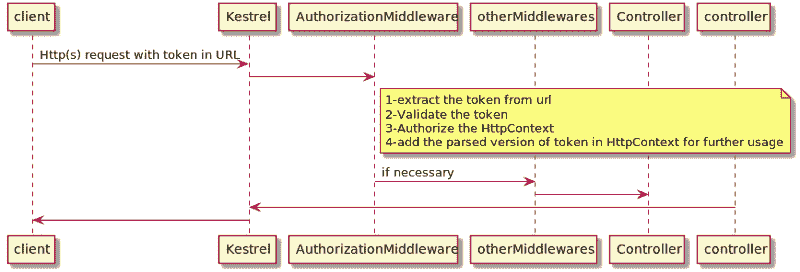

# 从 URL JWT 令牌认证&手动授权 HttpContext。网络核心 MVC

> 原文：<https://dev.to/alialp/from-url-jwt-token-authentication-manually-authorizing-httpcontext-in-net-core-mvc-3b6a>

在使用 JWT 的正常认证中，令牌将位于请求的“认证报头”中，认证将按照此处[的说明](https://code-maze.com/authentication-aspnetcore-jwt-1/)进行

> #### [ASP.NET 与 JWT 和 Angular 的核心认证-第 1 部分](https://code-maze.com/authentication-aspnetcore-jwt-1/)
> 
> 保护 web 应用程序是最重要的事情之一，通常也是最难完成的事情之一。在这个系列中，我们将学习如何使用 JSON web 令牌(JWT)在前端使用 Angular 和在服务器端使用 ASP.Net 核心来实现身份验证。

但是如果您需要使用 JWT 令牌来授权您的请求，而令牌在 URL 中，如下所示:

```
https://localhost:444/controller/action?token=eyJhbGciOiJIUzI1NiIsInR5cCI6IkpXVCJ9.
eyJodHRwOi8vc2NoZW1hcy5taWNyb3NvZnQuY29tL3dzLzIwMDgvMDYvaWRlbnRpdHkvY2xhaW1zL3VzZXJkYXRhIjoie1widXNlcm5hbWVcIjpcInRlYWNoZXJAa28uY29tXCIsXCJwZWVyVXNlck5hbWVcIjpcInN0dWRlbnRAa28uY29tXCIsXCJwbGF0Zm9ybUlkXCI6MCxcInRlbmFudElkXCI6XCI4M0IwM0RCQi0xQTEyLTQwQ0YtQjZDRS0wNDQ2RTA5RDFBNjcjZGV2b3AuYWxpQGdtYWlsLmNvbVwiLFwicGVlckRpc3BsYXlOYW1lXCI6XCJUZWFjaGVyIDFcIixcImRpc3BsYXlOYW1lXCI6XCJzdHVkZW50IDFcIixcInJ0Y1VybFwiOlwiaHR0cHM6Ly9sb2NhbGhvc3Q6NDQ0L3dlYnJ0Yy9jYWxsXCIsXCJzZXJ2aWNlVXJsXCI6XCJodHRwczovL1NlcnZpY2UvTG9nL2xvZ1wifSIsImV4cCI6MTU0NzgxNzcxMiwiaXNzIjoiaHR0cHM6Ly9sb2NhbGhvc3Q6NDQ0IiwiYXVkIjoiaHR0cHM6Ly9sb2NhbGhvc3Q6NDQ0In0.
DUzq0Im1nXLdGtZVI389NhuMXDe0YkGpZJTvOHytOoQ 
```

Enter fullscreen mode Exit fullscreen mode

事情会变得有点棘手。所以我决定做一个快速教程来解释我是如何实现它的。

## 总而言之

[](https://res.cloudinary.com/practicaldev/image/fetch/s--j4sDoQiw--/c_limit%2Cf_auto%2Cfl_progressive%2Cq_auto%2Cw_880/https://cdn-images-1.medium.com/max/800/1%2AAXjtDc1ZJXfQcUArMlwx5A.png)

让我们开始吧:)您的 **ConfigureServices** 方法应该是这样的:

```
services.Configure<CookiePolicyOptions>(options =>
{
    options.CheckConsentNeeded = context => true;
    options.MinimumSameSitePolicy = SameSiteMode.None;
});

services.AddMvc()
    .SetCompatibilityVersion(CompatibilityVersion.Version_2_1); 
```

Enter fullscreen mode Exit fullscreen mode

还有你的**配置**的方法:

```
if (env.IsDevelopment())
{
    app.UseDeveloperExceptionPage();
}
else
{
    app.UseExceptionHandler("/Home/Error");
    app.UseHsts();
    app.UseHttpsRedirection();
}

app.UseStaticFiles();
app.UseCookiePolicy();
app.UseMiddleware(typeof(AuthorizationMiddleware));
app.UseMvc(routes =>
{
    routes.MapRoute(
        name: "default",
        template: "{controller=Home}/{action=Index}/{id?}");
}); 
```

Enter fullscreen mode Exit fullscreen mode

魔法将在
发生

```
app.UseMiddleware(typeof(AuthorizationMiddleware)); 
```

Enter fullscreen mode Exit fullscreen mode

我们来详细看看**授权中间件**的调用方法:

```
public async Task InvokeAsync(HttpContext context)
{
    //getting the token from the URL
    var queryString = HttpUtility.ParseQueryString(context.Request.QueryString.Value);

    //setting the validation parameters
    //warning : these parameters should be same with the token's issuer parameters 
    var validationParameters = new TokenValidationParameters
    {
        ValidateIssuer = true,
        ValidateAudience = true,
        ValidateLifetime = true,
        ValidateIssuerSigningKey = true,

        ValidIssuer = _settings.Value.Jwt_valid_issuer,
        ValidAudience = _settings.Value.Jwt_valid_audience,
        IssuerSigningKey =
            new SymmetricSecurityKey(Encoding.UTF8.GetBytes(_settings.Value.Jwt_issuer_key))
    };

    var validator = new JwtSecurityTokenHandler();

    if (!validator.CanReadToken(queryString.Get("token")))
        throw new UnauthorizedAccessException("token is not readable");
    try
    {
        //trying to parse the token 
        var principal =
            validator.ValidateToken(queryString.Get("token"), validationParameters, out var validatedToken);
        if (principal.HasClaim(c => c.Type == ClaimTypes.UserData))
        {
            var userData = principal.Claims.First(c => c.Type == ClaimTypes.UserData).Value;

            //setting AuthData to be used for later usages in other middlewares
            //as well as the controller which is in the MVC middleware 
            context.Items["AuthData"] = JsonConvert.DeserializeObject<LoginModel>(userData);

            //authorizing the http context 
            context.User.AddIdentity((ClaimsIdentity) principal.Identity);

            //invoking the next middleware 
            await _next.Invoke(context);
        }
    }
    catch (Exception e)
    {
        throw;
    }
} 
```

Enter fullscreen mode Exit fullscreen mode

因此，如果这个中间件到达

```
await _next.Invoke(context); 
```

Enter fullscreen mode Exit fullscreen mode

这意味着令牌是有效的，HttpContext 是授权的，而且我们已经将令牌的解析版本添加到 HttpContext

```
context.Items["AuthData"] = JsonConvert.DeserializeObject<LoginModel>(userData); 
```

Enter fullscreen mode Exit fullscreen mode

因此，您可以像使用默认的 JwtBearer 认证一样实现您的控制器:

```
[HttpGet,Authorize]
public IActionResult Action()
{
    //retrieve the parsed token 
    var loginModel = HttpContext.Items["AuthData"] as LoginModel;
    return View(loginModel?.Username);
} 
```

Enter fullscreen mode Exit fullscreen mode

如果您有任何问题，请告诉我&祝您编码愉快:)