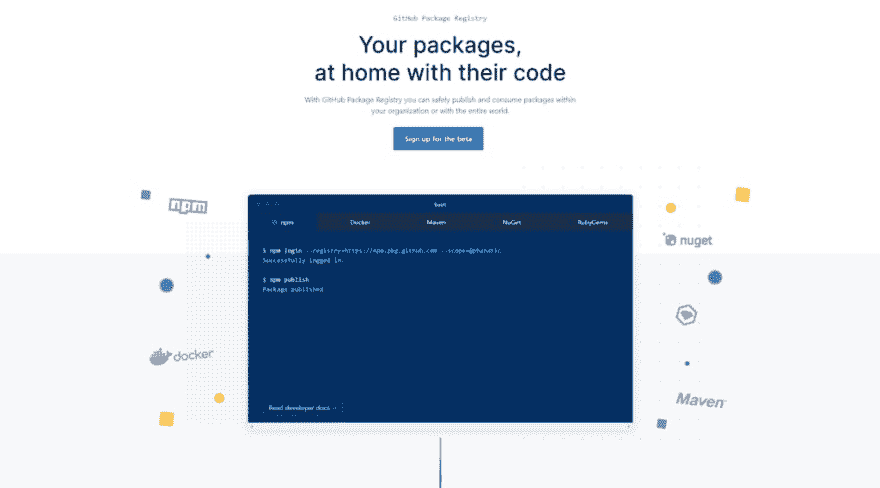
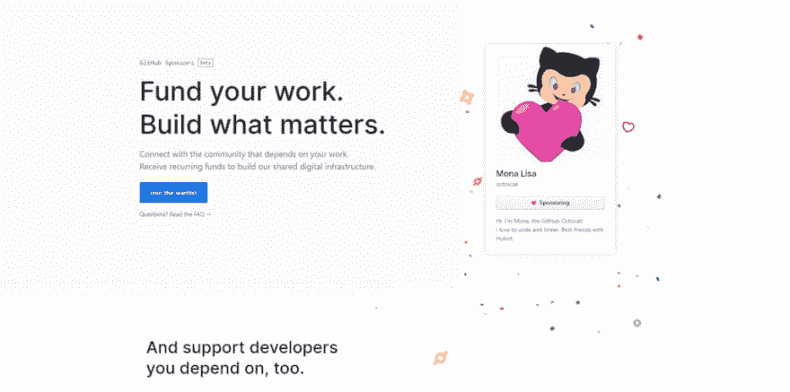
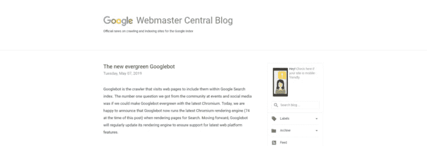
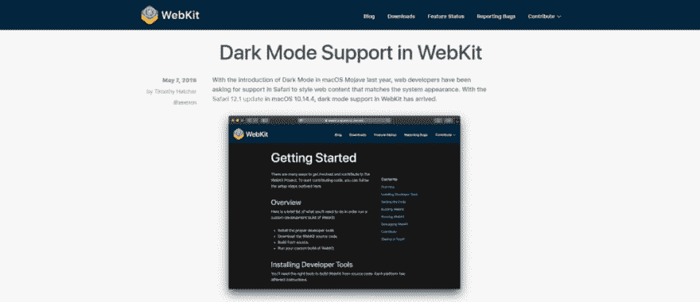
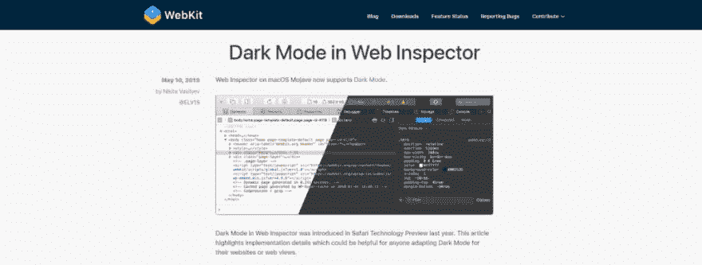

# 前端新闻#2: GitHub 包管理器和赞助商，Evergreen GoogleBot 和黑暗模式浏览器

> 原文：<https://dev.to/adriansandu/front-end-news-2-github-package-manager-and-sponsors-evergreen-googlebot-and-dark-mode-browsers-5age>

 

<figcaption>机器人插图来自 unDraw.com</figcaption>

大家好，欢迎来到另一个版本的前端新闻，这是一系列文章和视频，为您带来行业最新事件的信息。

这是我今天为你们准备的:

*   GitHub 通过开放自己的包管理器和发起赞助商计划占据了首页
*   GoogleBot 走向常青
*   WebKit 现在支持黑暗模式
*   Mozilla 发布了火狐 67 版本

就像上次一样，我也为那些喜欢听而不是读的人准备了一个视频版本。尽情享受吧！

[https://www.youtube.com/embed/jNR_5g5bUaI](https://www.youtube.com/embed/jNR_5g5bUaI)

### GitHub 公告

GitHub 在本月早些时候引起了轩然大波，当时他们宣布推出 GitHub 包注册表的有限测试程序，这是他们的新包管理服务。这将允许开发人员从用于管理他们自己的应用程序代码的同一个接口发布公共和私有包。目前，该服务与 npm、Docker、Maven、NuGet 和 RubyGems 兼容，该列表将在未来扩展。

<figcaption>[https://github.com/features/package-registry](https://github.com/features/package-registry)</figcaption>

5 月 23 日，GitHub 赞助商计划正式启动，这是另一个震惊业界的消息。这为人们向开源贡献者提供直接的经济支持开辟了道路。更令人兴奋的是，GitHub 将在项目的第一年为每个受资助的开发者匹配高达 5000 美元的捐款。支付处理成本也包括在内，直到明年的这个时候，开发商自己不会收取任何费用。

<figcaption>[https://github.com/sponsors](https://github.com/sponsors)</figcaption>

### GoogleBot 走向常青

谷歌网站管理员博客上的一项声明显示，谷歌机器人现在已经常青。这意味着，从现在开始，网络爬虫将一直使用最新版本的 Chromium(目前是 74 版本)。此次升级包含了 1000 多项新功能，如支持 ES6 和更新的 JavaScript 功能，支持通过 IntersectionObserver 进行延迟加载，以及支持 WebComponents v1 APIs。

<figcaption>[https://webmasters . Google blog . com/2019/05/the-new-evergreen-Google bot . html](https://webmasters.googleblog.com/2019/05/the-new-evergreen-googlebot.html)</figcaption>

### WebKit 支持黑暗模式

黑暗模式无处不在，Windows 10 和 MacOS Mojave 都支持它。为了让网上冲浪更加身临其境，WebKit 宣布 12.1 Safari 版本内置了对黑暗模式的支持。通过一点巧妙的编码，任何网页都可以兼容亮视图和暗视图模式。

<figcaption>[https://webkit.org/blog/8840/dark-mode-support-in-webkit/](https://webkit.org/blog/8840/dark-mode-support-in-webkit/)</figcaption>

不仅网页可以在黑暗模式下浏览。Safari 中的 Web 检查器工具现在与 MacOS Mojave 中设定的配色方案相匹配。宣布这一版本的博客帖子也展示了实现这一转换的过程的亮点。这些注释对其他想要扩展应用程序支持的开发人员可能会有所帮助。

<figcaption>[https://webkit.org/blog/8892/dark-mode-in-web-inspector/](https://webkit.org/blog/8892/dark-mode-in-web-inspector/)</figcaption>

### 火狐 67 发布

随着 Firefox 版本 67 的发布，我们的黑暗面之旅将继续。这个版本的流行浏览器还支持`_prefers-color-scheme_`媒体查询，允许开发者为他们的网页和应用程序启用黑暗模式。Chrome 现在是唯一一个黑暗模式还不可用的主流浏览器，但该功能将在今年晚些时候发布。

<figcaption>[https://hacks . Mozilla . org/2019/05/Firefox-67-dark-mode-CSS-web render/](https://hacks.mozilla.org/2019/05/firefox-67-dark-mode-css-webrender/)</figcaption>

本次更新中内置了许多其他功能，我将列举其中最重要的功能:

*   WebRender 首次在稳定版本中可用
*   Firefox 开发工具通过一个更好的 JavaScript 调试器得到了增强，而一些很少使用的工具已经被弃用
*   每个已安装的版本都有不同的默认配置文件，这使得并排运行不同的版本更加容易
*   增强的隐私控制
*   更轻松地访问帐户和保存的密码
*   在所有主要桌面平台上支持 AV1 下一代视频编解码器

要了解此版本中的完整变更列表，您可以查看官方文档，网址为[https://developer . Mozilla . org/en-US/docs/Mozilla/Firefox/Releases/67](https://developer.mozilla.org/en-US/docs/Mozilla/Firefox/Releases/67)

这是我为这个版本做总结的地方。下一集计划于周五在 YouTube 上播出，而这篇文章将于下周一在这里发表。请在媒体上关注前端 Nexus，并在 Twitter 上关注 https://twitter.com/frontendnexus 的，以便在更新发生时得到通知。我还想鼓励你在 https://www.youtube.com/channel/UCgACtqiDmnSaskDIBsK54ww[的](https://www.youtube.com/channel/UCgACtqiDmnSaskDIBsK54ww)订阅 YouTube 频道。一旦该频道达到 100 个订户，我就可以获得一个自定义 URL，因此非常感谢您的支持。

祝您度过愉快而富有成效的一周，我们下次再见！

* * *