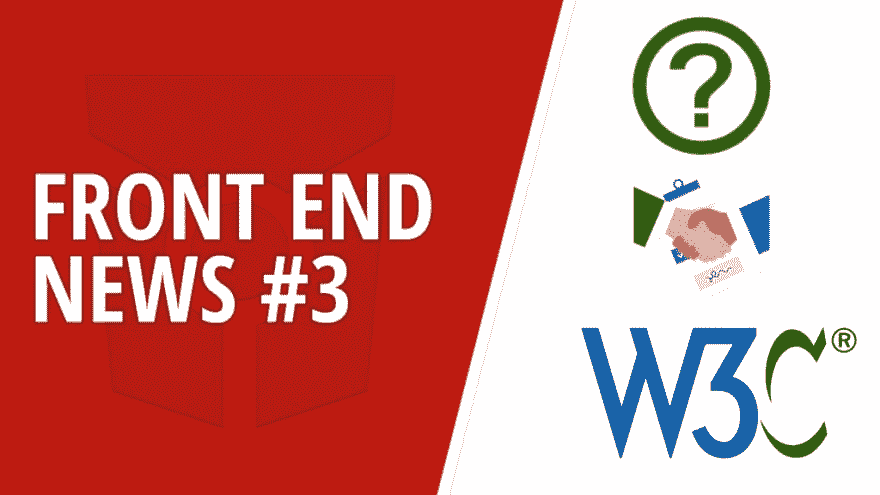
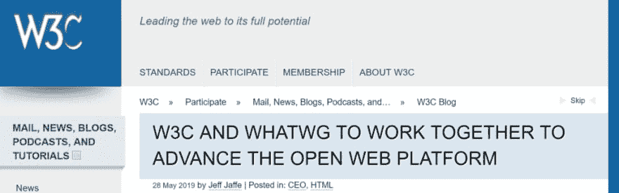
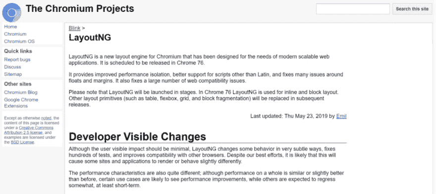
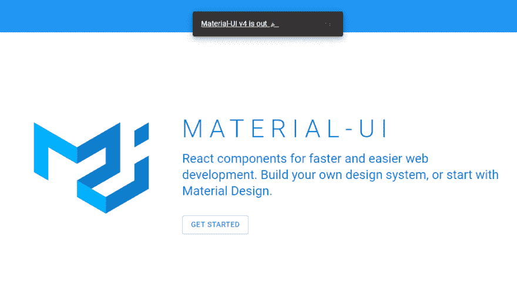
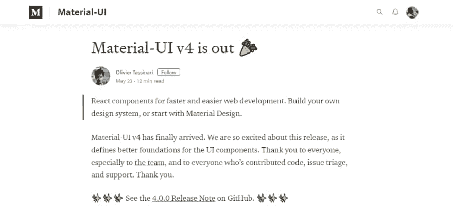
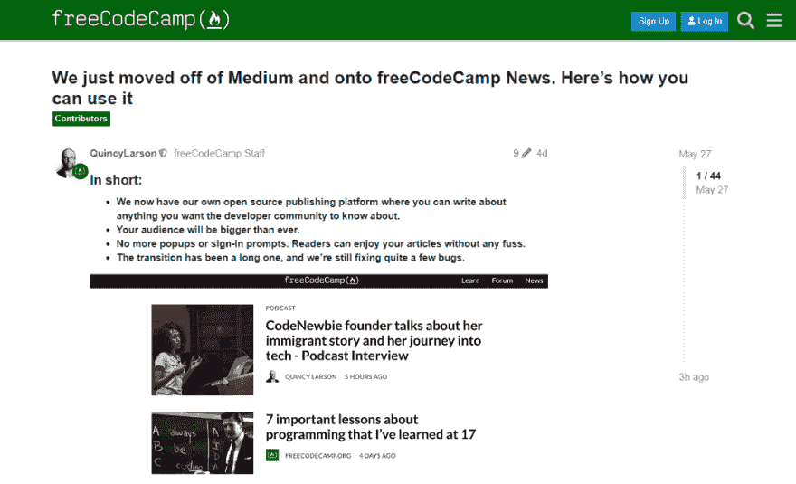
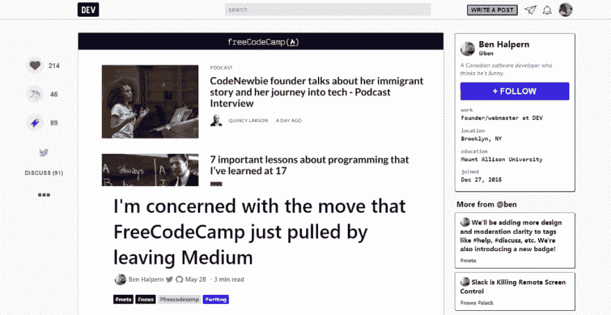

# 前端新闻#3: W3C 和 WHATWG 合作，Material-UI v4 和 FreeCodeCamp 脱离媒体

> 原文：<https://dev.to/adriansandu/front-end-news-3-w3c-and-whatwg-collaboration-material-ui-v4-and-freecodecamp-moves-off-medium-dm9>

大家好，欢迎来到另一个版本的前端新闻，这是一系列文章和视频，为您带来行业最新事件的信息。

这是我今天为你们准备的:

*   互联网的力量将共同推进开放网络平台
*   LayoutNG 计划在 Chrome 76 中发布
*   材质-UI v4 已过时
*   FreeCodeCamp 正在脱离媒介，走向自己的平台

就像上次一样，我也为那些喜欢听而不是读的人准备了一个视频版本。如果你也喜欢这种格式，如果你也订阅 YouTube 频道，我将不胜感激。

[https://www.youtube.com/embed/HVYTyroP390](https://www.youtube.com/embed/HVYTyroP390)

### W3C 和 WHATWG 将合作推进开放网络平台

第一个话题是 W3C 和 WHATWG 新宣布的合作。现在，是不是有点拗口？W3C 代表万维网联盟，是负责定义和维护万维网标准的组织。另一方面，WHATWG 或 Web 超文本应用技术工作组是一个对发展 HTML 和相关技术感兴趣的人的社区。

万维网联盟发布了一篇博客文章，宣布它已与 Web 超文本应用技术工作组签署了一项协议，共同开发一套 HTML 和 DOM 规范。这两个实体发表了一份谅解备忘录，确定了每个组织从现在起将发挥的作用。

<figure>

<figcaption>[https://www . w3 . org/blog/2019/05/W3C-and-whatwg-to-work-together-to-advance-the-open-web-platform/](https://www.w3.org/blog/2019/05/w3c-and-whatwg-to-work-together-to-advance-the-open-web-platform/)</figcaption>

</figure>

HTML 和 DOM 将合作开发，以产生生活标准规范，以及建议和审查草案快照。W3C 将停止独立发布此类标准，并将努力将新的审查草案转化为 W3C 建议。

如果您对此次合作的细节感兴趣，您可以在以下链接的文档中找到更多详细信息:

*   [https://www.w3.org/2019/04/WHATWG-W3C-MOU.html](https://www.w3.org/2019/04/WHATWG-W3C-MOU.html)
*   [https://en.wikipedia.org/wiki/World_Wide_Web_Consortium](https://en.wikipedia.org/wiki/World_Wide_Web_Consortium)
*   [https://en.wikipedia.org/wiki/WHATWG](https://en.wikipedia.org/wiki/WHATWG)

### LayoutNG 计划在 Chrome 76 中发布

从 76 版开始，Chrome 将配备一个新的布局引擎，名为 LayoutNG。官方声明提到，更新将为非拉丁文字提供更好的支持，并将修复许多浮动和边距问题，以及许多其他 web 兼容性问题。更详细地提到了一些改进，通过示例展示了当前显示模式和使用 LayoutNG 创建的改进模式之间的差异。

<figure>

<figcaption></figcaption>

</figure>

新引擎的采用将分阶段进行，Chrome 76 仅使用 LayoutNG 进行内联和块布局。进一步的更新将扩展到其他布局案例的使用，如表格、flexbox 或网格。

### 材质-UI v4 已出

Material-UI 是一组根据材质设计框架构建的 React 组件。版本 4 是第二次重大更新，因为开发者跳过了 v2，而 v3 只引入了与浏览器支持相关的微小变化。

<figure>

<figcaption></figcaption>

</figure>

v4 中的一些主要改进包括更好的定制(根据材料主题指南)，改进的性能和下载大小，以及为进一步的开发做准备。

<figure>

<figcaption>[https://medium . com/material-ui/material-ui-v4-is-out-4b 7587 D1 e 701](https://medium.com/material-ui/material-ui-v4-is-out-4b7587d1e701)</figcaption>

</figure>

对使用这组组件感兴趣的人可以使用改进的文档和 Packt 出版的 brand a cookbook 来学习如何使用这些组件。另一个选择是仍在开发中的高级主题商店，人们可以在那里购买只需要最少定制的现成解决方案。

### FreeCodeCamp 正在脱离介质

FreeCodeCamp 是网络上最大的开发者社区之一，拥有超过 135，000 名用户。他们提供免费的教程、课程和各种主题的编码挑战。

5 月 27 日，FreeCodeCamp 的创始人昆西·拉森(Quincy Larson)在一个论坛帖子中宣布，他们已经将所有内容从媒体转移到自己的 Ghost-powered 新闻平台。这一变化的主要原因是来自 Medium 的流量减少，以及最受欢迎的文章被移到了付费墙后面。虽然最初的 5000 篇文章(其中大部分是由投稿人撰写的)仍然可以在媒体上看到，但它们已经在内部平台上交叉发布。

<figure> 

<figcaption>我们刚刚离开了媒体，转而关注自由代码营新闻。下面是使用方法——[https://www . freecodecamp . org/forum/t/we-just-moved-off-of-medium-on-freecodecamp-news-heres-how-you-can-use-it/279929](https://www.freecodecamp.org/forum/t/we-just-moved-off-of-medium-and-onto-freecodecamp-news-heres-how-you-can-use-it/279929)</figcaption>

</figure>

然而，这一转变并不完全顺利。一方面，有许多技术和格式问题，这在如此大规模的变动中是可以预料的。另一方面，可能存在一个问题，即 FreeCodeCamp 是否有权在未经投稿人明确同意的情况下移动他们的文章。

本·哈尔彭，Dev 的创始人。To 是另一个广受欢迎的开发者社区，他表达了自己的担忧，认为此举不仅违反了中期服务条款，还侵犯了投稿作者的权利。由于这一过程，这些文章甚至在没有通知原作者的情况下就被发布到了 FreeCodeCamp 平台上，它们有错误的规范 URL，并且在许多情况下，作者已经默认使用了`freeCodeCamp.org`帐户。同时，每个作者必须亲自请求工作人员创建一个新帐户，然后该帐户将被记为作者。

<figure> 

<figcaption>我关注的是 freeCodeCamp 刚刚被离职 Medium 拉走的举动—[https://dev . to/Ben/I-m-concerned-with-the-move-that-freeCodeCamp-just-pulled-by-leaving-Medium-io8](https://dev.to/ben/i-m-concerned-with-the-move-that-freecodecamp-just-pulled-by-leaving-medium-io8)</figcaption>

</figure>

Ben 并没有指责 FreeCodeCamp 的恶意意图，但他确实认为迁移过程没有经过适当的思考，并指出 HackerNews 是另一个离开 Medium 的主要实体，他是在一个公开透明的过程中进行的。在 FreeCodeCamp 和 Dev.to 论坛上，讨论仍在继续。

这一版就这么多了。在 https://twitter.com/frontendnexus[的 Twitter 上关注 Front End Nexus](https://twitter.com/frontendnexus),以便在更新发生时得到通知。我还想鼓励你订阅 T2 YouTube 频道 T3。一旦该频道达到 100 个订户，我就可以获得一个自定义 URL，因此非常感谢您的支持。

祝您度过愉快而富有成效的一周，我们下次再见！

* * *