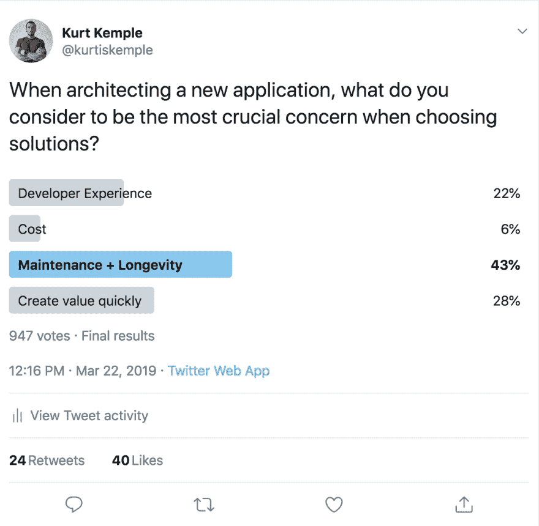

# 全栈无服务器

> 原文：<https://dev.to/kkemple/fullstack-serverless-440e>

## 发展格局千变万化

近年来，后端和前端开发都发生了巨大的变化。随着客户端变得越来越有状态，支持它们的服务也变得越来越瘦，越来越无状态。管理所有这些微小服务和功能的复杂性正在被抽象化，允许那些没有 devops 技能的人利用无服务器技术。随着客户机越来越多，管理状态以及与任何数量的后台服务或 API 的交互也变得越来越复杂。工具和框架已经开始出现，从开发人员那里抽象出来，允许他们专注于快速构建产品。

那么，我为什么要提起这个？因为我觉得所有这些变化最终会以一种新的方式构建应用程序。它利用了我们在过去几年中看到的前端和后端的变化，允许开发人员在非常短的时间内在有服务的服务之上构建真正有趣的应用程序。

## 有服务无服务器

在后端，我们已经看到计算能力成为一种商品，引发了无服务器的发展。然而，如果您曾经以真正无服务器的方式构建过任何东西，那么您就会知道，您所获得的可伸缩性和成本节约伴随着越来越多的复杂性。

如果你认为管理微服务很糟糕，试着将其中一个微服务的所有功能分散到各自的位置，然后通过事件将它们粘在一起。😱

虽然无服务器肯定有它的优势，但它不是为了虚晃一枪。做好并不容易，通常需要后端开发团队数月的工作。Ben Kehoe 比我在链接的帖子中更好地解释了为什么要使用无服务器，但我可以说，你选择无服务器是因为专注的价值。

归根结底，我们希望快速创造价值。希望不会以牺牲开发人员的体验和安全性为代价，但是我们确实希望尽可能少地编写代码来解决业务问题。也许甚至没有...

我们如何利用无服务器的优势，而不必自己管理新的复杂性？一般来说，随着给定技术的发展，它会经历复杂性的转变。虽然 serverless 本身由 lambda 函数、主题配置和事件管理组成，但在它的基础上构建了一些更高级别的抽象，使得它对那些可能认为自己是前端或产品开发人员的人来说实际上非常友好。

这反过来又带来了一批[实用的无服务器](https://medium.com/@dabit3/full-stack-development-in-the-era-of-serverless-computing-c1e49bba8580)产品，它们利用了无服务器的可扩展性，但将其抽象为解决特定问题领域的有意义的产品。Nader Dabit 在我前面链接的文章中列举了一些很好的服务例子。他在文章中说:

> 服务性服务的几个例子包括 **Auth0 / Amazon Cognito** (托管认证) **Algolia** (托管搜索) **Contentful** (内容基础设施)**AWS app sync/Cloud Firestore**(托管 API 服务)**Amazon Lex/Rekognition/Textract**(机器学习服务)，以及 **Cloudinary** (托管图像&视频托管服务)。- *Nader Dabit，无服务器计算时代的全栈开发*

## UI 工具包和框架

在前端，我们也看到了复杂性的大幅增加，再次借用 Nader Dabit 的话，他解释了什么发生了变化，使事情变得更加复杂:

> 由于 spa 的兴起、更复杂的数据问题、多设备目标和用户体验期望的提高，客户端开发在过去十年左右变得更加复杂。- *Nader Dabit，无服务器计算时代的全栈开发*

然而，伴随着这种复杂性而来的是一些令人惊叹的工具和框架。这些抽象使得管理新的复杂性变得更加容易，允许开发人员专注于创造价值。最棒的是，我们不必以牺牲可访问性和安全性为代价。我们把它融入到解决方案中。

公平地说，这些工具提供了焦点。他们允许你严格处理业务问题，并为你处理所有的技术问题。这反映了后端的相同变化和无服务器计算的发展。

像 [Expo](https://expo.io/) 、 [Ionic](https://ionicframework.com/) 、 [Gatsby](https://www.gatsbyjs.org/) 和 [Meteor](https://www.meteor.com/) 这样的框架使得基于它们的构建模块构建生产就绪的高质量应用成为可能。

## 两全其美

我们现在看到的是包含了这两个世界的精华的平台。为应用程序的整个开发生命周期提供解决方案。与构建自己的无服务器基础设施和工具相比，构建可以毫无疑问地扩展的成熟应用程序要容易得多，而且成本更低。像  、  、  和  这样的解决方案提供了全套功能，如工具包和 API、数据存储、文件存储以及构建和部署服务。我将这些类型的平台称为`Full-stack Serverless`。它们提供的特性集通常涵盖从命令行工具到后端服务，以及两者之间的一切。

我最近在 Twitter 上做了一个[民意调查，我问道:“当设计一个新的应用程序时，你认为选择解决方案时最重要的考虑是什么？”](https://twitter.com/kurtiskemple/status/1109126793938767872)

不足为奇的是，大多数人投票支持“维护和长寿”，排在第二位的是“快速创造价值”。维护和寿命排在第一位并不奇怪，因为当你负责自己的服务器或确保你的应用程序安全和高性能时，会有很多额外的技术问题代码。解决技术问题而不是商业问题的代码。

这就是为什么我认为未来我们不会处理服务或应用的维护和寿命，因为我们会将这一负担转移到有服务价值的服务上。这样做可以让你专注于制造能够快速创造价值的产品。

在投票中，开发人员体验排在交付价值之后，这很有趣，因为我觉得为了让解决方案在这个领域运行，开发人员体验就是一切。很多人害怕供应商锁定...除非他们所使用的东西提供了如此令人愉快的开发体验，以至于他们相信你能得到他们所需要的，并且事实上关心他们的成功。

当你选择加入的时候，是因为你觉得这个平台已经足够提高你的工作效率，不使用它是没有意义的。你是寻求快速创造价值的人之一，专注于构建你的应用，而不是构建你的基础设施。这就是我陷入的困境，这就是为什么我总是滔滔不绝地谈论像 Gatsby 和 Expo 这样的解决方案，我想立即构建产品，并知道其余的事情已经为我处理了，现在你告诉我我不再需要考虑如何处理数据、身份验证、用户和内容。签名。我。向上。

我认为之前一直存在对规模的担忧，这使得购买这些全栈解决方案变得困难，但随着无服务器的发展，我认为这一想法变得更加可行。我认为我们正处于全栈无服务器平台新时代的早期阶段，我非常期待看到事情的发展。