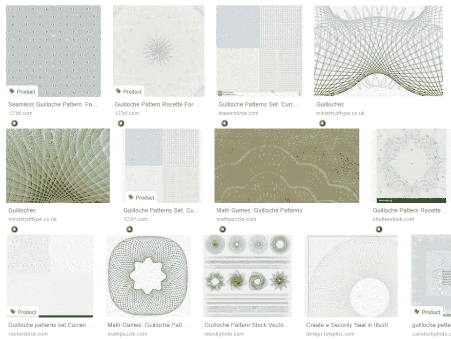
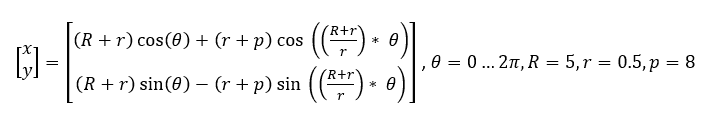
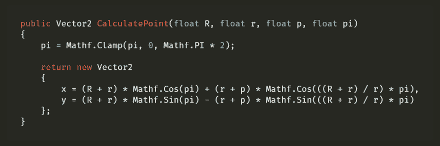
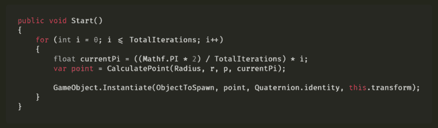
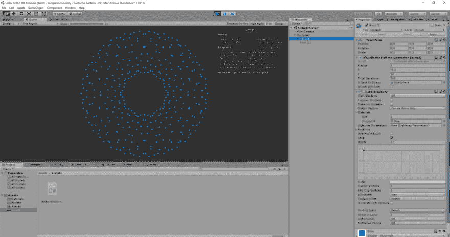
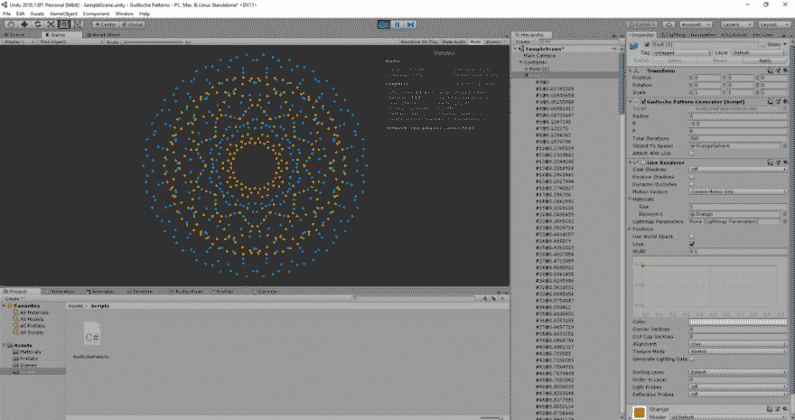
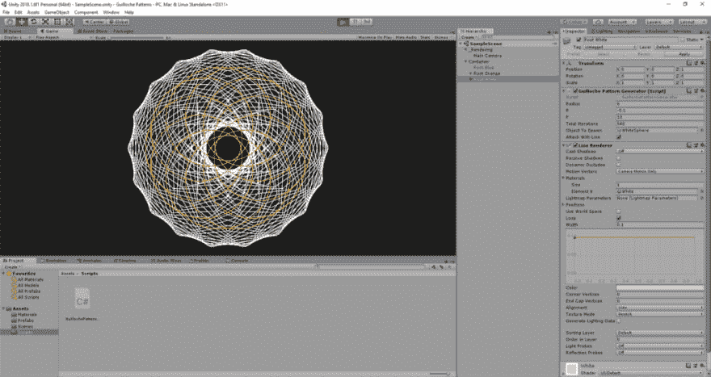
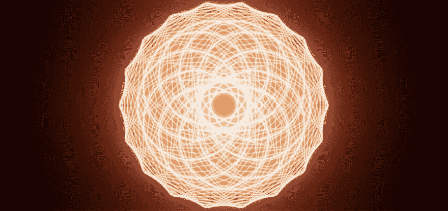

# 有趣的统一和扭索图案

> 原文：<https://dev.to/ginomessmer/fun-with-unity-and-guilloche-patterns-4k87>

我正在为我的一个前端项目寻找基于 Guilloché图案的花式股票图像，你知道，这些花式图案被用于各种钞票，作为防止篡改的附加安全功能。

<figure> 

<figcaption>在这里没钱说话。我们将看看“100”数字标签</figcaption>

</figure>

背后的著名图案

然而，我还没有找到任何免费的，我也懒得在 Illustrator 或任何其他矢量图形编辑器中创建一个，因为我缺乏这方面的经验。

所以我继续前进，并决定在很长一段时间后再次启动 Unity3D，并在 2D 玩得开心。

### 我们从哪里开始？

首先，一些背后的故事背后的扭索图案。许多人都熟悉这种或多或少看起来像这样的模式:

大多数人把它与装饰或金钱联系在一起。这种图案可以追溯到 18 世纪，当时人们已经开始将这种图案用于家具和手表等奢侈品。

它开始使用，并且还被用作各种商业产品和物品如钞票的附加安全层的密封。

让我们来看看一些快速数学:

这个公式允许你计算图案的给定点。改变其中一个变量会完全改变结果，从而使 Guilloché模式安全可靠并经过实战检验。

这就是我们实际需要知道的一切。是时候创建一个新的 Unity 项目了。我使用默认的 2D 模板进行最小化设置。

### 脚本

使用上面的公式，我们可以创建一个新的方法，允许我们计算一个特定点的矢量:

有了这个设置，我们可以从我们的启动方法开始这个方法:

让我们快速看一下:

看起来很别致，不是吗？让我们放下另一个有不同选项的预设。

现在让我们添加一个线渲染器来连接每个点，以获得一些额外的曲率:

让我们做一些实际的调整，用一些后期处理效果来增加整个场景的趣味——因为我们可以:

[https://medium . com/media/a 714 bcffe 388 BF 2642 f 793 FD 22 c 53 f 9 a/href](https://medium.com/media/a714bcffe388bf2642f793fd22c53f9a/href)

我们可以做更多疯狂的事情，但我会把它留给你。查看我的 [GitHub 库](https://github.com/ginomessmer/fun-with-unity-and-guilloche-pattern)，并随意分享你的收获。看起来数学有时真的很美很有趣。

* * *