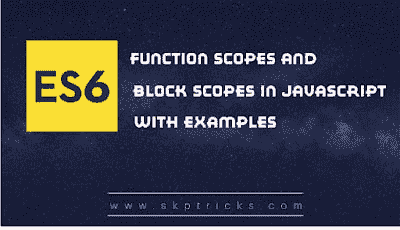

# JavaScript 中的函数范围和块范围

> 原文：<https://dev.to/skptricks/function-scopes-and-block-scopes-in-javascript-423i>

Post 链接:[JavaScript 中的函数作用域和块作用域](https://www.skptricks.com/2018/12/function-scopes-and-block-scopes-in-javascript.html)

在本教程中，我们将讨论 JavaScript 中什么是函数作用域和块作用域。在 javascript 中，块的作用域不同于函数的作用域，看下面的例子，你会对此有更多的理解。

[JavaScript 中的函数作用域和块作用域](https://www.skptricks.com/2018/12/function-scopes-and-block-scopes-in-javascript.html)

