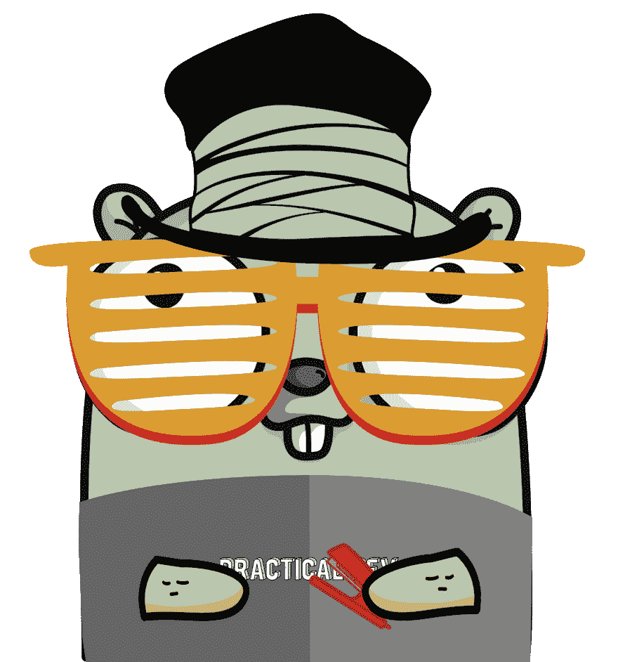

# 用 dcode 在 Go 中进行函数式编程

> 原文：<https://dev.to/arschles/functional-programming-in-go-with-dcode-2p3c>

回到 2017 年，我在 GopherCon 做了一个关于用 Go 做函数式编程的[演讲](https://www.youtube.com/watch?v=c8Fwb4KbVJM)。我上台讲了一些 FP 基础像`Functor` s，高阶函数之类的。我听到一些反馈说，在 Go 有泛型之前，在 Go 中做 FP 是不实际的(不要着急，伙计们，[契约](https://go.googlesource.com/proposal/+/master/design/go2draft-contracts.md)已经摆在桌面上了！).

这并没有阻止我。我甚至在 gopherize.me 上做了一个地鼠，以此在 Go 上秉承 FP 的精神:

[](https://res.cloudinary.com/practicaldev/image/fetch/s--iPTvApq3--/c_limit%2Cf_auto%2Cfl_progressive%2Cq_auto%2Cw_880/https://thepracticaldev.s3.amazonaws.com/i/drodioqdvko89xb7864s.png)

的确，契约对于函数式 Go 代码来说是一个巨大的福音，但是在 Go *中没有*泛型我们也可以做很多函数式编程。

**在 Go 中做 FP 不需要泛型。**

# dcode

当我在 2017 年开始写那篇演讲时，我创建了[github.com/go-functional](https://github.com/go-functional)GitHub 组织来举办在围棋中进行 FP 的实验项目。

除了我在幻灯片上展示的位于[核心](https://github.com/go-functional/core)中的代码，我还原型开发了其他一些函数库，比如 [quicktest](https://github.com/go-functional/quicktest) 和纯函数型 [SQL 查询构建器](https://github.com/go-functional/query)。我真正了解的一个领域是 JSON，这就是`dcode`的诞生。

## 灵感

很久以前，我用 Scala 和 [lift-json](https://github.com/lift/lift/tree/master/framework/lift-base/lift-json/) 构建了 web 服务。这个库为 JSON 对象提供了一个纯粹的功能树表示。对于深度遍历，它也相对较快。

最近，我发现了 Elm 语言 T1，尤其是它的 T2 JSON 解析器 T3。这个解析器接口是一个简洁的 DSL，可以让你说你想要遍历一个 JSON 对象。它是不可思议的自文档化，即使在处理大型 JSON 对象时也是如此。事实上，DSL 看起来与 [JSONPath](http://jsonpath.com/) 相似。

Elm API 使得任何人都可以访问 lift-json 树表示，而不需要他们编写自己的树遍历代码。

## 用法

您可以编写一行代码，根据需要遍历 JSON 对象中任意数量的层。

例如，如果您有这个 JSON(改编自 JSONPath 页面):

```
{  "firstName":  "John",  "lastName"  :  "doe",  "age"  :  26,  "address"  :  {  "streetAddress":  "naist street",  "city"  :  "Nara",  "postalCode"  :  "630-0192",  "accessInstructions":  {  "gate":  true,  "message":  "Please dial 0123 so I can buzz you into the gate"  }  }  } 
```

如果你想得到`$.address.accessInstructions.message`(也就是地址访问指令对象中`message`字段的值)，你可以写这段代码来创建一个解码器，当它被调用时，它会试图从你给它的任何 JSON 中取出那个值。

```
decoder := Field(
    "address",
    Field("accessInstructions"),
    Field("message", String()),
) 
```

还有一个累加器接口，所以你不必把所有这些调用都嵌套到`Field` :

```
decoder := First("address").Then("accessInstructions").Then("message").Into(String()) 
```

# 为什么？

`dcode`显然不适合每一个用例。如果您希望解码一个有很多键的大型 JSON 对象，并且每次传入的 JSON 值都是相同的，那么您很可能会更成功地编写一个`struct`并使用 [`encoding/json`](https://godoc.org/encoding/json) 解码成它(尽管`dcode`确实有解码成`struct`的功能)。

然而，这个库在某些情况下表现很好:

*   **你需要遍历深层 JSON 对象来获取值**。对于需要使用大型 JSON API 的一小部分的程序来说，这种用例很常见
*   **你提前不知道物体的“形状”**。通常，你会想一次尝试几种不同的解码策略。这个用例在处理遗留 API 客户端的 web 应用程序中很常见

因为`dcode`是基于函数式编程原则的，所以它也有两个有用的模式:

#### 可组合的

你构造的每一个`Decoder`(用`Field`或`First()...Into()`)都是一个无状态的函数，大约是:

```
func (d *Decoder) Decode(b []byte, i interface{}) error 
```

> 注意:我在这里写了这个函数作为例子。它在库中不存在，但是您可以使用[顶级`Decode`函数](https://godoc.org/github.com/go-functional/dcode#Decode)来获得相同的结果。

当然，这个函数签名看起来很像 [`(encoding/json).Unmarshal`](https://godoc.org/encoding/json#Unmarshal) ，很有亲切感。

更重要的是，这些`Decode`函数是通过将其他`Decode`函数组合在一起构建的。`Field`或`First()...Into()`接口都支持这种组合。

这个 API 使得如何构建 JSON 解码逻辑变得显而易见，并且重构起来也很简单。这也确实鼓励了与`Decoder`的“泄漏”到代码库的其他部分相同的可组合性

> 加分:`dcode`本身就很重构图优势。看看 [`Map`](https://godoc.org/github.com/go-functional/dcode#Map) 和 [`OneOf`](https://godoc.org/github.com/go-functional/dcode#OneOf) 的例子。

#### 松散耦合

`Decoder` s 是解码 JSON 对象的指令，它们可以单独存在，没有 JSON 应该解码成的值。这允许您将`Decoder` s 传递给任何函数，以便它可以将任何 JSON 解码成它认为合适的任何值。将来，我们可能会考虑添加功能来序列化和反序列化`Decoder`本身，这样你就可以通过网络传递它们。

相比之下，如果使用`encoding/json`来解码 JSON，通常会创建一个`struct`来定义 JSON 的“形状”。这个 API 要求值(结构字段)和解码指令(反射的字段名或结构标签)紧密耦合。

# 开始吧！

查看[自述文件](https://github.com/go-functional/dcode/blob/master/README.md)，了解更多关于如何以及为什么使用`dcode`的信息。当然，这是一项正在进行的工作，所以如果你发现有什么遗漏、错误或者只是简单的错误，请不要害羞，请[提交问题](https://github.com/go-functional/dcode/issues/new)！

继续摇滚吧，地鼠们