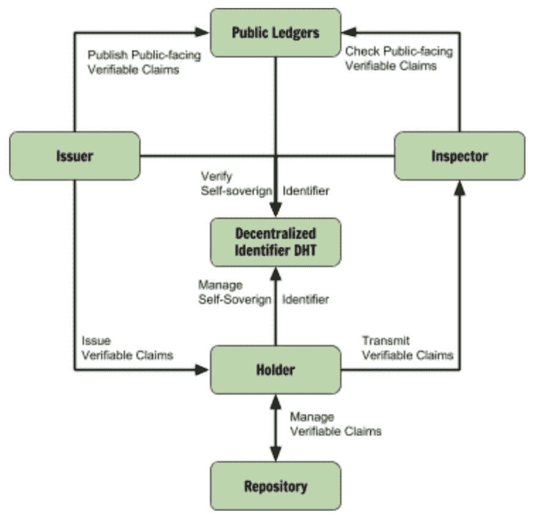

# 未来发展-分散身份

> 原文：<https://dev.to/radixdlt/future-developments-decentralized-identity-2emo>

# 摘要

[分散标识符(DIDs) v0.11](https://w3c-ccg.github.io/did-spec/) 规范定义了互联网上分散、自主身份层的标准，可由任何 DLT 实施。它定义了如何构造标识，如何建立和允许通信。[SOV rin 基金会](https://sovrin.org/wp-content/uploads/2018/03/Sovrin-Protocol-and-Token-White-Paper.pdf)扩展了该标准的权利要求规范和权利要求定义，以使其在 W3C 官方权利要求标准制定过程中得到广泛应用。Sovrin 进一步用 [Hyperledger Indy](https://github.com/hyperledger/indy-sdk) 提供了他们规范的开源实现。

# 动机

传统的身份管理系统是基于诸如政府、公司目录服务、认证机构或域名注册机构等中央机构。要在没有中央机构的情况下跨这些系统进行身份管理，需要标准化的分散式身份管理。

# 概述

# 标识符

引入分散标识符(did)以促进分散环境中的可信识别；

-DID 是一个永久的标识符，它解析为一个资源，该资源用作 DID 的描述和配置(DID 描述符对象或 DID 文档)。
-DIDs 不需要中央机构来注册、解决、更新或撤销。
-did 可以拥有可加密验证的所有权和相关元数据。

# 做了文档

每个 DID 都有一个相关的 DID 文档，其中包含加密材料、身份验证套件和服务端点。与认证套件相结合的密码材料提供了一组认证机制(例如，公钥、替代假名生物特征协议等)。).此外，可选的服务端点支持与 DID 所有者的可信交互。

# 类型

为了符合上面定义的要求，DID 可以被实现为没有密码属性、密码标识符(CID)或具有别名的纯 DID。请注意，这些变体被视为 DIDs 的子群。

# 纯粹干了

纯 DID 是没有任何加密能力的通用唯一标识符(即，没有私钥，没有签署任何东西的能力)。用 UUIDs 实现，在所有者当前无法存储私钥时使用(例如，难民)。pure DID 的一个例子可能是这样的:

`did:76d0cdb7-9c75-4be5-8e5a-e2d7a35ce907`

# 密码标识符(CID)

加密标识符或 CID 是一个全球唯一的标识符，它是根据加密密钥材料通过算法生成的，因此它具有特定的加密属性。本质上，CID 是公钥或从公钥(例如，截断的散列)中生成的值，这使其能够对事物进行加密签名。CID 示例可能如下所示:

`cid-1:MIIBIjANBgkqhkiG9w0BAQEFAAOCAQ8AMIIBCgKCABMC`

# 别名

别名是“使用指定的规范化算法和指定的散列算法产生的传统地址的散列”别名“Walter”的示例可能如下所示:

`sha-256:e3b0c44298fc1c149afbf4c8996fb92427ae41e4649b934 ca495991b7852b855`

# 声称

声明是由一个 DID(发行人)对其自身或另一个 DID(持有人)作出的由第三方(检查员)检查的特定结构的签名证明。这种结构由声明定义(或声明模式)决定，所有参与者都可以获取、比较和理解声明定义。有 5 种基本类型的声明可用于提供特定级别的信息安全，从公开到加密再到私有。

# 明文主张

明文声明是没有任何加密的声明。它们通常用于公共分类帐索赔，例如，用于企业和组织的公共记录信息。

# 加密声明

加密文本声明是使用对称或非对称加密的明文声明的加密副本。

# 哈希签名声明

哈希签名声明是明文声明的特殊加密树。它们可用于选择性地向某些方揭示某些声明。

# 证明存在(POE)索赔

存在证明(POE)声明只是任何东西的散列。它们可用于证明某个对象(例如，签名的文档)在某个时间点存在，例如，证明 GDPR 所要求的同意。

# 匿名凭证传输声明

匿名凭证传输声明是表达为声明的零知识证明(“zk 证明”)的应用。它们可用于证明索赔，而无需透露实际信息，例如“21 岁以上”，有效护照，而无需透露实际年龄或护照。

账本上的信息是公开和永久的。因此，只有无法识别个人身份的数据才应该存储在那里。所有包含任何类型的私人数据的声明都应保留在分类帐外，并且只能通过安全且不相关的方式共享(在 Sovrin 中定义的点对点通信，在 Hyperledger:Indy 中实施)。

# 挂帐

-分散的标识符和相关的 DID 文档。
-声明定义
-数据共享同意证明
-公共声明
-撤销注册

# 明细账

-任何种类的私人数据(包括散列的个人数据)
-存在的私人证明

为了广泛采用分散式身份识别系统，我们需要降低准入门槛并改进加入流程。因此，我们认为应该定义一种灵活的、简短的、人类可读的名称和资源标识符的解决方案，这些名称和标识符映射到帐户、数据或服务。

# 加入 Radix 社区

[电报](https://t.me/radix_dlt)普通聊天
[不和](https://discord.gg/7Q7HSZZ)开发者聊天
[Reddit](https://reddit.com/r/radix) 普通讨论
[论坛](https://forum.radixdlt.com/)技术讨论
[推特](https://twitter.com/radixdlt)发布公告
[电子邮件](https://radixdlt.typeform.com/to/nyKvMV)简讯每周更新
邮件[hello@radixdlt.com](//hello@radixdlt.com)普通查询