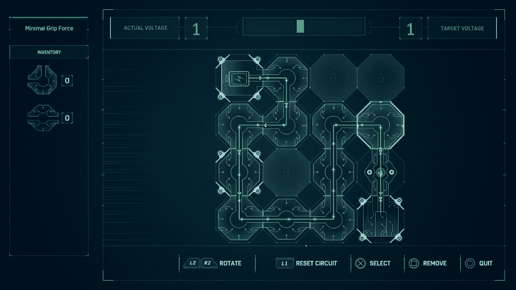
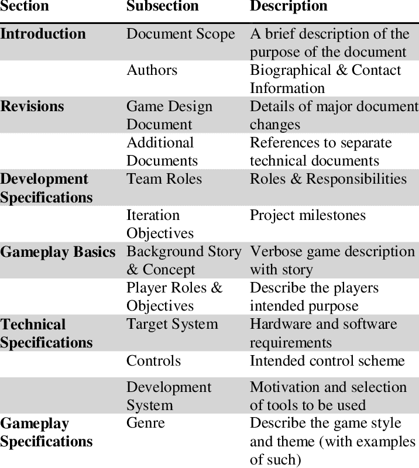
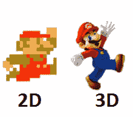

# 游戏开发管道和技术

> 原文：<https://dev.to/scottslatton/game-development-pipeline-and-technologies-h0b>

如果你想从事游戏开发，有很多途径可以选择，在这篇文章中，我将会介绍制作游戏的流程、工作职责和技术。我会尽可能多地加入链接，希望你将来能回到这篇文章，以此为起点，引领你沿着你想走的路走下去。我希望你也记住，你今天就可以开始使用 gamedev，完全免费。我认为知道你也不需要知道如何开始编码也很重要。

*注*:分析瘫痪是一个非常真实的事情，所以我建议如果你真的想进入游戏制作，从下面的大纲中挑选任何你感兴趣的东西，然后就去做吧。无论是什么，一定要深入研究，因为如果你站在旁观者的角度仔细挑选你的技术，你会被远远甩在后面。软件不断变化，但基本原则不会改变，所以开始做点什么吧！

## 什么是管道？

在游戏开发中，管道是一个清晰的、方法化的过程，用来生产进入游戏的资产和特性。我将带你大致了解一个游戏是如何创建的。

## 设计文档

这个过程从一个设计文档开始，被称为 GDD(游戏设计文档)，它概述了进入游戏的必要步骤和概述。本文件应被视为宜家游戏制作手册。它应该包括艺术灵感和某些决定背后的逻辑。你的 GDD 应该会有来自各个部门的关注，所以它需要尽可能的充实。对于一个人的团队来说，这份文档并不是必需的，但是我发现创建一个 GDD 是非常有趣的，它让我的想法脱离了幻想的领域，并使它更接近于实现。GDD 的作品集也可以作为未来项目的灵感来源，因为你可以从这些作品中获得灵感来创造新的东西。

## 原型制作

原型制作可以在 GDD 建造的任何时候进行。原型制作基本上就是在你开始数字化工作之前创建一个实体游戏。通过创建一个棋盘游戏或测试游戏引擎之外的机制，你可以很快决定什么有趣，什么不有趣。这是你应用你的[博弈论](https://dev.to/scottslatton/applying-game-theory-to-your-app-5337)知识的地方，检查你的资源是否平衡，激励是否存在。如果你渴望成为一名游戏设计师，你将很有可能在这个阶段生活和发展。在这个阶段，你可以评估关卡设计和玩家的决定和行动。[马里奥](https://qz.com/429862/the-original-super-mario-game-was-designed-on-graph-paper/)以只用绘图纸设计关卡而闻名。

### 使用的技术:

*   骰子
*   扑克牌
*   方格纸
*   Photoshop(用于制作定制卡片或地图)
*   铅笔和钢笔

## 2D vs 3D

在原型阶段，你可能已经做出了选择，但是一旦这个阶段结束，就需要做出决定了。你打算做一个 3D 游戏还是 2D 游戏？在做决定时，我认为最重要的一件事是考虑你的团队的规模。你是一个人的军队吗？如果是这样的话，你最好还是和 2D 呆在一起。这是因为 3D 带来了大量的工作。通过坚持 2D，你几乎可以专注于关卡设计、玩家互动和为玩家构思故事(如果这是你想要的)。有了 3D，你不仅要考虑动画和纹理(在 2D 被称为“精灵”)，而且你还必须模拟所有的资产，创造更多的东西，以填充玩家现在可以穿越的空间。

另一方面，3D 现在包含了增强现实(AR)和虚拟现实(VR)，即使没有这些技术，也会给玩家带来与 2D 完全不同的体验。无论如何，我不想阻止任何人开始 3D 冒险，但我希望他们为即将到来的斗争做好准备。

## 游戏引擎

游戏引擎是一个沙盒，你把游戏的所有部分放在一起。他们负责物体和玩家之间的碰撞和互动，以及网络和照明。*程序员*将主要在选择的引擎中工作。选择一个游戏引擎是一个很大的决定，应该主要根据你想做的和你已经知道的来决定。如果你想制作一款 2D 游戏，你可以去[游戏制作工作室 2](https://store.steampowered.com/app/585410/GameMaker_Studio_2_Desktop/) 体验 2D 独有的体验。它使用一种叫做游戏制作语言(GML)的专有编程语言，这种语言以非常容易掌握而闻名。游戏制作工作室制作的一款著名游戏是[超光速漂流](https://store.steampowered.com/app/257850/Hyper_Light_Drifter/)

如果你读过任何关于游戏引擎的东西，那么你可能知道接下来会发生什么。游戏引擎的两大巨头是 [Unity](https://unity.com/) 和[虚幻引擎](https://www.unrealengine.com)(通称 UE4)。这两个都是免费的解决方案(在一定程度上)，并支持 2D 和 3D 项目。UE4 中有许多著名的游戏，但目前最受欢迎的是《T4》和《堡垒之夜》。就编程而言，Unreal 使用 C++和一个名为“蓝图”的拖放系统，你可以在那里购买其他程序员为特定功能(如爬墙)制作的代码模块，并在最少的必要编码经验下使用它。

另一方面，Unity 使用 C#作为主要的编程语言。以前他们支持一个叫做 Unityscript 的 Javascript 版本，但是现在已经停止使用了。Unity 的主要优势之一是它的社区性。Unity 有一个非常大的社区，有丰富的共享信息。一款由 Unity 制作的值得注意的游戏是[炉石](https://playhearthstone.com/)。

## 建模

建模是为游戏、电影和其他形式的视觉媒体创建艺术的 3D 特定过程..这是一种数学和视觉艺术形式，你可以在其中为游戏或电影创造物体或角色。就我个人而言，我发现 3D 建模真的有治疗作用，就像制作陶器或绘画一样。也就是说，这可能是一个巨大的时间陷阱，所以专业的 3D 建模师成为了他们软件的大师，他们记住了快捷方式，工作的价值不仅取决于某样东西看起来有多好，还取决于你能做得多快。3D 物体必须以特定的方式制作，这样游戏引擎才能有效地运行它们，而不会完全崩溃。要学习 3D 建模，我建议遵循一些基本的教程系列，以确保你遵循最佳实践(如“无多边形”，多边形计数和正确的 UV 展开)。

另一件需要注意的事情是*角色建模*和一般 3D 建模器的区别。角色建模师是高度专业化的艺术家，因为他们需要细节和发展，而不是需要制作砖块或灯的人。需要使用一种被称为“高到低多边形”的技术来制作游戏引擎中可用的极其详细的模型。

### 使用的技术:

* [Maya](https://www.autodesk.com/products/maya/overview) 进行 3D 建模(学生免费)
* [Zbrush](http://pixologic.com/) 进行角色建模
* [Blender](https://www.blender.org/) ，免费的 3D 建模软件，非常适合学习

## UV 展开

UV 展开是指获取 3D 对象并使其 2D 以便在其上绘画的过程。这永远不会是一个完美的过程，但是我们可以使用软件来帮助我们。对于你使用的任何 3D 建模软件，它应该带有用于解压缩和展平模型的工具，以便为纹理化做准备。然而，专业工具可以提供巨大的帮助，在我看来，应该是每个 3D 建模师的工具箱。一个这样的工具是[头盔](https://www.uvlayout.com/)。

## 贴图

纹理是对建模的 3D 对象进行着色和绘画的行为。一旦一个物体或角色被制作出来，它需要被正确地展开，然后被涂上颜色。这个阶段在游戏中形成了很多艺术风格的个性，所以为所有纹理艺术家提供一个好的方向是很重要的。你可以在 Photoshop 或 Gimp 中手工绘制这幅 2D 画布，也可以使用像 Substance Painter 这样的专门程序，我强烈推荐。

### 使用的技术:

[物质画师](https://store.steampowered.com/app/978680/Substance_Painter_2019/#app_reviews_hash)和[设计师](https://store.steampowered.com/app/978690/Substance_Designer_2019/)
[Photoshop](https://www.adobe.com/products/photoshop.html)
[GIMP](https://www.gimp.org/)

## 动画

我将把它分成两个部分，因为这是 2D 和 3D 差异巨大的一个领域。它们都属于相同的基础动画概念，比如关键帧和定时，因此我认为任何一个*动画师*都应该有[这本书](https://www.amazon.com/dp/086547897X/ref=cm_sw_r_cp_apa_i_Xa2QCbDXZ2PS1)来不断参考和学习。应该注意的是，任何种类的动画都需要大量的练习和时间。

### 2D

【2D】动画可以是[手绘的](https://store.steampowered.com/app/268910/Cuphead/)，也可以是数字绘制的，让艺术家的个人风格真正闪耀出来。而 3D 在登上舞台之前可能会有很多人在同一个模型上动手脚，在我看来会让动画感觉不那么个人化。2D 游戏设计公司利用 [sprite sheets](http://www.angelfire.com/mn2/ryuujin/sprites/megamanx.gif) 来制作动画，这些 sprite sheets 将许多不同的帧放在一个 sheet 上，然后被分割(由引擎)并像动画书一样以一定的速度播放。

#### 使用的工具:

[Photoshop](https://www.adobe.com/products/photoshop.html)
T3】GIMPT5[Illustrator](https://www.adobe.com/products/Illustrator.html)

### 3D

 
3D 动画可以让玩家难以置信的逼真和身临其境。与电影相比，游戏 3D 动画的难点在于动画必须从各个角度看起来都很棒。模型有一个放置在模型内部并映射到模型所有部分的骨架，它带有充实的控件，以便动画制作人员实际上...你知道，*动画*。创建这些控件的过程被称为*装配*，这是我的专长。

#### 使用的工具:

* [玛雅](https://www.autodesk.com/products/maya/overview)
* [搅拌机](https://www.blender.org/)，免费且非常适合学习

## 音频

配音演员、音乐家和音效艺术家可以将游戏带入生活，这是本文中所没有的。像 [Halo](https://www.youtube.com/watch?v=0jXTBAGv9ZQ) 这样的游戏的配乐承载了一份遗产，音效增加了额外的“活力！”到玩家互动。这些声音被放置在引擎中，并由设计者或程序员绑定到对象、交互或菜单上。

### 使用的工具:

[土坯试听](https://www.adobe.com/products/audition.html)

## 游戏测试

在创造资产的同时，掌握游戏的脉搏是至关重要的。你需要确保你安排时间玩你的游戏，看看它是否有趣。将你的游戏交给许多不同的人并得到他们诚实的反馈是很重要的。也许你的菜单需要调整，也许你的玩家绝对讨厌他们总是一击不中。因此，将游戏交到能给你诚实反馈的人手里，让你有所提高，应该是你的首要任务。

有这么多的职位需要填补，你可以采取的作用只是走出去，并开始创造一些东西！

顺便说一句:我会尽可能地更新这个列表。

额外阅读:

【2019 年游戏行业状况