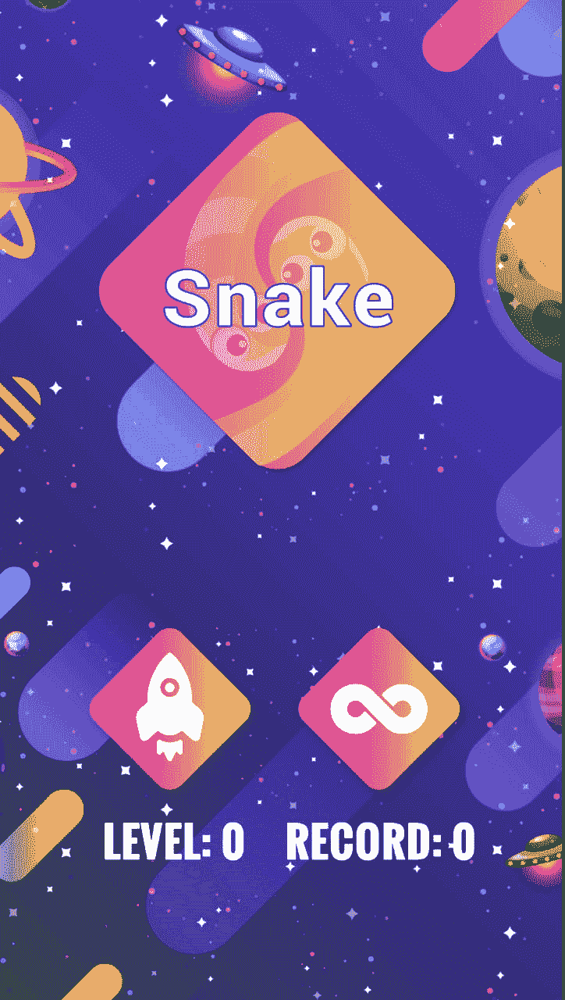
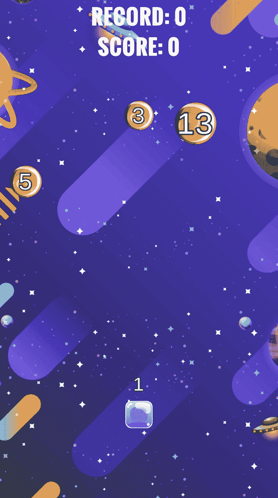

# 蛇

> 原文：<https://dev.to/balconygames/gamedev-snake-1f5f>

大家好。

我刚刚发布了新的游戏，但是看起来在下一个版本中，我会把重点放在给以前的游戏增加额外的好功能上。开始学习 Adobe 动画，看起来就像几年前我用的 Flash。

继续下去越来越难:()但是现在在空闲时间打算花更多的钱在动画上或者找人帮忙。

[https://play.google.com/store/apps/details?id=com.balconygames.snake](https://play.google.com/store/apps/details?id=com.balconygames.snake)

希望它能再次成为一款不错的消磨时间的应用。:)

感谢您的阅读！

[T6】](https://res.cloudinary.com/practicaldev/image/fetch/s--NfWi_ckY--/c_limit%2Cf_auto%2Cfl_progressive%2Cq_auto%2Cw_880/https://thepracticaldev.s3.amazonaws.com/i/4ayjli3rat53x9hi035t.png)