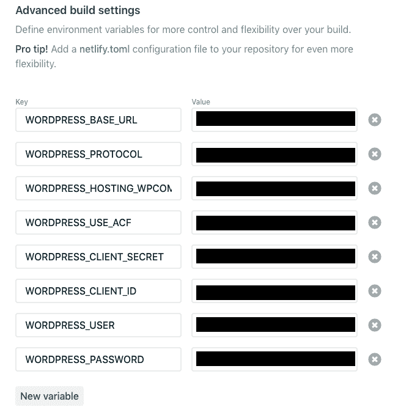

# 盖茨比和 WordPress:生存或死亡！

> 原文：<https://dev.to/booyaa/gatsby-and-wordpress-netlify-or-die-2fec>

*Billy Huynh 在 [Unsplash](https://unsplash.com/photos/saS98jKhVjA)*
上拍摄的照片我们已经完成了我们的新网站，是时候设置 Netlify 了。

*   在你的回购中安装`gatsby-cli`(netlify 需要它来建立你的网站):`npm install --save gatsby-cli`
*   获取您的节点版本`node -v`并将其粘贴到`.nvmrc`中，将 netlify 固定到您用来构建站点的版本(注意:不要在版本号中包含`v`，即`v11.3.0`变成了`11.3.0`
*   完成 netlify 设置到步骤 5，但不要点击 deploy: [分步指南:Netlify 上的 Gatsby | Netlify](https://www.netlify.com/blog/2016/02/24/a-step-by-step-guide-gatsby-on-netlify/#connecting-to-netlify)
*   展开`advanced build settings`

还记得我们在`gatsby-config.js`设置的那些环境变量吗？是时候把它们加起来了。

让我们点击*部署*按钮来发布站点。如果有任何错误，请查看 Netlify 站点的部署部分中的日志。

*要进入系列的下一部分，点击当前标记(黑点)旁边的灰点。*