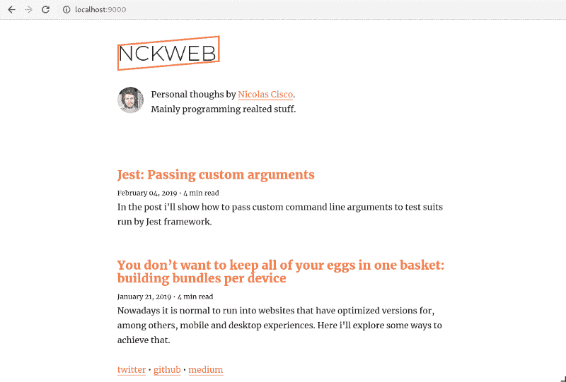
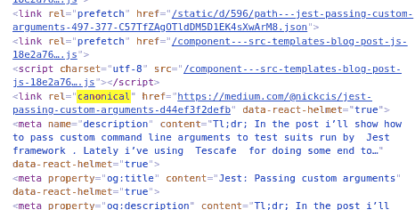
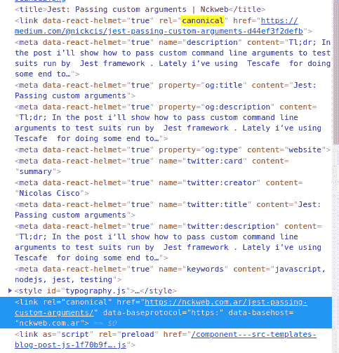

# 盖茨比:规范的网址和反应头盔

> 原文：<https://dev.to/nickcis/gatsby-canonical-urls--react-helmet-2h48>

*TL；博士开发了一个 [`gatsby-plugin-react-helmet-canonical-urls`](https://github.com/NickCis/gatsby-plugin-react-helmet-canonical-urls) ，因为`gatsby-plugin-canonical-urls`和`gatsby-plugin-react-helmet`在使用规范链接时不能很好地配合。*

[](https://res.cloudinary.com/practicaldev/image/fetch/s--pQgf_9k5--/c_limit%2Cf_auto%2Cfl_progressive%2Cq_auto%2Cw_880/https://nckweb.com.ar/static/52872c5a9697a7b464b4c677dfeba6cc/30b4c/blog.png)

最近[丹·阿布拉莫夫宣布他将停止在媒体上写作](https://medium.com/@dan_abramov/why-my-new-blog-isnt-on-medium-3b280282fbae)，因此，尝试建立我自己的[盖茨比博客](https://www.gatsbyjs.org/)是一个伟大的周末项目。我真的不想要什么花哨的东西，只是一个干净的外观，不需要我花太多时间来建立博客网站。

我的第一步是打开[盖茨比教程](https://www.gatsbyjs.org/tutorial/)。虽然，我必须承认，盖茨比的人写文档做得很好，它似乎是针对新来者的，我只是不想阅读如何安装节点和所有这些东西。我想在终端中抛出一个命令行程序，并在途中解决这些问题。

我终于找到了[生成器 cli](https://www.gatsbyjs.org/tutorial/part-zero/#create-a-gatsby-site) 并从[丹的过度反应](https://github.com/gaearon/overreacted.io)中借鉴了一些想法，我选择了[盖茨比的启动博客](https://github.com/gatsbyjs/gatsby-starter-blog)，公平地说，它满足了我的所有需求。

```
> npx gatsby new nckweb.com.ar https://github.com/gatsbyjs/gatsby-starter-blog 
```

任务完成🚀。

我需要解决两个与 SEO 相关的问题，我已经准备好了:

*   我计划导入我的媒体故事，我必须弄清楚如何设置规范的标签，以便不会因为重复的内容而受到谷歌的惩罚。
*   我用`www`和不用它来发布我的站点，所以我必须为所有页面自动设置规范标签(例如:`www.nckweb.com.ar/foo`页面应该有一个规范标签，其值为:`nckweb.com.ar/foo`)。

## 自定义规范数据

样板文件结构似乎有点简单:

```
.
├── content
│   ├── assets
│   │   ├── icon.png
│   │   └── profile-pic.jpg
│   └── blog
│       └── first-post
│           └── index.md
├── gatsby-browser.js
├── gatsby-config.js
├── gatsby-node.js
├── package.json
├── README.md
├── src
│   ├── components
│   │   ├── bio.js
│   │   ├── layout.js
│   │   └── seo.js
│   ├── pages
│   │   ├── 404.js
│   │   └── index.js
│   ├── templates
│   │   └── blog-post.js
│   └── utils
│       ├── global.css
│       └── typography.js
├── static
│   ├── favicon.ico
│   └── robots.txt
└── yarn.lock 
```

检查一个示例帖子的降价，您会发现属性是用 front matter 语法编写的([就像 jekyll 的](https://jekyllrb.com/docs/front-matter/))。我刚刚添加了一个名为`canonical_url`的新变量，它将具有规范值。(由于 [dev.to 使用这个名字来设置规范的](https://clips.twitch.tv/RelievedSavageOctopusDoggo)，我希望🤞它将自动工作，但我不是我的幸运日)。

我想做一些搜索引擎优化的东西，我的第一个赌注是检查与该名称的组件。幸运的是，[那个组件](https://github.com/gatsbyjs/gatsby-starter-blog/blob/master/src/components/seo.js)正在使用[反应头盔](https://github.com/nfl/react-helmet)。所以，我只需要弄清楚如何将前端的`canonical_url`值传递给这个 seo 组件。

下一个主角是 [`blog-post`组件](https://github.com/gatsbyjs/gatsby-starter-blog/blob/master/src/templates/blog-post.js):

```
class BlogPostTemplate extends React.Component {
  render() {
    const post = this.props.data.markdownRemark
    const siteTitle = this.props.data.site.siteMetadata.title
    const { previous, next } = this.props.pageContext

    return (
      <Layout location={this.props.location} title={siteTitle}>
        <SEO title={post.frontmatter.title} description={post.excerpt} />
        ...
      </Layout>
    )
  }
}

export const pageQuery = graphql`
  query BlogPostBySlug($slug: String!) {
    site {
      siteMetadata {
        title
        author
      }
    }
    markdownRemark(fields: { slug: { eq: $slug } }) {
      id
      excerpt(pruneLength: 160)
      html
      frontmatter {
        title
        date(formatString: "MMMM DD, YYYY")
      }
    }
  }
`; 
```

耶！🎉。它使用 seo 组件，从 graphql 查询判断，获取`canonical_url`只是将属性添加到`frontmatter`查询中。

[](https://res.cloudinary.com/practicaldev/image/fetch/s--k60fkj95--/c_limit%2Cf_auto%2Cfl_progressive%2Cq_auto%2Cw_880/https://nckweb.com.ar/static/4eb12f1a50978083507e6f2065b7e204/6a1e8/canonical-source.png)

到目前为止，一切顺利，我得到了导入帖子的规范。

## 插件，插件，插件

[](https://res.cloudinary.com/practicaldev/image/fetch/s--V5HRwQyD--/c_limit%2Cf_auto%2Cfl_progressive%2Cq_auto%2Cw_880/https://nckweb.com.ar/static/b742bd3362e37c30d9be5f4ea40fd92c/9b0e7/simpsons.jpeg)

我不想重新发明轮子，所以我的第一次尝试是[寻找一个插件](https://www.gatsbyjs.org/plugins/?=canonical)，我遇到了 [`gatsby-plugin-canonical-urls`](https://www.npmjs.com/package/gatsby-plugin-canonical-urls) ，它正好做了我需要的。

设置它就像阅读它的文档一样简单。但是，事情变得有点糟糕:

[](https://res.cloudinary.com/practicaldev/image/fetch/s--fuzhskeC--/c_limit%2Cf_auto%2Cfl_progressive%2Cq_auto%2Cw_880/https://nckweb.com.ar/static/f3c0f0022b6947a4cc0c0825a40f23fb/f77a8/double-canonical.png)

两个规范链接，为什么？

## 弄脏了手

我决定解决这个问题，所以我直接进入代码。

据我了解(查[`gatsby-plugin-canonical-urls`](https://github.com/gatsbyjs/gatsby/tree/master/packages/gatsby-plugin-canonical-urls)[`gatsby-plugin-react-helmet`](https://github.com/gatsbyjs/gatsby/tree/master/packages/gatsby-plugin-react-helmet))一个插件由以下结构组成:

```
.
├── index.js
├── package.json
├── .babelrc
├── README.md
├── src
│   ├── gatsby-browser.js
│   └── gatsby-ssr.js
└── yarn.lock 
```

相关文件有`gatsby-browser.js`和`gatsby-ssr.js`，`index.js`只是一个存根。前两个文件分别允许使用[浏览器 api](https://www.gatsbyjs.org/docs/browser-apis/) 和 [ssr api](https://www.gatsbyjs.org/docs/ssr-apis/) 。

阅读代码:

```
// gatsby-plugin-canonical-urls/src/gatsby-ssr.js

import React from "react"
import url from "url"

exports.onRenderBody = (
  { setHeadComponents, pathname = `/` },
  pluginOptions
) => {
  if (pluginOptions && pluginOptions.siteUrl) {
    const parsedUrl = url.parse(pluginOptions.siteUrl)
    const myUrl = `${pluginOptions.siteUrl}${pathname}`
    setHeadComponents([
      <link
        rel="canonical"
        key={myUrl}
        href={myUrl}
        data-baseprotocol={parsedUrl.protocol}
        data-basehost={parsedUrl.host}
      />,
    ])
  }
}

// gatsby-plugin-react-helmet/src/gatsby-ssr.js

import { Helmet } from "react-helmet"

exports.onRenderBody = ({
  setHeadComponents,
  setHtmlAttributes,
  setBodyAttributes,
}) => {
  const helmet = Helmet.renderStatic()
  // These action functions were added partway through the Gatsby 1.x cycle.
  if (setHtmlAttributes) {
    setHtmlAttributes(helmet.htmlAttributes.toComponent())
  }
  if (setBodyAttributes) {
    setBodyAttributes(helmet.bodyAttributes.toComponent())
  }
  setHeadComponents([
    helmet.title.toComponent(),
    helmet.link.toComponent(),
    helmet.meta.toComponent(),
    helmet.noscript.toComponent(),
    helmet.script.toComponent(),
    helmet.style.toComponent(),
  ])
} 
```

两个插件都实现了`onRenderBodyapi`:

> 在构建 HTML 时，在 Gatsby server 呈现的每个页面之后调用，以便您可以设置要在您的`html.js`中呈现的 head 和 body 组件。
> 
> Gatsby 对 HTML 进行了两次渲染。它遍历您的页面，首先只呈现正文，然后获取结果正文 HTML 字符串，并将其作为`body` prop 传递到您的`html.js`以完成呈现。
> 
> 将自定义组件发送到 html.js 通常很方便。例如，支持服务器渲染的 React.js 库的一个非常常见的模式是将渲染期间生成的数据提取出来添加到 html 中。

此时，我对正在发生的事情有了清晰的了解:

*   两个插件都在头部添加了元素调用`setHeadComponents`
*   盖茨比没有阻止`link rel="canonical"`重复
*   两个插件都不关心其他插件是否添加了规范标签。

## 可能的解决方案

由于我不想重新发明轮子，我的第一个尝试是*【fix】*任何提到的问题。

1.  让盖茨比的`setHeadComponents`意识到`link rel="canonical"`不能重复。

尽管这是我最初的想法之一，但我并不真的相信它。首先取决于插件的执行顺序(即:第一个呼叫`setHeadComponents`将是获胜的那个)。为了发展这一点，我需要更好地理解盖茨比是如何工作的。

1.  在任一插件上实现 [`onPreRenderHTML`](https://www.gatsbyjs.org/docs/ssr-apis/#onPreRenderHTML) api(或者创建一个实现该 api 的新插件)以移除重复的`link rel="canonical"`。

为了避免重复，我需要使用`getHeadComponent`来获取所有磁头组件，检查是否有重复的规范，然后使用`replaceHeadComponents`来设置磁头组件的重复数据。这样做也将取决于插件的执行顺序，这是我想要避免的。此外，文档中有一个大写的警告(*“警告如果多个插件实现了这个 API，那么最后一个插件会‘获胜’”*)，这让我不愿意采用这种方法。

1.  React 头盔处理这种重复，如果 canonical 的插件不使用`setHeadComponents`设置与 react-头盔的 api 的链接，问题就解决了。

当我使用 react-helmet 来设置 meta 标签时，这个解决方案实际上是有意义的。我只是想知道如何添加`Helmet`组件。

## 戴头盔的圣徒

使用这种方法，我必须添加`Helmet`元素。因为它必须在调用`onRenderBody`之前完成，所以我不应该使用那个 api。此外，为了给默认的规范标签更低的优先级，这个组件必须放在页面使用的`Helmet`组件之前(也就是说，在 react 组件树的更高层次上)。

实现这些的一个简单方法是包装当前页面并在包装中插入一个*头盔*组件:

```
const Wrapper = ({ children, ...props }) => (
  <>
    <Helmet>
      link={[
        rel: 'canonical'
        ...
      ]}
    />
    { children }
  </>
); 
```

盖茨比有 [`wrapPageElement`](https://www.gatsbyjs.org/docs/ssr-apis/#wrapPageElement) 这正好允许这样做:

```
const React = require('react');
const { Helmet } = require('react-helmet');

exports.wrapPageElement = ({ element, props }, pluginOptions) => {
  if (pluginOptions && pluginOptions.siteUrl) {
    const myUrl = `${pluginOptions.siteUrl}${props.location.pathname || '/'}${props.location.search}${props.location.hash}`;

    return (
      <>
        <Helmet
          link={[
            {
              rel: 'canonical',
              key: myUrl,
              href: myUrl,
            }
          ]}
        />
        {element}
      </>
    );
  }

  return element;
}; 
```

## 客户端渲染呢？

为了保持一致，插件还应该在客户端添加`Helmet`组件。虽然，如果我不添加它，我不会触发任何 react 水合问题(react 水合的 DOM 树在有或没有这个默认的规范头盔组件的情况下都是一样的)，但当客户端 React 运行时，规范链接将被删除。

另外，如果你检查`gatsby-plugin-canonical-urls`，你会注意到它还实现了 [`gatsby-browser`](https://github.com/gatsbyjs/gatsby/blob/master/packages/gatsby-plugin-canonical-urls/src/gatsby-browser.js) :

```
 exports.onRouteUpdate = ({ location }) => {
  const domElem = document.querySelector(`link[rel='canonical']`)
  var existingValue = domElem.getAttribute(`href`)
  var baseProtocol = domElem.getAttribute(`data-baseProtocol`)
  var baseHost = domElem.getAttribute(`data-baseHost`)
  if (existingValue && baseProtocol && baseHost) {
    domElem.setAttribute(
      `href`,
      `${baseProtocol}//${baseHost}${location.pathname}${location.search}${
        location.hash
      }`
    )
  }
} 
```

幸运的是，盖茨比的浏览器 api 实现了 [`wrapPageElement`方法](https://www.gatsbyjs.org/docs/browser-apis/#wrapPageElement)。因此，解决这个客户端问题只是在浏览器的 api 下公开相同的方法。

* * *

到目前为止，实现 Gatbsy 博客的体验非常棒！。API 非常简单，所以如果长长的插件列表不适合你，你可以很容易地实现你的。

围绕这个项目的社区非常活跃，我甚至因为在这篇文章中解决了一个[小文档问题](https://github.com/gatsbyjs/gatsby/pull/11844)而获得了一份礼物！

* * *

*原贴于[nckweb.com.ar](https://nckweb.com.ar/gatsby-canonical-urls-react-helmet/)T3】*