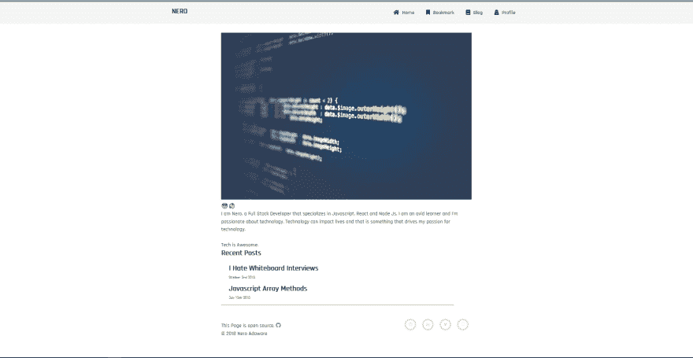
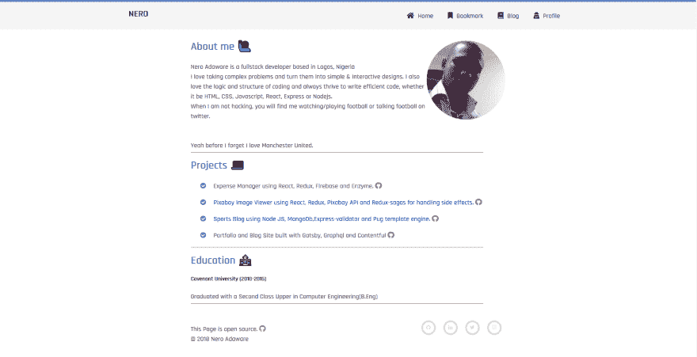

# 盖茨比太棒了

> 原文：<https://dev.to/finallynero/gatsby-is-awesome-2o8c>

> 这篇文章最初发表在我的[个人博客](https://www.finallynero.dev/blogs/)上，你可以查看更多相关的帖子。

### 什么是盖茨比 js？

Gatsby 只是一个建立在 React 之上的静态站点框架。它类似于其他静态站点生成器，如 Hugo、Jekkyl、Nextjs、Nuxtjs e.t.c。如果你不知道什么是静态站点生成器，那么它是一个框架或库，在构建时生成 HTML、CSS 和 javascript 文件。Gatsby 在构建 web 应用程序方面也很出色，因为你可以享受静态网站的好处，比如 speed(超快的速度),还可以构建动态网站。
[Gatsby for web 应用](https://www.gatsbyjs.org/blog/2018-11-07-gatsby-for-apps/)

### 盖茨比让我感兴趣的地方

不到两年前，我开始了学习如何编码的旅程，在学习了 6-8 个月的 Javascript 和 React 后，我觉得我需要一个组合/个人网站，在那里我可以展示我的副业项目，也可以展示我建立网站的能力，我首先考虑用 React 建立它，但它太过了，我需要一个后端，以防我需要开始写博客，所以我继续寻找。 看着不同的开发者的个人网站，试图找出他们使用了哪种技术来构建它，有一个引起了我的注意(老实说，我不记得开发者的名字/网站了 ...我的错)它很简单，在谷歌搜索后，我第一次听说了静态站点生成器，在底部我看到了“用 Jekkyl 构建”。
什么是静态站点生成器？我问自己，你知道作为一个寻找答案的开发人员，你可以进入谷歌搜索的兔子洞，我从来没有真正理解什么是静态站点生成器，但我遇到了 Gatsby，最棒的是它是建立在 React 上的，所以我有机会在学习技术的同时磨练我的 React 技能，并仍然试图弄清楚静态站点生成器是什么。

该文档是我使用过的所有库和框架中最好的一个，它提供了一个初学者包，真正帮助我理解了它是如何工作的，并且它给了我一个可以在其上构建的 Gatsby 应用程序。那一次我使用了 Kyle Matthews(我想是他自己)创建的 Gatsby-blog-starter。

这是我第一个盖茨比作品集/博客的主页。

这个设计不是世界上最好的，但它很管用。在构建这个项目的过程中，我学到了很多东西，这是我第一次使用 CMS(内容管理系统)，它也让我对 Graphql 有了基本的了解，同时我也能够提高我对 React 的理解。我使用样式化组件作为我的 CMS 的样式化和内容化组件。

### 重建我的投资组合网站

当盖茨比 v2 出来的时候，我决定重建/重新设计我的作品集，这是在我完成我的作品集网站两个月后。我更新了一些在 v2 中改变的 API，为 SCSS 抛弃了风格化组件，为 markdown 抛弃了内容化组件。我让它反应灵敏，但我可以在设计上做很多事情，因为我仍然不擅长设计。

嗯，我的第一份开发工作开始有很多面试，所以我没有时间在我的投资组合网站上工作。我的糟糕/不那么糟糕的投资组合在我的面试中帮了我很多(在这个编码旅程中的新手，如果你可以尝试建立一个投资组合，它不一定要漂亮，它有助于向未来的雇主展示你的迷你/副业项目。还有如果你能用盖茨比因为它很牛逼)而我很幸运的在 2018 年 11 月得到了我的第一份开发者工作。快进四个月后，我决定我应该对我的作品集做一个适当的重新设计，因为我的设计技能有了一点提高(尽管仍然很糟糕),而且我已经写了一些我想发表的博客文章。我画了一个我想要的草图，然后开始建造。当我和盖茨比建立关系的时候，我注意到了它的一些优点，我确实想谈谈。

#### 数据源(源插件)

Gatsby 支持几乎任何你能想到的 CMS(contentful，wordpress，netlify CMS)，markdown，Api，本地资源等的数据。Gatsby 唯一一次让我困惑的是当我不得不为我的博客选择数据源时，我有多个选项可供我选择，我不得不处理决策疲劳，最终我选择了 Markdown，因为...我不知道，我必须做出选择。最棒的是，集成一个数据源就像`npm install whatever-data-source`或`yarn add my-favorite-datasource`一样简单，并将配置添加到您的`gatsby-config.js`中。我使用 markdown，所以我添加了`gatsby-source-filesystem`插件，因为它用于从您的本地文件系统(本地计算机)获取数据。`gatsby-source-filesystem`插件可以获取图像、markdown、JSON 等文件。此时，Gatsby 知道这些数据，但这些原始数据需要转换成网站可以使用的内容。Gatsby 再次通过 Transformer 插件提供了一种无缝的方式。

#### 变压器插件。

是的，就像变形金刚从普通汽车变成汽车人，就像变形金刚插件所做的那样，通过 Graphql 查询将原始数据从源插件转换成网站可用的数据。因为我在使用 markdown，所以我所要做的就是`npm install gatsby-transformer-remark`或`yarn add gatsby-transformer-remark`，然后将`gatsby-transformer-remark`添加到`gatsby-config.js`的插件数组中。现在我所有的博客文章都可以通过 graphql 查询获得。

#### Graphql

我认识的大多数用过 graphql 的人都知道它很棒。我没有在 Gatsby 之外使用过 graphql，但我喜欢数据按需可用的事实。Gatsby v2 还在普通的`graphql`标签中添加了`StaticQuery` API，以帮助在组件中进行 graphql 查询。

#### 路由

Gatsby 中的路由建立在 [Reach 路由器](https://reach.tech/router)之上，但是您不需要添加任何配置来使用路由器和定义路由。在 Gatsby 中定义一条路由就像在 Gatsby 应用程序的页面文件夹中创建`name-of-route.js`文件一样简单，因此该文件的名称就是路由，即`blogs.js`产生一条`/blogs`路由。在我的应用程序中，我目前有五条路线。

#### 我在我的站点中使用的插件。

Gatsby 为你的网站提供了几乎所有你需要的插件。我称之为面向开发者的 WordPress，因为它有很多插件。除了我用来获取数据的源代码插件(gatsby-source-filesystem ),我还使用了 gatsby 和社区创建的其他一些插件。

*   我在我的个人网站上添加了这个插件，这样我就可以在我的 markdown 中嵌入 codepens。

*   我用这个来在我的减价中嵌入推文。

*   Sass/Scss 就像我的造型需求的首选技术，所以这个插件使我能够在我的应用程序中使用 Sass。

*   这个插件使用 Prismjs 在我的 markdown 中提供代码/语法高亮。

*   这个插件让我的网站在与`gatsby-plugin-manifest`插件一起使用时离线工作。

*   `gatsby-plugin-robots-txt`:这个插件帮助生成一个`robot.txt`，它通过告诉网络引擎/搜索引擎抓取哪个页面来帮助你的 SEO(搜索引擎优化)。

这些是我在我的网站上使用的一些插件。这只是向你展示了 Gatsby 的一个优点，那就是你只需要一个插件就可以实现你想要的任何功能。

我知道你们都想知道我的新个人网站是什么样子，但它没有第一个设计的那么糟糕(我认为)。你可以去看看

[个人网站](https://finallynero.xyz)

这些是我喜欢盖茨比的一些原因，也帮助我学习 React 和 Javascript。