# gce 虚拟机防火墙配置

> 原文：<https://dev.to/nabbisen/gce-vm-firewall-cofiguration-9f9>

# 简介

谷歌提供 GCE，谷歌计算云，作为 GCP 的 IaaS 产品，谷歌云平台。

GCE 允许我们默认使用两个数字作为服务器端口，80 作为 http，443 作为 https。构建简单的 web 服务器就够了，但不要构建更多。

我必须立即建立一个 ftp 服务器。因此，我尝试了 GCP 防火墙的定制配置。

# 总结

只有两个步骤来实现它:

*   步骤 1:设置 VPC 网络
*   步骤 2:配置 GCE 的虚拟机实例

✿ ✿ ✿

# 程序

### 第一步:建立 VPC 网络

选择[VPC 网络]-[防火墙规则]:

单击“创建防火墙规则”:

[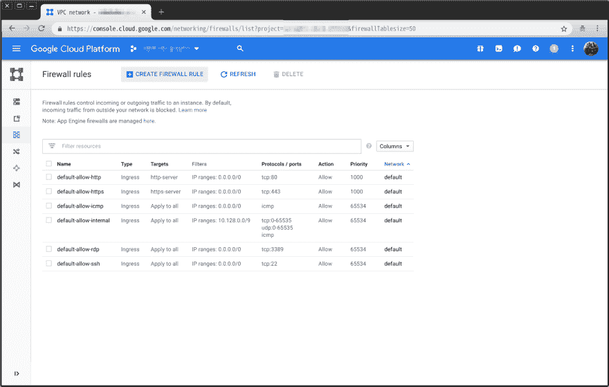](https://res.cloudinary.com/practicaldev/image/fetch/s--EpPncxAj--/c_limit%2Cf_auto%2Cfl_progressive%2Cq_auto%2Cw_880/https://thepracticaldev.s3.amazonaws.com/i/1nsbt3vcso554faj2ef0.png)

* * *

在我的例子中，tcp 21 被设置为 ftp 端口。

#### 命名

规则名称:

[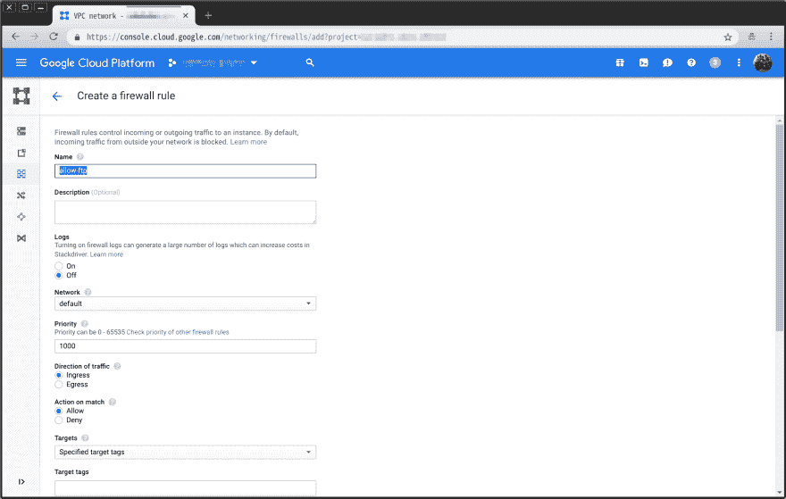](https://res.cloudinary.com/practicaldev/image/fetch/s--hUCHu0U_--/c_limit%2Cf_auto%2Cfl_progressive%2Cq_auto%2Cw_880/https://thepracticaldev.s3.amazonaws.com/i/1nqkq7mgtjg4z5wa4od8.png)

标签名称:

[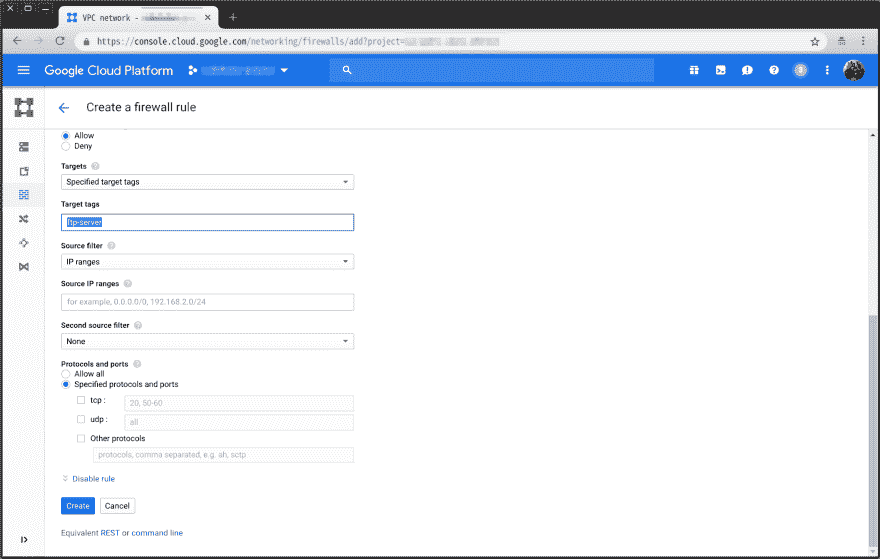](https://res.cloudinary.com/practicaldev/image/fetch/s--w-U81WRk--/c_limit%2Cf_auto%2Cfl_progressive%2Cq_auto%2Cw_880/https://thepracticaldev.s3.amazonaws.com/i/ncqb5stp923851wsur8v.png)

这个“标记名”将在设置 GCE VM 实例时使用。

#### 网络规则

入口或出口:

[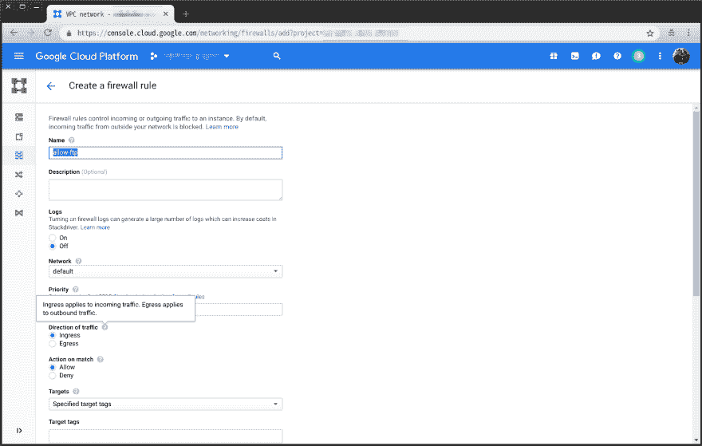](https://res.cloudinary.com/practicaldev/image/fetch/s--9bytQ3vL--/c_limit%2Cf_auto%2Cfl_progressive%2Cq_auto%2Cw_880/https://thepracticaldev.s3.amazonaws.com/i/iaqcf1coxo58wt9jixwa.png)

Ingress 足以达到我的目的。

IP 范围:

[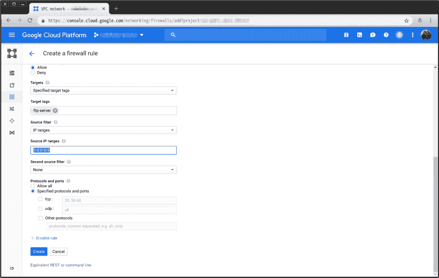](https://res.cloudinary.com/practicaldev/image/fetch/s--CRkKpa3t--/c_limit%2Cf_auto%2Cfl_progressive%2Cq_auto%2Cw_880/https://thepracticaldev.s3.amazonaws.com/i/3o2av9f52jpqj013fzve.png)

协议和端口:

[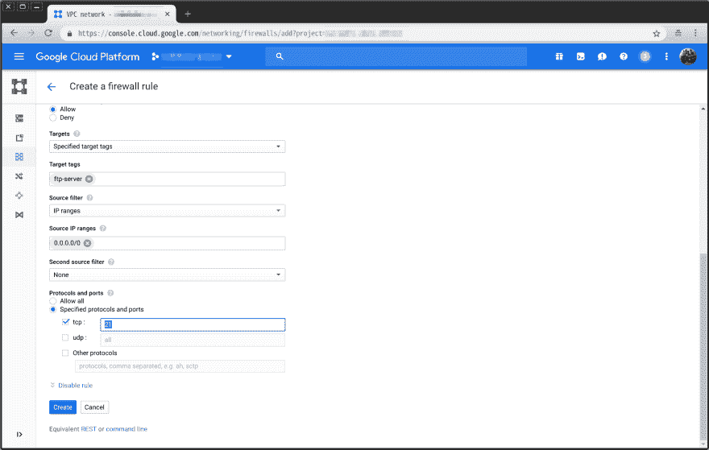](https://res.cloudinary.com/practicaldev/image/fetch/s--3_G5W6Fc--/c_limit%2Cf_auto%2Cfl_progressive%2Cq_auto%2Cw_880/https://thepracticaldev.s3.amazonaws.com/i/1d7lhg12jfclk4q03ch0.png)

* * *

执行“创建”:

[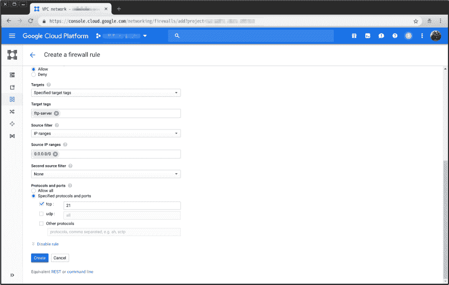](https://res.cloudinary.com/practicaldev/image/fetch/s--DNY5EqdV--/c_limit%2Cf_auto%2Cfl_progressive%2Cq_auto%2Cw_880/https://thepracticaldev.s3.amazonaws.com/i/b4u55c4alxsa8kz9x964.png)

结果:

[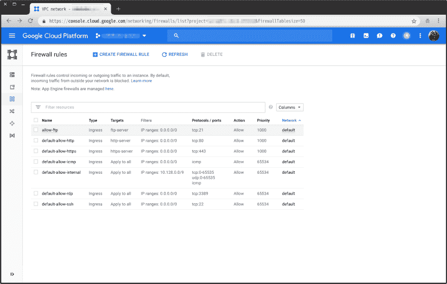](https://res.cloudinary.com/practicaldev/image/fetch/s--kCrncX0F--/c_limit%2Cf_auto%2Cfl_progressive%2Cq_auto%2Cw_880/https://thepracticaldev.s3.amazonaws.com/i/33vczkqzrft9w1rwgf8m.png)

添加第一行。

### 步骤 2:配置 GCE 的虚拟机实例

#### 案例 2-1:编辑现有虚拟机

开始编辑:

[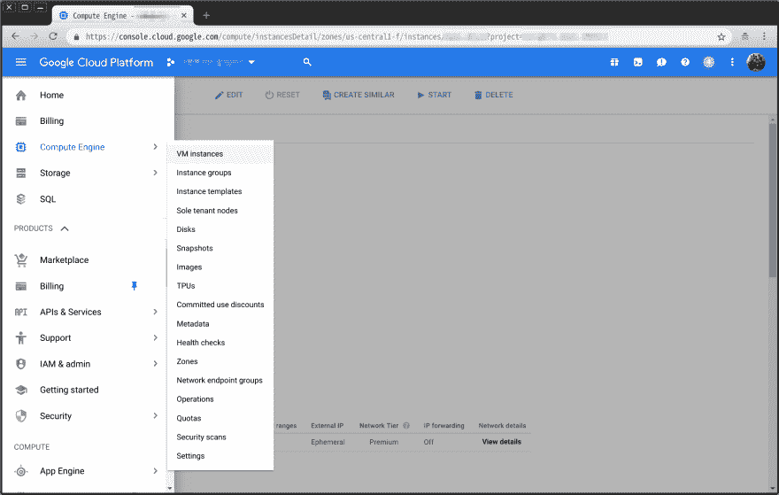](https://res.cloudinary.com/practicaldev/image/fetch/s--fiLSIbEW--/c_limit%2Cf_auto%2Cfl_progressive%2Cq_auto%2Cw_880/https://thepracticaldev.s3.amazonaws.com/i/8wory9hdjvk7krszkpi1.png)

[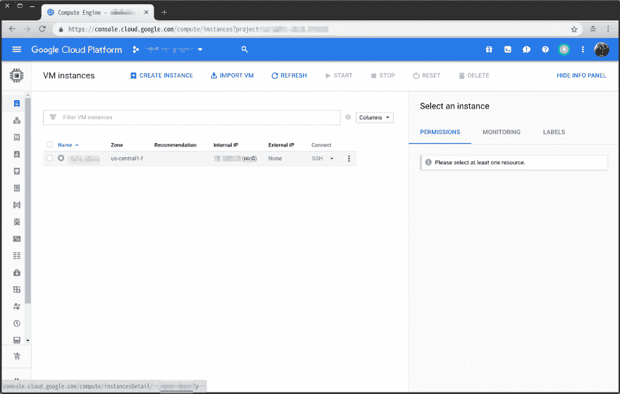](https://res.cloudinary.com/practicaldev/image/fetch/s--6pBocMf9--/c_limit%2Cf_auto%2Cfl_progressive%2Cq_auto%2Cw_880/https://thepracticaldev.s3.amazonaws.com/i/q8dq6cue27x5dcbikeqb.png)

[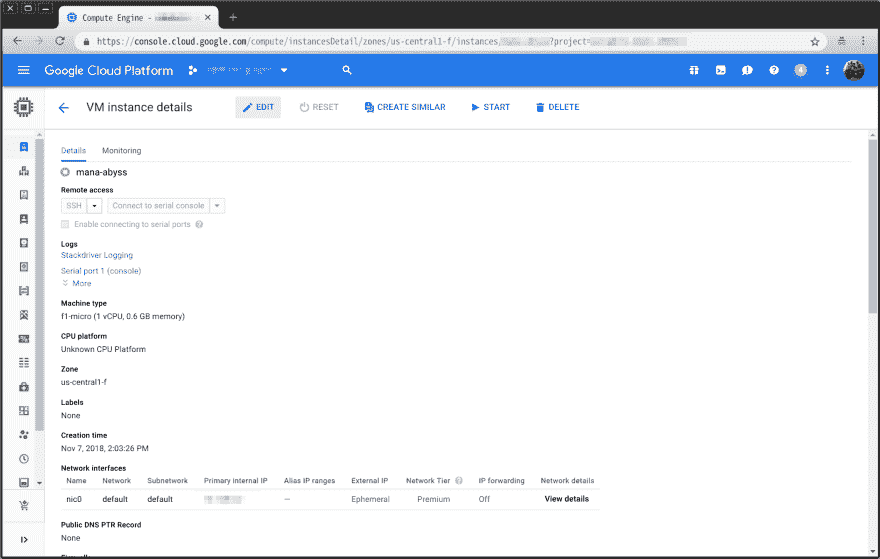](https://res.cloudinary.com/practicaldev/image/fetch/s--NuqM7oiQ--/c_limit%2Cf_auto%2Cfl_progressive%2Cq_auto%2Cw_880/https://thepracticaldev.s3.amazonaws.com/i/y4ekb17rp5yi9fqj59vi.png)

使用“标签名称”添加“网络标签”:

[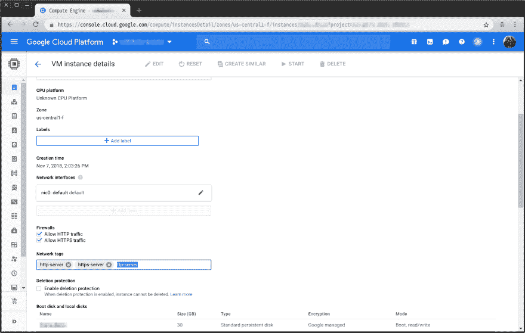](https://res.cloudinary.com/practicaldev/image/fetch/s--uOPTVp2l--/c_limit%2Cf_auto%2Cfl_progressive%2Cq_auto%2Cw_880/https://thepracticaldev.s3.amazonaws.com/i/0owbwfbbntgwj2gi078c.png)

保存:

[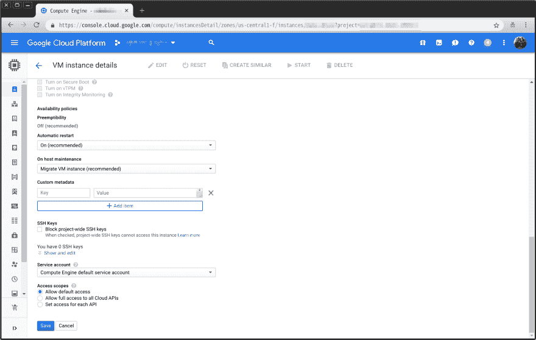](https://res.cloudinary.com/practicaldev/image/fetch/s--_4UZ9jeo--/c_limit%2Cf_auto%2Cfl_progressive%2Cq_auto%2Cw_880/https://thepracticaldev.s3.amazonaws.com/i/ik0ju00z5umlo3xj41hb.png)

完成☺

#### 案例 2-2:创建虚拟机时的配置

使用“标签名称”添加“网络标签”:

[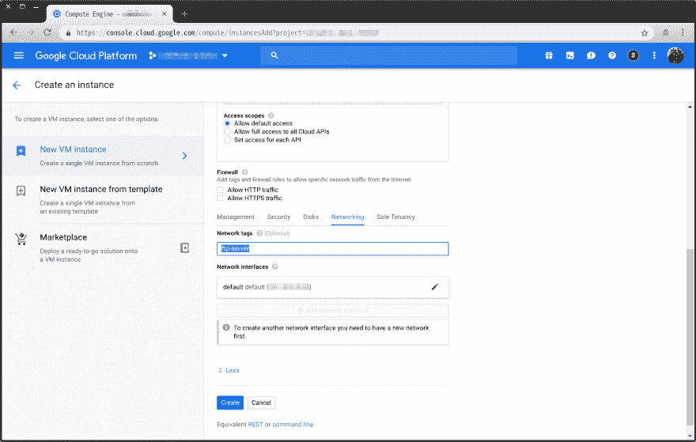](https://res.cloudinary.com/practicaldev/image/fetch/s--UVhnf59L--/c_limit%2Cf_auto%2Cfl_progressive%2Cq_auto%2Cw_880/https://thepracticaldev.s3.amazonaws.com/i/xabvhon0uavyk2h1qget.png)

完成☺

✿ ✿ ✿

为🕊服务愉快