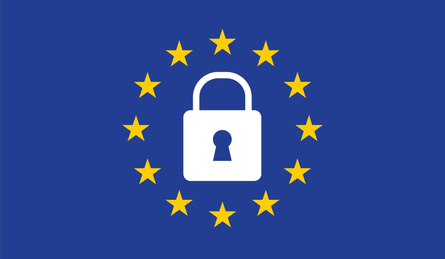

# GDPR 合规性:持续漏洞扫描如何成为关键

> 原文：<https://dev.to/nandod1707/gdpr-compliance-how-continuous-vulnerability-scanning-is-key-2ina>

即使在对 GDPR 合规性的兴趣达到顶峰几个月后，一些公司仍在努力确保自己遵守这套旨在保护欧洲公民隐私和安全的新法规。该规定适用于任何地方的企业，只要它们的用户在欧盟，最高罚款可能达到数百万欧元，他们的担心是正确的。

以英国航空公司为例。2018 年 9 月 6 日，该航空公司宣布，它遭受了一次入侵，影响了约 38 万用户，部分被盗数据包括个人和支付信息。

现在，虽然我们不知道英国航空公司将被罚款，但根据 GDPR，像这样的违规行为可能会导致 2000 万欧元的罚款，或高达公司前一年年营业额的 4%(以较高者为准)，根据 2017 年的数字，英国航空公司的罚款可能达到约 4.89 亿英镑(6.33 亿美元)。

一个类似的例子是万豪酒店。2018 年 11 月，他们宣布他们成为了一次攻击的受害者，这次攻击泄露了 5 亿用户的数据。万豪 2017 年全年营业额为 229 亿美元。

最近，谷歌在法国被罚款 5000 万欧元，原因是未能向用户提供足够的数据许可政策信息，也没有给予用户足够的控制权来控制他们的信息如何被使用。

当我们读到关于 GDPR 的报道时，可能听起来都是关于通知(让用户知道公司正在使用什么类型的数据以及将如何使用这些数据，并及时通知他们安全漏洞)，但如果这些案例告诉我们什么的话，那就是公司将不仅在如何使用客户数据方面，而且在如何保护数据方面受到审查。这就是早期检测和预防安全漏洞的关键所在。

《GDPR》第 32 条规定，企业必须“实施适当的技术和组织措施，确保与风险相适应的安全水平，包括[……]酌情:[……]定期测试、评估和评价确保处理安全的技术和组织措施的有效性的程序。”

当然，这不是很具体。作为“定期测试”安全性的过程，什么重要，什么不重要？我们概述了以下几种可能性:

### 渗透检测

渗透测试或“pen 测试”是一种针对系统的模拟攻击，用于确定系统的安全性以及可能存在的任何漏洞，这些漏洞会让攻击者有机可乘。Pen 测试通常由顾问使用自动工具和手动的特别策略来尝试利用系统。

钢笔测试的费用取决于测试者，但通常起价在 5000 美元左右。

### 内部漏洞扫描器

笔测试员使用的一些工具可以买到。这些通常包括桌面或在线扫描仪，但需要一些先进的网络安全知识，才能对他们发现的漏洞采取行动。

定价取决于所选的软件，一些提供商收取约 5000 美元的一次性费用，其他提供商则按年收取相同的费用。

### 云漏洞扫描器

基于云的 web 扫描器是模拟对 web 应用程序的攻击的服务，就像真实的攻击者可能做的那样。他们使用顾问在笔式测试中使用的一些工具。一旦扫描完成，您将获得一份报告，其中包含发现的所有漏洞。

这些扫描仪的价格各不相同，付费版本的起价每月不到 100 美元，但你也可以找到永远免费的初始计划。

## 预防 vs 反应的好处

根据 IBM Security 的数据，2018 年大型数据泄露(其中超过一百万条记录丢失)的平均成本为 390 万美元。这一数字考虑了因违规而产生的多种费用，包括业务损失、技术调查、法律处罚和员工花费在恢复上的时间。

这么高的成本确实有助于正确看待定期扫描您的应用程序并在别人之前找到需要修复的安全漏洞的好处。在打击数据泄露方面，预防的成本远低于事后反应的成本。

总的来说，随着近年来袭击数量和频率的增加，以及 GDPR 现在生效的事实，“安全胜于遗憾”比以往任何时候都更有意义。