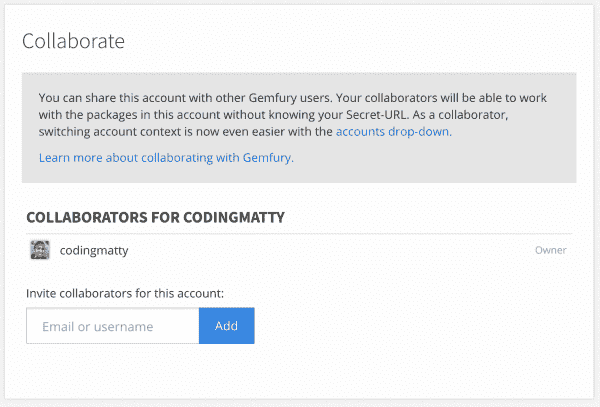
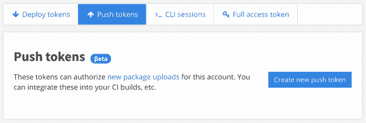
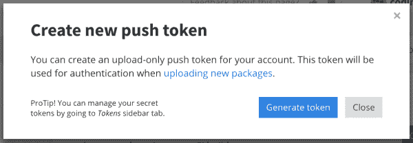
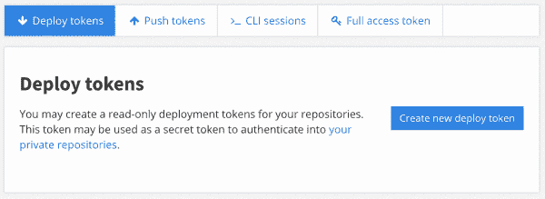
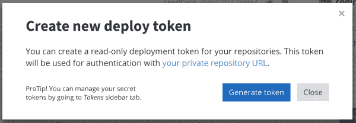

# 用于 Javascript 包的 Gemfury

> 原文：<https://dev.to/codingmatty/gemfury-for-javascript-packages-1o67>

注意:NPM 是两个不同工具的名字:保存 javascript 包的注册中心(npmjs.com)和本地管理 javascript 包的 CLI。我谈到了这两者，为了区分它们，我在注册表中使用了全部大写的“npm ”,在 CLI 中使用了全部小写的“NPM”。

不久前我在工作中开始了一个项目。具体来说，是我们前端的一个 javascript 包。它需要被不同的项目共享(我计划在以后的文章中解释这个项目)。虽然我可以开始这个项目而不用担心它将如何被消耗，但我想提前开始考虑它。一个主要的已知需求是它将是一个私有包，至少现在是这样。

第一个选择是依赖 Github。这是 npm 包所允许的，并且不会很难处理。事实上，当开发人员无论如何都必须获得克隆回购协议的权限时，它就已经内置了身份验证。但是我们想找到一个更强大的解决方案。特定于保存包的东西，与用于维护代码的工具分开。

显而易见的答案是 NPM。这是每个 javascript 开发人员都熟悉的东西。而且很好用。但是，成本价值比相当高。并不是每个团队都是这样，尤其是开源项目。但我们决定暂时不这么做。

老实说，我甚至不知道除了 NPM 还有其他选择。当我向我的团队提出可能的托管解决方案时，我了解到至少有几个选择。其中一些是自我宿主，但其他人只是 NPM 的一般替代品。

然后我们的基础设施经理提到我们有一个 [Gemfury](https://gemfury.com/) 账户。里面有一颗没用过的宝石。我们是一家 ruby 商店，这很有道理，但是这对我的 javascript 包有什么帮助呢？我不打算把我的 javascript 包包装成一个宝石来发布它。但我仔细考虑过了。

经过一些研究，我发现 Gemfury 实际上支持过多的语言和注册表选项。虽然听起来它们只对 ruby gems 有用，但实际上它们可以与 python 的 PIP、php 的 Composer 甚至 Debian 库一起工作。这就像一个自助餐，你可以在一个屋檐下吃一些炒饭，陀螺和德克萨斯烧烤。

好吧，他们已经学会了如何在代码注册业务中横向扩展，但我关心的是托管一个私有的 javascript 包。他们与 NPM 相比如何？

## Gemfury 特性

以下是在 Gemfury 上吸引我们的主要功能:

**令牌** - Gemfury 有“部署”(即拉)和“推送”令牌的概念。这些是单向的、可撤销的令牌，您可以使用它们来允许人员或系统执行单向操作。例如，如果您只想允许人们安装一个包，您可以为他们提供一个“部署”令牌。相反，如果您想设置连续部署来发布对 Gemfury 的更改，您可以使用“push”令牌。这些对于意向性和安全性来说是非常强大的。

使用这些令牌有不同的方式，但是[文档](https://gemfury.com/help/repository-url)建议将令牌放入 url。下面我将向您展示在使用 npm 的情况下，我们是如何避免这种情况的，这似乎是可以接受的。

**精细的用户权限** -随着组织的建立，您可以添加合作者(我们将在下面看到如何操作)。这些协作者可以对组织进行三级访问:

*   仅下载
*   上传和下载
*   所有者(完全访问权限)—此权限允许某人为组织添加合作者和管理令牌。

通过添加协作者，您可以为人们提供通过他们自己的凭证进行访问的权限。这使您不必提供单个访问令牌，也不必为多个用户管理多个令牌。通过这样做，您可以在不影响任何其他人或系统的情况下添加和删除协作者。

**NPM 代理** -这是 NPM 特有的，我不能代表其他注册表选项。你可以设置 npm 来*只*点击你的 Gemfury 注册表来安装包，这对于一个非常狭窄的用例来说可能是好的。但是大多数项目将需要能够首先从 Gemfury *安装*，然后如果找不到包就转移到 NPM。Gemfury 提供了一种方法来做到这一点([安装私有 npm 模块](https://gemfury.com/help/npm-registry/))。

这实际上允许你用与 NPM 相同的名字来命名上传的包，但是会有效地屏蔽那个包。如果您想避免更新许多项目中的依赖项，但您有一个您更喜欢使用的 NPM 上的公共包的分支，这可能是有用的。

您还可以命名您的 javascript 包，并只设置这个命名空间来搜索 Gemfury。这就是我们所做的，也是我将在下面展示的。但无论哪种方式，Gemfury 都能适应。

对于任何从事过一段时间 web 开发的人来说，你可能已经受到了影响，或者至少听说过 [Left-Pad 惨败](https://www.theregister.co.uk/2016/03/23/npm_left_pad_chaos/)。结果导致 NPM 声明所有的包都是不可变的。不管你是谁或你想做什么，如果你向 NPM 发布了什么，它将永远留在那里。您不能删除它，也不能覆盖它。(您实际上有 72 小时删除它，之后可以联系支持人员)

这意味着当你犯了一个错误，即使还没有人受到它的影响，你也必须发布一个新的 T2 版本。代码的剩余部分将永远保留。但是，如果您可以重新构建并覆盖现有的版本呢？或者你想把它一起拉出来。这可能不是正确的做法，但不管是好是坏，Gemfury 允许这样做。我很感激。明智地放弃这种力量。

* * *

我也将在这里提供一些缺点，但似乎没有多少影响我们:

**令牌描述** - ~~虽然你可以创建所有你想要的令牌，但目前 Gemfury 不允许你向它们添加描述。这使得很难弄清楚哪一个在哪里被使用。我建议保存一个安全文件来提供密钥的描述，但是希望他们很快会添加这个功能。~~ [代币说明](https://www.fury.blog/changelog/2019-02-22-token-description/)已于 2019 年 2 月 22 日添加。

**版本标记**——NPM 允许你将版本标记为`latest`或`beta`，而 Gemfury 目前不允许。然而，它们确实支持完整的 [semver](https://semver.org/) ，允许像`-beta.0`这样的后缀，这提供了一个足够好的解决方案。

在使用 npm 和安装 gems 之间，还有一些其他奇怪的复杂的认证方法，但是在这篇文章中我只想关注 javascript 包。

## 设置

现在我们可以进入实质内容了。

以下是指导我们设置过程的一些条件:

*   我们有同时使用`npm`和`yarn` CLI 工具的项目
*   我们希望撤销一个用户的访问权限变得容易——如果他们离开或丢失了他们的笔记本电脑，我们不想给每个人带来不便。
*   我们希望能够安全地安装在 CI 机器上，并且与用户类似，能够轻松地撤销这些凭证。

以下是步骤:

*这些步骤假设您想要创建一个组织账户。在这里阅读更多关于组织账户的信息: [Gemfury 组织账户文档](https://gemfury.com/help/organizations)。你可能不需要**一个**一个小团体。在这种情况下，您应该能够跳过第 1 步，剩下的步骤将与单个用户帐户相同，包括添加协作者。*

1.  创建组织([创建组织链接](https://manage.fury.io/manage/orgs/new)
2.  让用户创建他们自己的 Gemfury 帐户([注册链接](https://manage.fury.io/users/sign_up))。
    *   他们可以通过 Github 登录，但是 Gemfury 会提示他们创建一个新密码，这是他们在本地登录所需要的。
3.  将用户添加到创建的组织中。

[](//images.ctfassets.net/9ddv2zmnaoer/1gsvkx2mwu91C69meBVPwb/4f120cd1b114336a92e49428ac962262/image.png)

以下步骤适用于本地设置:

*我们使用命名空间来简化配置，但这不是必需的。这就像在`package.json`文件*中的包名后面加上`@organization/`一样简单

1.  在每个消费项目的`.npmrc`文件中添加对 Gemfury 注册表的引用。
    *   `yarn`会自动选取项目的`.npmrc`配置，但是有一种方法只允许 yarn 通过`.yarnrc`文件使用配置。

```
# ${PROJECT_ROOT}/.npmrc
# Make sure to provide the trailing slash '/'
@namespace:registry=https://npm-proxy.fury.io/organization/ 
```

Enter fullscreen mode Exit fullscreen mode

1.  使用 **Gemfury 凭证**通过`npm` CLI 登录。

```
npm login --registry https://npm-proxy.fury.io/organzation/ 
```

Enter fullscreen mode Exit fullscreen mode

这将添加或编辑用户的全局`.npmrc`文件，该文件位于用户的主目录中，该行为:

```
# ~/.npmrc
//npm-proxy.fury.io/organization/:_authToken=${SECRET_TOKEN} 
```

Enter fullscreen mode Exit fullscreen mode

1.  通过命令行安装依赖项。

```
npm install --save @namespace/package
# OR
yarn add @namespace/package 
```

Enter fullscreen mode Exit fullscreen mode

有了正确的设置，这个安装步骤应该首先在 Gemfury 注册表中查找，如果没有找到依赖项，则在 NPM 中检查。

现在，一旦开发人员被添加为合作者(步骤 3)并通过`npm` CLI 登录 Gemfury(步骤 5 ),他们将能够毫无问题地安装依赖项。

*注意:我们在`yarn`版本 1.6 和 1.7 上确实有一些问题，我强烈建议使用最新版本来避免任何问题。*

* * *

持续集成(CI)设置:

如上所述，**令牌**是提供安全单向操作的好方法。这些令牌的最佳用例是在您的 CI 系统上，保存在环境变量中。这使得它们很容易被替换掉，而不会影响任何其他系统。

我们有两个不同的系统，提供不同的功能，因此不同的设置。下面是我们如何配置它们的。

对于处理包部署的 CI 系统，我们需要一些东西来构建我们的包并将其发布到 Gemfury。

1.  创建一个**推送**令牌。

[ ](//images.ctfassets.net/9ddv2zmnaoer/g6HDGOS7vnarbTt5FcNml/4fbc94d9fa48eb90920bb63ff9d598b7/image.png) [ ](//images.ctfassets.net/9ddv2zmnaoer/1kPqNJYIAeO6rDkn0VZk3R/e3ee360a86d3e2e4c7dd2b1ebd910534/image.png)

1.  将生成的令牌添加到 CI 环境变量中。这一步完全取决于你的 CI。(作为参考，我把我的命名为`FURY_PUSH_TOKEN`)
2.  将包上传到 Gemfury。有几种方法可以将包上传到 Gemfury。查看 [Gemfury 上传文档](https://gemfury.com/help/upload-packages)了解更多信息。

我们选择用`npm pack`生成资产，然后使用`curl`将它们推送到 Gemfury。

```
npm pack
curl -F package=@"$(echo namespace-package-*.tgz)" https://${FURY_PUSH_TOKEN}@push.fury.io/organization/ 
```

Enter fullscreen mode Exit fullscreen mode

注意:`$(echo namespace-package-*.tgz)`只是让我们不需要知道文件名的版本，但是它假设只有一个 tgz 文件。

对于我们处理消费应用程序的 CI 系统，我们只需要在尝试安装之前进行身份验证。

1.  创建一个**部署**令牌

[ ](//images.ctfassets.net/9ddv2zmnaoer/CgVZdX9qBtDzE0Ta4NUUa/562ac4d78a27e63358c619bcd768c7cd/image.png) [ ](//images.ctfassets.net/9ddv2zmnaoer/71ZW8i0ZdCC5oSlZyX6958/3bd4e26eb6a846288156b6deff3b16d8/image.png)

1.  将生成的令牌添加到 CI 环境变量中。这一步完全取决于你的 CI。(作为参考，我把我的命名为`FURY_PULL_TOKEN`)
2.  在您的 CI 脚本中，在安装依赖项之前手动向 npm 进行身份验证。

```
echo "//npm-proxy.fury.io/organization/:_authToken=${FURY_PULL_TOKEN}" > ~/.npmrc
npm install 
```

Enter fullscreen mode Exit fullscreen mode

这应该可以了！如果对我们的设置有任何疑问，请随时联系我。我很乐意尽我所能帮忙🙂

* * *

我希望这能帮助你设置好 [Gemfury](https://gemfury.com/) 。这真的是一个很棒的服务，界面直观，价格合理，每个人都可以开始使用。

虽然将 javascript 包放在最初为 ruby gems 设计的平台上看起来不太直观，但确实很有帮助。当你和一家使用多种不同语言的公司在一起时，这种能力会变得难以置信的强大。Gemfury 提供了一个不可思议的平台来容纳各种包装。

让我知道你的经历。