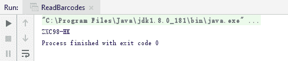

# 用 Java 生成和读取条形码

> 原文：<https://dev.to/eiceblue/generate-and-read-barcode-in-java-1o06>

条形码是数据的可视的、机器可读的表示；这些数据通常描述了携带条形码的物体的一些情况。条形码已广泛应用于商品流通、图书管理、邮政管理、银行系统等诸多领域。

在这篇博文中，我将介绍如何使用免费的 Spire 来生成和读取一些流行的 1D 和 2D 条形码。Java 的条形码。下面是免费版支持的条形码类型列表。

| 条形码类型 | 产生 | 阅读 |
| --- | --- | --- |
| CODABAR | √ | √ |
| 代码 _11 | √ | √ |
| 代码 _39 | √ | √ |
| 代码 _ 39 _ 扩展 | √ | √ |
| 代码 _93 | √ | √ |
| 代码 _ 93 _ 扩展 | √ | √ |
| 代码 _128 | √ | √ |
| EAN_8 | √ | √ |
| EAN_13 | √ | √ |
| EAN_128 | √ | × |
| EAN_14 | √ | √ |
| SCC_14 | √ | √ |
| POST_NET | √ | × |
| 二维码 | √ | × |

更多条码类型，试试商业版 [Spire。条形码](https://www.e-iceblue.com/Introduce/barcode-for-java.html)。

## 生成条码图像

生成条形码涉及到两个重要的类，一个是 BarcodeSettings，另一个是 BarcodeGenerator。BarcodeSettings 用于定制您的条形码的具体类型，数据，大小，颜色等。BarcodeGenerator 用于根据条形码设置创建图像数据。

```
//create an instance of BarcodeSetteings
BarcodeSettings settings = new BarcodeSettings();
//set barcode type
settings.setType(BarCodeType.CODE_39);
//set barcode data
settings.setData("ZXC98-HK");
//set the display text
settings.setData2D("ZXC98-HK");
//show text on bottom
settings.setShowTextOnBottom(true);
//set the border invisible
settings.hasBorder(false);
//create BarCodeGenerator object based on settings
BarCodeGenerator barCodeGenerator = new BarCodeGenerator(settings);
//generate image data 
BufferedImage bufferedImage = barCodeGenerator.generateImage();
//write image data to a .png format file
ImageIO.write(bufferedImage, "png", new File("Code39.png")); 
```

输出:
[](https://res.cloudinary.com/practicaldev/image/fetch/s--xWCaAkLy--/c_limit%2Cf_auto%2Cfl_progressive%2Cq_auto%2Cw_880/https://thepracticaldev.s3.amazonaws.com/i/fx8dopj3dtejms76s82e.png)

## 从图像中读取条形码

要读取上面生成的条形码图像，请使用 BarcodeScanner 类的 scanOne()方法。

```
String data = BarcodeScanner.scanOne("G:\\idea-projects\\spire.barcode samples\\Code39.png");
System.out.print(data); 
```

如果您的图像有多个条形码，请使用 scan()方法以字符串数组的形式返回扫描结果。

```
String[] data = BarcodeScanner.scan(string imgPath); 
```

输出:

[](https://res.cloudinary.com/practicaldev/image/fetch/s--u5oUvFSK--/c_limit%2Cf_auto%2Cfl_progressive%2Cq_auto%2Cw_880/https://thepracticaldev.s3.amazonaws.com/i/bztb0fmq9taissy5a0ue.png)