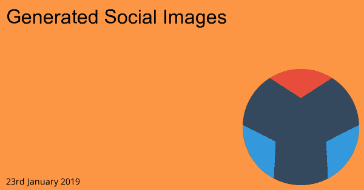

# 生成的社会图像

> 原文：<https://dev.to/arcath/generated-social-images-49ca>

我关注 [dev 到](https://dev.to)，他们的推文中有一些很棒的图片，基本上只是文章标题和作者。我真的很喜欢它的样子，想在这里尝试一些东西。

<source type="image/webp">
<source type="image/png">

我不喜欢手工劳动，这包括使用 photoshop 为每个帖子创建图像，这样就只剩下生成与[盖茨比](https://www.gatsbyjs.org/)的图像了。

# JIMP

我想把形象一代完全留在盖茨比身上，让事情变得容易些。这意味着我需要一个只有 JS 的图像创建库，我在那里找到了 JIMP。

在`on-create-node`钩子期间，我为可能共享的节点(如帖子、笔记和书籍)触发了我的`createImage`函数。

这个函数为脸书和 Twitter 创建了一个图像，我通过模板`Helmet`中的 open graph 标签链接到这个图像。

图片本身没什么特别的，只是内容背景颜色、网站图标、发布日期和标题。以这篇文章为例:

这样做的代码非常简单，可以在站点源代码[这里](https://github.com/Arcath/arcath.net-gatsby/blob/master/gatsby/create-page-image.js)中找到。我很惊讶这竟然如此简单。

让盖茨比来生成图像是非常方便的。我可以将图像保存在已经相当大的 git 存储库之外，并且我不必记得确保它们被提交。

这是一个小功能，网站的大多数用户甚至不会看到，但它是一个很好的功能。我对 Gatsby 的印象越来越深刻，因为我一直在使用它，现在我认为它和 Netlify CMS 一起可以完全取代 WordPress 来建立我的学校网站。