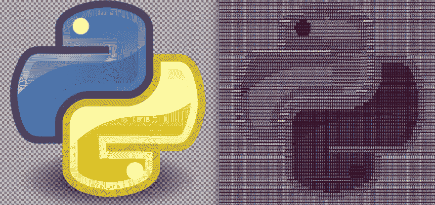

# 使用 Python 从彩色图像生成 ASCII 艺术

> 原文：<https://dev.to/anuragrana/generating-ascii-art-from-colored-image-using-python-4ace>

<figure>[](https://res.cloudinary.com/practicaldev/image/fetch/s--8sAahUfT--/c_limit%2Cf_auto%2Cfl_progressive%2Cq_auto%2Cw_880/https://cdn-images-1.medium.com/max/1024/1%2AKr2bry2Pc3mVPV6idbjYUw.png) 

<figcaption>图片来源:[https://www.pythoncircle.com](https://www.pythoncircle.com)</figcaption>

</figure>

向 [Python 脚本系列](https://www.pythoncircle.com/category/script/)添加新脚本。在这篇文章中，我们将看到如何将彩色图像转换为 ASCII 艺术。

#### 依赖关系:

你需要安装 pillow python 包。如果还没有创建，建议您使用 python3 创建一个虚拟环境。

一旦虚拟环境被激活，使用 pip install pillow 命令安装软件包。

#### 步骤:

我们正在执行以下操作，以从图像生成 ascii 艺术。

*   获取图像路径作为命令行参数。
*   从提供的路径打开图像。
*   计算长宽比。
*   调整图像大小。这里我们把新的宽度设为 120 像素。根据长宽比调整新高度。
*   将图像转换为灰度格式。
*   获取图像的所有像素。用列表中的字符替换定义范围内强度的像素。
*   打印图像并保存到文本文件。

#### 代码:

```
import sys
from PIL import Image

# pass the image as command line argument image_path = sys.argv[1]
img = Image.open(image_path)

# resize the image width, height = img.size
aspect_ratio = height/width
new_width = 120
new_height = aspect_ratio * new_width * 0.55
img = img.resize((new_width, int(new_height)))
# new size of image
# print(img.size) 
# convert image to greyscale format img = img.convert('L')

pixels = img.getdata()

# replace each pixel with a character from array chars = ["B","S","#","&","@","$","%","*","!",":","."]
new_pixels = [chars[pixel//25] for pixel in pixels]
new_pixels = ''.join(new_pixels)

# split string of chars into multiple strings of length equal to new width and create a list new_pixels_count = len(new_pixels)
ascii_image = [new_pixels[index:index + new_width] for index in range(0, new_pixels_count, new_width)]
ascii_image = "\n".join(ascii_image)
print(ascii_image)

# write to a text file. with open("ascii_image.txt", "w") as f:
 f.write(ascii_image) 
```

如果您在“终端”中获得拉长的图像，您可以相应地调整高度。我正在使用公式`new_height = aspect_ratio * new_width * 0.55`生成`new_height`。

语句`list(img.getdata())`返回所有像素的亮度列表。强度值将在 0 到 255 之间。值越低，颜色越深。这就是为什么我们在字符列表中从高强度到低强度排列字符。

`pixel//25`的值，其中 25 是一个字符的强度范围，可以在 0 到 11 之间，也就是为什么 charslist 中有 11 个字符。您可以在列表中保留更多的字符，比如 16 个字符，然后将范围大小保持为 17。

第`new_pixels = [chars[pixel//25] for pixel in pixels]`行用字符列表中的第一个字符替换强度从 0 到 25 的像素，用字符列表中的第二个字符替换强度从 26 到 50 的像素，依此类推。

在最后几行中，我们将字符串分解成一个矩阵并打印出来。

#### 如何使用脚本:

要运行该脚本，请使用下面的命令。

```
python3 script_name path_to_image

python3 image_to_ascii.py /home/Downloads/image.png 
```

代码可在 [Github](https://github.com/anuragrana/Python-Scripts/blob/master/image_to_ascii.py) 上获得。

更多来自[https://www.pythoncircle.com](https://www.pythoncircle.com)

*   [**在 Django 应用中记录数据库变化**](https://www.pythoncircle.com/post/675/logging-databases-changes-in-django-application/)
*   [**用 Python 上传文件到 Ftp 服务器**](https://www.pythoncircle.com/post/668/uploading-a-file-to-ftp-server-using-python/)
*   [**显示 Django 2.0**](https://www.pythoncircle.com/post/564/displaying-custom-404-error-page-not-found-page-in-django-20/) 中的自定义 404 错误(未找到页面)页面
*   [**解决 Django 错误:模板不存在于/App_Name/**](https://www.pythoncircle.com/post/660/solving-django-error-templatedoesnotexist-at-app_name/)