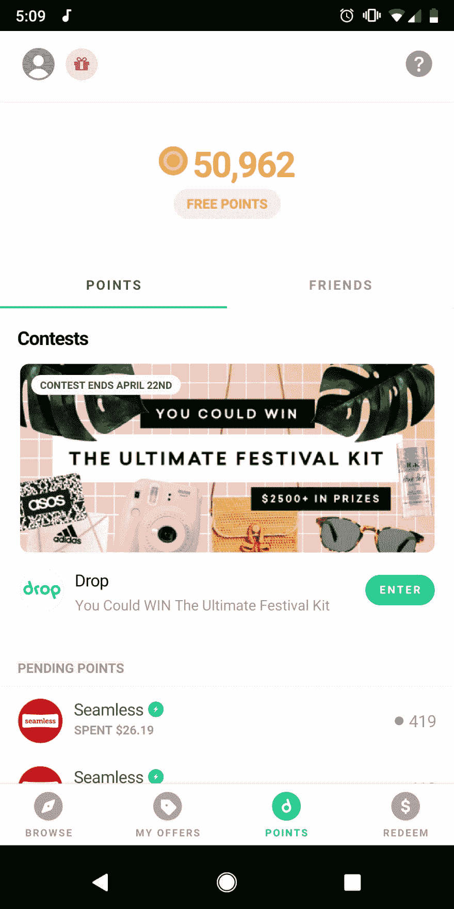

# 创造被动补充收入第 2 部分

> 原文：<https://dev.to/tevko/generating-passive-supplemental-income-part-2-cin>

## [$ ICMY:在这里找到第 1 部分！$](https://dev.to/tevko/generating-passive-supplemental-income-part-1-4fb1)

第二部分: [Drop](https://www.earnwithdrop.com/) 是一款允许用户连接借记卡和信用卡的应用程序，以便在各种交易中赚取积分。

老实说，我不喜欢这个应用程序。它漏洞百出，没有网络界面，有时积分会永远“待定”。但这并没有阻止我在这个平台上赚几百美元(比和 [Robinhood](https://share.robinhood.com/timothe535) 一起赚的还多)！).

**前提很简单:**在连接您的卡后，与 Drop partners 的某些交易会为您赢得积分，这些积分可以兑换为礼品卡(您可以使用礼品卡或[直接出售礼品卡以换取现金](https://www.raise.com/raise-rewards/TEVKO6758))。这是一种快速创收的简单方法，因为您所需要做的只是设置个人资料、链接您的卡并观察您的积分余额增长。

积分不会过期，这意味着如果你创建了一个账户并忘记了它，下次登录时你会得到一大笔积分余额。(这种情况可能会发生在我身上，也可能不会发生在我身上，也可能不会产生价值几百美元的亚马逊和星巴克礼券)。我目前坐拥超过 5 万个积分，其中大部分来自优步、星巴克和无缝交易。

该应用程序提供了一种简单的方法，如果使用正确，每月可以额外产生数百美元，只需连接您的信用卡/借记卡，然后让它独自看着积分累积。有很多方法可以积累额外的积分，包括慷慨的推荐计划。

说到这里，如果你决定注册，只要你链接第一张卡，使用推荐代码 **dadzf** 就可以获得 5000 积分(价值 5 美元)。

