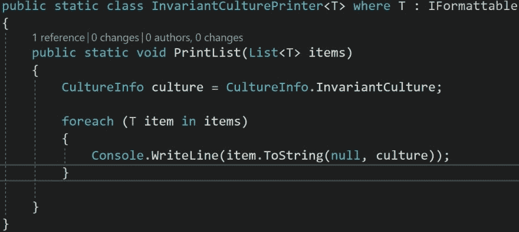

# C#中的泛型(第 3 部分-泛型类)

> 原文：<https://dev.to/seantwie03/generics-in-c-part-3-generic-classes-1e96>

## 简介

这是我的 C#泛型系列的第三部分([第一部分](https://dev.to/seantwie03/generics-in-c-part-1-generics-in-collections-2dm1)，[第二部分](https://dev.to/seantwie03/generics-in-c-part-2-creating-generic-methods-2pho))。在这篇文章中，我将解释如何创建泛型类。为了演示这一点，我将创建一个静态类，使用 InvariantCulture 格式打印列表中的所有项目。

文化差异的一个地方是日期时间。DotNet 有一个名为 IFormattable 的接口，该接口实现了一个接受 formatProvider 的 ToString()方法。使用这个接口和一个**类型约束**，我将演示如何在静态类 InvariantCulturePrinter 中使用不变文化打印出 IFormattables。

## 不变文化打印机

首先，让我们看看静态类 InvariantCulturePrinter。

这是一个泛型类，其工作方式与第二部分中的泛型方法非常相似。T 由传递给类型参数的变量替换。主要区别在于“where T : IFormattable”。这是一种类型约束。

PrintList()方法使用一个 ToString()方法，该方法有两个参数。第一个参数是 stringFormat，第二个参数是 formatProvider。如果这是一个接受任何泛型列表作为参数的泛型方法，我们如何确定该参数将包含支持该 ToString(stringFormat，formatProvider)实现的类型？

这就是类型约束的用武之地。IFormattable 指定 ToString(stringFormat，formatProvider)方法。因此，将 IFormattable 指定为类型约束将确保这个 ToString 实现始终可用。