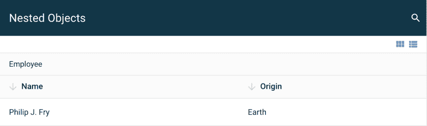

# ZingGrid 中的数据基础知识入门

> 原文：<https://dev.to/zinggrid/get-started-with-data-basics-in-zinggrid-726>

在我的上一篇文章中，我用 [ZingGrid](http://zinggrid.com) 带你构建了你的第一个数据网格，这是一个用于数据网格和数据表的 JavaScript 库。现在，我将总结在页面加载后向网格添加数据的要点。查看视频教程，看看它是如何做到的，或者跟着我一起看这篇书面教程。
[https://www.youtube.com/embed/XSuNwIrpiHg](https://www.youtube.com/embed/XSuNwIrpiHg)
本帖中你将了解的两个话题是:

1.  ZingGrid 接受的数据类型
2.  ZingGrid 中的数据分配

* * *

## zing grid 接受的数据类型

ZingGrid 接受五种类型的数据结构:

1.  对象数组`[{}]`
2.  嵌套对象数组`[{key: {}}]`
3.  对象的对象`{key: {}}`
4.  嵌套对象的对象`{key: {key: {}}}`
5.  数组的数组`[[]]`

请注意，当您在数据中嵌套对象时，默认情况下 ZingGrid 会自动为您创建嵌套的列标题。下面举个例子来说明我的意思:
[](https://res.cloudinary.com/practicaldev/image/fetch/s--HBLvxTmo--/c_limit%2Cf_auto%2Cfl_progressive%2Cq_auto%2Cw_880/https://firebasestorage.googleapis.com/v0/b/zinggrid-marketing.appspot.com/o/emails%252Fgetting-started-1%252Fnested-object-example.png%3Falt%3Dmedia%26token%3Df9cc7b8e-2f67-4d42-b493-40d245d31268)

#### 物体阵列

[查看使用该数据结构的实例。](https://app.zingsoft.com/demos/create/XEET90Q0)

```
[
  {
    "name": "Philip J. Fry",
    "origin": "Earth"
  }
] 
```

#### 嵌套对象的数组

[查看使用该数据结构的实例。](https://app.zingsoft.com/demos/create/WA1E4DR2)

```
[
  {
    "employee": {
      "name": "Philip J. Fry",
      "origin": "Earth"
    }
  }
] 
```

#### 物中之物

[查看使用该数据结构的实例。](https://app.zingsoft.com/demos/create/IXQ33BN1)

```
{
  "1": {
    "name": "Philip J. Fry",
    "origin": "Earth"
  },
  "2": {
    "name": "Turanga Leela",
    "origin": "Earth"
  }
} 
```

#### 对象的嵌套对象

[查看使用该数据结构的实例。](https://app.zingsoft.com/demos/create/BDKM7REB)

```
{
  "1": {
    "employee": {
      "name": "Philip J. Fry",
      "origin": "Earth"
      }
  },
  "2": {
    "employee": {
      "name": "Turanga Leela",
      "origin": "Earth"
      }
  }
} 
```

#### 阵列中的阵列

[查看使用该数据结构的实例。](https://app.zingsoft.com/demos/create/U8MWMWX6)

```
[
  ["Philip J. Fry","Earth"],
  ["Turanga Leela","Earth"] ...
] 
```

* * *

## zing grid 中的数据赋值

ZingGrid 提供了`data`属性，作为向网格分配数据的最原始的方法。该数据必须具有有效的 JSON 结构。当将对象和数组传递给 HTML 属性时，这是符合 HTML 规范的。有三种受支持的方法来设置 ZingGrid 的数据属性:

1.  HTML 内嵌数据
2.  ZingGrid API
3.  HTML 属性操作

#### HTML 内嵌数据(字符串化)

在标记中分配内联数据是在 ZingGrid 中分配数据的最基本方式。到目前为止，这是我们在本系列所有示例中使用的方法。

```
<zing-grid data='[{"name": "Philip J. Fry"}]'></zing-grid> 
```

#### ZingGrid API

要分配 JavaScript 对象数据，使用 ZingGrid API 方法`setData()`。这是在 ZingGrid 中分配数据的最有效的 T2 方式。这是因为这种赋值涉及属性赋值，而不是属性操作。这意味着数据被直接分配给内部 ZingGrid 组件数据属性。[查看 API 文档](https://www.zinggrid.com/docs/api-methods#zg-data)查看所有的数据方法，或者查看下面的实例。

```
const zgRef = document.querySelector('zing-grid');
const data = [{...}];
// target grid and assign data directly
zgRef.setData(data); 
```

[https://codepen.io/zinggrid/embed/gqyqYg?height=600&default-tab=result&embed-version=2](https://codepen.io/zinggrid/embed/gqyqYg?height=600&default-tab=result&embed-version=2)

#### 属性操纵

通过 JavaScript 将数据作为对象分配是分配数据最实际的用途，它可以通过直接的属性操作来实现。这将为 HTML 属性分配一个字符串，因此数据字符串将出现在标记中，但对于大型数据集来说，这不是一个好主意。查看下面的实例。

```
const zgRef = document.querySelector('zing-grid');
const data = [{...}];
// target attribute directly and stringify your data structure
zgRef.setAttribute('data', JSON.stringify(data)); 
```

[https://codepen.io/zinggrid/embed/mvgaNr?height=600&default-tab=result&embed-version=2](https://codepen.io/zinggrid/embed/mvgaNr?height=600&default-tab=result&embed-version=2)

* * *

好了，这些是关于 ZingGrid 中数据的基础知识。如果您有任何问题，请告诉我，如果您想了解如何将远程 JSON 文件和端点连接到 ZingGrid，请关注本系列的下一篇教程。🔌👀