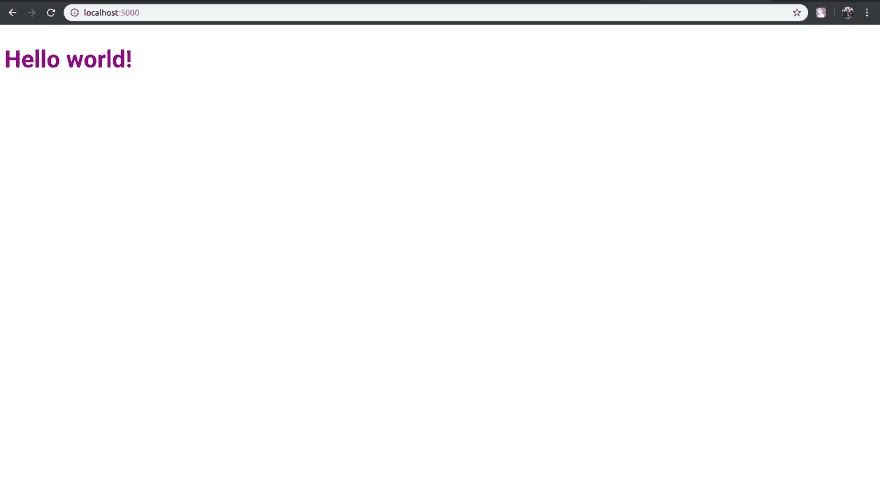

# 从苗条开始

> 原文：<https://dev.to/aveeksaha/get-started-with-svelte-4gbh>

关于构建和部署苗条应用程序的初学者教程。

# 什么是苗条？

> Svelte 是一种构建 web 应用程序的新方法。它是一个编译器，将您的声明性组件转换成高效的 JavaScript，并对 DOM 进行外科手术式更新。

Svelte 不同于 Vue 或 React 等传统组件框架，因为它本质上是一个编译器，在构建时将您的代码转换为普通的 JavaScript。这允许您创建反应性组件，而没有虚拟 DOM 的性能开销。

你可以在他们的网站 [`Svelte`](https://svelte.dev/) 上了解更多

# 设置

像所有伟大的教程一样，今天我将向你展示如何使用 Svelte 制作一个 ToDo 应用程序。

对于本教程，我们将建立在苗条的样板上，我们需要`degit`来完成，所以开始安装`degit`使用

```
npm install -g degit 
```

Enter fullscreen mode Exit fullscreen mode

然后我们安装样板文件并安装所有的依赖项。

```
npx degit sveltejs/template svelte_tut
cd svelte_tut
npm install 
```

Enter fullscreen mode Exit fullscreen mode

要运行开发服务器，请运行

```
npm run dev 
```

Enter fullscreen mode Exit fullscreen mode

然后打开 [http://localhost:5000](http://localhost:5000) ，应该会看到这样的内容

[](https://res.cloudinary.com/practicaldev/image/fetch/s--MwiaPrf2--/c_limit%2Cf_auto%2Cfl_progressive%2Cq_auto%2Cw_880/https://home.aveek.io/blog/svelte/svelte_1.png)

# 制作 app

打开`src/App.svelte`并用
替换原来的代码

```
<script>
   // Variable to store user input
   let task = "";
   // Array to store tasks
    let todos = ["eat", "sleep", "code"]
</script>

<style>

</style> 
```

Enter fullscreen mode Exit fullscreen mode

我们可以使用 Svelte 将变量`task`绑定到一个输入元素，并添加一个函数，每当我们按下一个按钮时，就将一个新元素推入数组。

```
<script>
   // Variable to store user input
   let task = "";
   // Array to store tasks
   let todos = ["eat", "sleep", "code"]

   function addTask() {
       // Dont add something if the input value is empty
        if(task!=""){
           // Push a new task to the array
           todos.push(task)
            task = ""
        }
    }
</script>

<style>

</style>

<!-- The value of task will now change when you type in the input
because the task variable is now bound to the input value -->
<input bind:value={task}>

<!-- when the onclick event is triggered it calls addTask -->
<button on:click={addTask}>Add Task</button> 
```

Enter fullscreen mode Exit fullscreen mode

现在使用一个循环，我们将把`tasks`数组中的所有元素显示为一个列表，我们将添加一个方法，通过选中它旁边的复选框来从数组中移除元素。

```
<script>
   let task = "";
   let todos = ["eat", "sleep", "code"]

   function addTask() {
        if(task!=""){
           todos.push(task)
           // The DOM is only updated when an assignment is made so this
           // code below is needed even though it may seem redundant
           // Otherwise the list of todos won't update when we add a task
            todos = todos;
            task = ""
        }
   }

   function removeTask(index) {
        todos = todos.slice(0, index).concat(todos.slice(index + 1));
        console.log(index);
    }
</script>

<style>
   /* remove bullets from list */
   ul {
       list-style: none;
   }
</style>

<input bind:value={task}>
<button on:click={addTask}>Add Task</button>

<ul>
<!-- For each element in the array, create a new list element -->
    {#each todos as todo, index (todo)}
        <li>
       <!-- When the checkbox is ticked the item is removed from the todos array -->
            <input type=checkbox on:click={() => removeTask(index)}>
            {todo}
        </li>
    {/each}
</ul> 
```

Enter fullscreen mode Exit fullscreen mode

现在我们的 todo 列表差不多完成了，我们可以向`public/global.css`文件添加一些全局 CSS。

```
html, body {
    padding: 5%;
}

html {
   display: table;
   margin: auto;
}

body {
   display: table-cell;
   vertical-align: middle;
} 
```

Enter fullscreen mode Exit fullscreen mode

你最终的结果应该是这样的 [](https://res.cloudinary.com/practicaldev/image/fetch/s--LhHSHuky--/c_limit%2Cf_auto%2Cfl_progressive%2Cq_auto%2Cw_880/https://home.aveek.io/blog/svelte/svelte_2.png)

为了编译应用程序，我们只需要运行

```
npm run build 
```

Enter fullscreen mode Exit fullscreen mode

# 持久存储

如果您希望在我们刷新页面时保存数据，我们可以使用`IndexedDB`来存储任务列表。IndexedDB API 没有那么直观，所以我们将使用一个名为`idb-keyval`的包装器。

用
安装

```
npm install idb-keyval 
```

Enter fullscreen mode Exit fullscreen mode

将其导入到`App.svelte`中，删除 todo 数组中的默认值，然后加载该数组(如果已经存储)。

```
// import idb-keyval
import { get, set } from 'idb-keyval';

let task = "";
// Empty the default values in the array
let todos = []

get('todos')
.then(arr => {
    // If the array is stored from a previous session, assign it to todos
    if(arr !== undefined)
        todos = arr
}) 
```

Enter fullscreen mode Exit fullscreen mode

然后我们需要在每次添加或删除任务时存储 todos 数组

```
function addTask() {
    if(task!=""){
        todos.push(task)
        todos = todos;
        // Store the array
        set('todos', todos)
        task = ""
    }
}

function removeTask(index) {
    todos = todos.slice(0, index).concat(todos.slice(index + 1));
    // Store the array
    set('todos', todos)
    console.log(index);
} 
```

Enter fullscreen mode Exit fullscreen mode

现在列表不会在你每次刷新页面时重置。

# 部署到网络生活

首先我们要添加一个只有一行的`.gitignore`-

```
node_modules 
```

Enter fullscreen mode Exit fullscreen mode

在 GitHub 或 GitLab (Bitbucket 也可用)上创建一个新项目，然后`cd`到你的项目文件夹，运行下面的

```
git init
git remote add origin <git URL of your project>
git add .
git commit -m "Initial commit"
git push origin master 
```

Enter fullscreen mode Exit fullscreen mode

在你的浏览器中打开 [Netlify](https://www.netlify.com/) ，如果你还没有账户的话，注册一个。去你的[站点](https://app.netlify.com/account/sites)点击`New site from Git`然后按照步骤操作

1.  选择您的 git 提供商。

*   选择您刚刚创建并提交的存储库。
*   在构建选项下，转到基本构建设置，并填写以下两个字段:
    *   构建命令:`npm run build`
    *   发布目录:`public/`

然后单击部署。当部署完成后，访问概述中给出的站点 url，它应该看起来像这样[演示](https://svelte-tut.netlify.com/)

# 代号&演示

现场演示- [`Demo`](https://svelte-tut.netlify.com/)

本教程的代码可以在 [`Gitlab`](https://gitlab.com/aveeksaha/svelte-tut) 上找到