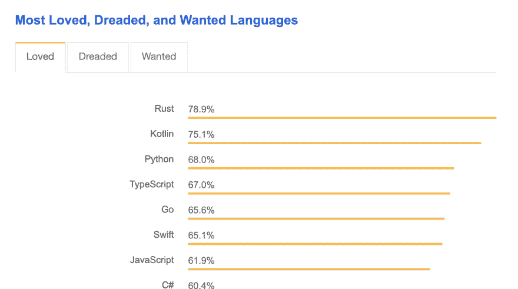
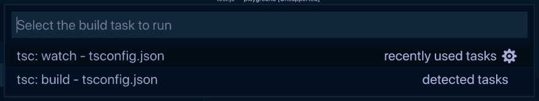

# 2019 年开始使用 TypeScript

> 原文：<https://dev.to/robertcoopercode/get-started-with-typescript-in-2019-6hd>

# 2019 年开始使用 TypeScript

> 最初发布在[我的博客](https://www.robertcooper.me/get-started-with-typescript-in-2019)

基于 2018 年的 [Stack Overflow 开发者调查，TypeScript 作为一种编程语言比 JavaScript 更“受人喜爱”。JavaScript 开发人员如此喜爱 TypeScript 的原因是，向 JavaScript 添加类型可以让您在运行代码之前发现错误。TypeScript 编译器提供的错误将很好地说明如何修复错误。向 JavaScript 添加类型还允许代码编辑器提供一些更高级的功能，比如代码完成、项目范围的重构和自动模块导入。](https://insights.stackoverflow.com/survey/2018/)

[](https://res.cloudinary.com/practicaldev/image/fetch/s--pYfIUzy8--/c_limit%2Cf_auto%2Cfl_progressive%2Cq_auto%2Cw_880/https://thepracticaldev.s3.amazonaws.com/i/hcowt5ce179qy1iejohq.png) 来自 [2018 栈溢出开发者调查](https://insights.stackoverflow.com/survey/2018/#most-loved-dreaded-and-wanted)的“最受喜爱的编程语言”调查问题结果

如果您将 TypeScript 视为一种全新的编程语言，那么学习 TypeScript 可能会令人生畏。然而，TypeScript 只是 JavaScript 的一个附加层，在开始使用它之前，您不必了解 TypeScript 附带的所有语法。TypeScript 允许您通过将文件扩展名从`.js`更改为`.ts`来轻松转换 JavaScript 文件，并且所有代码都将正确编译为 TypeScript。如果希望在 TypeScript 文件中强制更大百分比的类型覆盖率，可以将 TypeScript 配置为更具限制性，但这可以在您更熟悉该语言之后完成。

本文旨在让您快速了解在标准 TypeScript 项目中通常会遇到的大约 95%的场景。对于最后的 5%，Google 是你的朋友，我在文章的底部添加了有用的 TypeScript 资源的链接。

* * *

### 设置打字稿

当然，要开始编写正确编译的 TypeScript，需要一个正确配置的开发环境。

**1。安装类型脚本编译器**

首先，需要安装 TypeScript 编译器，以便将 TypeScript 文件转换为 JavaScript 文件。为此，TypeScript 可以全局安装(在文件系统中的任何位置都可用)或本地安装(仅在项目级别可用)。

```
# NPM Installation Method

npm install --global typescript # Global installation
npm install --save-dev typescript # Local installation

# Yarn Installation Method

yarn global add typescript # Global installation
yarn add --dev typescript # Local installation 
```

Enter fullscreen mode Exit fullscreen mode

*从命令行运行的命令，以便在您的计算机上全局或本地安装 TypeScript】*

**2。确保您的编辑器设置为支持 TypeScript**

您需要确保您的编辑器被正确配置为使用 TypeScript。例如，您可能需要安装一个插件(例如 [atom-typescript](https://atom.io/packages/atom-typescript) ，如果使用 atom 编辑器的话)，以便在您的编辑器中充分利用 typescript。如果使用 VS 代码，TypeScript 支持是内置的，所以不需要扩展😎。

**3。创建一个** `**tsconfig.json**` **文件**

一个`tsconfig.json`文件用于配置 TypeScript 项目设置。`tsconfig.json`文件应该放在项目的根目录中。该文件允许您用不同的选项配置 TypeScript 编译器。

如果你只是想让 TypeScript 工作，你可以让`tsconfig.json`包含一个空的 JSON 对象，但是如果你需要 TypeScript 编译器有不同的行为(比如在一个特定的输出目录中输出 transpiled JavaScript 文件)，你可以[阅读更多关于可以配置哪些设置的](https://www.typescriptlang.org/docs/handbook/compiler-options.html)。

> **注意:**您还可以运行`_tsc --init_`来生成一个`_tsconfig.json_`文件，其中包含一些为您设置的默认选项和一堆注释掉的其他选项

**4。将文件类型脚本转换成 JavaScript**

为了将您的 TypeScript 代码转换成 JavaScript，需要在终端中运行`tsc`命令。运行`tsc`将使 TypeScript 编译器搜索`tsconfig.json`文件，这将确定项目的根目录以及在编译 TypeScript 和将`.ts`文件转换为`.js`文件时使用的选项。

为了快速测试设置是否有效，您可以创建一个测试 TypeScript 文件，然后在命令行中运行`tsc`,看看是否在 TypeScript 文件旁边生成了一个 JavaScript 文件。

例如，这个类型脚本文件…

```
const greeting = (person: string) => {
    console.log('Good day ' + person);
};

greeting('Daniel'); 
```

Enter fullscreen mode Exit fullscreen mode

*示例类型脚本语法*

应该转换到这个 JavaScript 文件…

```
var greeting = function(person) {
    console.log('Good day ' + person);
};

greeting('Daniel'); 
```

Enter fullscreen mode Exit fullscreen mode

*通过传输 TypeScript 生成的 JavaScript 文件*

如果您想让 TypeScript 编译器监视您的 TypeScript 文件中的变化，并自动触发从`.ts`到`.js`文件的转换，您可以运行`tsc -p`。项目存储库中的命令。

在 VS 代码中，你可以使用`⌘⇧B`来调出一个菜单，该菜单可以在正常模式或监视模式下运行 transpiler(分别为`tsc:build`或`tsc:watch`)。

[](https://res.cloudinary.com/practicaldev/image/fetch/s--9w4yUCJY--/c_limit%2Cf_auto%2Cfl_progressive%2Cq_auto%2Cw_880/https://thepracticaldev.s3.amazonaws.com/i/wveqfec4tmme1pd2ksh6.png) 使用`⌘⇧B`可以调出的 VS 代码构建任务菜单

* * *

### 了解静态和动态类型

JavaScript 有 7 种动态类型:

*   不明确的
*   空
*   布尔代数学体系的
*   数字
*   线
*   标志
*   目标

上述类型被称为*动态*，因为它们是在运行时使用的。

TypeScript 为 JavaScript 语言带来了*静态*类型，这些类型在编译时被评估(无需运行代码)。*静态*类型预测*动态*类型的值，这可以帮助警告你可能的错误，而不必运行代码。

* * *

### 基本静态类型

好了，让我们深入研究一下 TypeScript 的语法。下面是 TypeScript 中最常见的类型。

> **注意:**我省略了`_never_`和`_object_`类型，因为根据我的经验，它们不是很常用。

#### `boolean`

你已经了解并喜爱的简单的`true`和`false`价值观。

```
let isAwesome: boolean = true; 
```

Enter fullscreen mode Exit fullscreen mode

*布尔型注释*

#### `string`

用单引号(`'`)、双引号(`"`)或反斜线括起来的文本数据。

```
let name: string = 'Chris';
let breed: string = 'Border Collie'; 
```

Enter fullscreen mode Exit fullscreen mode

*字符串类型标注*

如果使用反勾号，字符串称为 [*模板文字*](https://developer.mozilla.org/en-US/docs/Web/JavaScript/Reference/Template_literals) ，表达式可以插入其中。

```
let punchline: string = 'Because it was free-range.';
let joke: string = `
    Q: Why did the chiken cross the road?
    A: ${punchline} `; 
```

Enter fullscreen mode Exit fullscreen mode

*使用模板文字的字符串类型注释*

#### `number`

任何浮点数都被赋予类型`number`。作为类型脚本的一部分，支持的四种类型的数字文字是*十进制*、*二进制*、*八进制*和*十六进制*。

```
let decimalNumber: number = 42;
let binaryNumber: number = 0b101010; // => 42
let octalNumber: number = 0o52; // => 42
let hexadecimalNumber: number = 0x2a; // => 42 
```

Enter fullscreen mode Exit fullscreen mode

*数字类型标注*

> 注意:如果二进制、八进制和十六进制数字让你困惑，你并不孤单。

#### `array`

TypeScript 中的数组类型可以用两种方式编写。第一种方法要求将`[]`后缀为数组中的元素类型。

```
let myPetFamily: string[] = ['rocket', 'fluffly', 'harry']; 
```

Enter fullscreen mode Exit fullscreen mode

*使用方括号符号的字符串数组*

编写`Array`类型的另一种方法是使用 Array，后跟数组中的元素类型(在尖括号内)。

```
let myPetFamily: Array<string> = ['rocket', 'fluffly', 'harry']; 
```

Enter fullscreen mode Exit fullscreen mode

*使用尖括号符号的字符串数组*

#### `tuple`

`tuple`是一个数组，包含固定数量的相关类型的元素。

```
let myFavoriteTuple: [string, number, boolean];

myFavoriteTuple = ['chair', 20, true]; // ✅
myFavoriteTuple = [5, 20, true]; // ❌ - The first element should be a string, not a number 
```

Enter fullscreen mode Exit fullscreen mode

*声明一个有 3 个元素的元组，然后给元组赋值*

#### `enum`

一个`enum`是一种将名字与一个常数值相关联的方法，这个常数值可以是一个数字或者一个字符串。当您希望一组不同的值具有与之关联的描述性名称时，枚举非常有用。

默认情况下，枚举被赋予从`0`开始的数字，并为枚举的每个成员增加`1`。

```
enum Sizes {
    Small,
    Medium,
    Large,
}

Sizes.Small; // => 0
Sizes.Medium; // => 1
Sizes.Large; // => 2 
```

Enter fullscreen mode Exit fullscreen mode

*从 9 开始的枚举示例*

第一值可以设置为除`0`之外的值。

```
enum Sizes {
    Small = 1,
    Medium,
    Large,
}

Sizes.Small; // => 1
Sizes.Medium; // => 2
Sizes.Large; // => 3 
```

Enter fullscreen mode Exit fullscreen mode

*从非 0 值开始的枚举示例*

默认情况下，枚举是分配的数字，但是，字符串值也可以分配给枚举。

```
enum ThemeColors {
    Primary = 'primary',
    Secondary = 'secondary',
    Dark = 'dark',
    DarkSecondary = 'darkSecondary',
} 
```

Enter fullscreen mode Exit fullscreen mode

*带有字符串值的枚举示例*

#### `any`

如果变量的类型未知，并且我们不希望类型检查器在编译时抱怨，那么可以使用`any`的类型。

```
let whoKnows: any = 4; // assigned a number

whoKnows = 'a beautiful string'; // can be reassigned to a string
whoKnows = false; // can be reassigned to a boolean 
```

Enter fullscreen mode Exit fullscreen mode

*任意类型的示例*

`any`在开始使用 TypeScript 时可能会频繁使用。然而，最好尽量减少`any`的使用，因为当编译器不知道与变量相关的类型时，TypeScript 的有用性会降低。

#### `void`

当没有与某事物相关联的类型时，应该使用`void`类型。它最常用于指定不返回任何内容的函数的返回值。

```
const darkestPlaceOnEarth = (): void => {
    console.log('Marianas Trench');
}; 
```

Enter fullscreen mode Exit fullscreen mode

*使用空类型的例子*

#### `null`和`undefined`

`null`和`undefined`都对应于您可能在 JavaScript 中看到的`null`和`undefined`值的类型。这些类型单独使用时不是很有用。

```
let anUndefinedVariable: undefined = undefined;
let aNullVariable: null = null; 
```

Enter fullscreen mode Exit fullscreen mode

*如何使用空类型和未定义类型的示例*

默认情况下，`null`和`undefined`类型是所有其他类型的*子类型*，这意味着`string`类型的变量可以被赋值为`null`或`undefined`。这通常是不可取的行为，因此通常建议将`tsconfig.json`文件中的`strictNullChecks`编译器选项设置为`true`。将`strictNullChecks`选项设置为`true`使得`null`和`undefined`需要明确设置为变量的类型。

* * *

### 式推断

幸运的是，您不必在代码的每个地方都指定类型，因为 TypeScript 有所谓的*类型推断*。类型推断是 TypeScript 编译器用来自动确定类型的方法。

**基本类型推理**

TypeScript 可以在变量初始化期间、设置默认参数值时以及确定函数返回值时推断类型。

```
// Variable initialization
let x = 10; // x is given the number type 
```

Enter fullscreen mode Exit fullscreen mode

*类型推断的例子，其中 x 变量有一个推断的数字类型*

在上面的例子中，`x`被分配了一个数字，TypeScript 将变量`x`与类型`number`相关联。

```
// Default function parameters
const tweetLength = (message = 'A default tweet') => {
    return message.length;
}; 
```

Enter fullscreen mode Exit fullscreen mode

*推断的字符串类型被赋予消息参数*

在上面的例子中，`message`参数被赋予了一个类型为`string`的默认值，因此 TypeScript 编译器推断出`message`的类型为`string`，因此在访问`length`属性时不会抛出编译错误。

```
function add(a: number, b: number) {
    return a + b;
}

const result = add(2, 4);

result.toFixed(2); // ✅
result.length; // ❌ - length is not a property of number types 
```

Enter fullscreen mode Exit fullscreen mode

*根据函数的参数类型*将推断出的数字类型分配给 add 函数的返回值

在上面的例子中，由于 TypeScript 被告知`add`函数的两个参数都有一个类型`number`，它可以推断返回类型也将是一个`number`。

**最佳常见类型推断**

当从多种可能的类型中推断出一种类型时，TypeScript 使用“最佳公共类型”算法来挑选一种适用于所有其他候选类型的类型。

```
let list = [10, 22, 4, null, 5];

list.push(6); // ✅
list.push(null); // ✅
list.push('nope'); // ❌ - type 'string' is neither of type 'number' or 'null' 
```

Enter fullscreen mode Exit fullscreen mode

*最佳公共类型算法确定只有数字和空类型才允许作为列表数组*的元素

在上面的例子中，数组由`number`和`null`类型组成，因此 TypeScript 只期望`number`和`null`值是数组的一部分。

* * *

### 类型标注

当类型推理系统不够用时，您将需要在变量和对象上声明类型。

**基本类型**

在*基本静态类型*部分中引入的所有类型都可以用一个后跟类型名的`:`来声明。

```
let aBoolean: boolean = true;
let aNumber: number = 10;
let aString: string = 'woohoo'; 
```

Enter fullscreen mode Exit fullscreen mode

*注释基本类型的例子*

**数组**

正如在讨论`array`类型的小节中所示，数组可以用两种方式之一进行注释。

```
// First method is using the square bracket notation
let messageArray: string[] = ['hello', 'my name is fred', 'bye'];

// Second method uses the Array keyword notation
let messageArray: Array<string> = ['hello', 'my name is fred', 'bye']; 
```

Enter fullscreen mode Exit fullscreen mode

*注释数组*

**接口**

将多个类型注释放在一起的一种方法是使用接口。

```
interface Animal {
    kind: string;
    weight: number;
}

let dog: Animal;

dog = {
    kind: 'mammal',
    weight: 10,
}; // ✅

dog = {
    kind: true,
    weight: 10,
}; // ❌ - kind should be a string 
```

Enter fullscreen mode Exit fullscreen mode

*使用接口标注类型*

**类型别名**

为了避免混淆，TypeScript 还允许您使用类型别名指定多个类型批注。

```
type Animal = {
    kind: string;
    weight: number;
};

let dog: Animal;

dog = {
    kind: 'mammal',
    weight: 10,
}; // ✅

dog = {
    kind: true,
    weight: 10,
}; // ❌ - kind should be a string 
```

Enter fullscreen mode Exit fullscreen mode

*使用类型别名注释类型*

就使用接口或类型别名而言，最佳实践似乎是，通常应该在代码库中选择`interface`或`type`，并且保持一致。然而，如果编写一个第三方公共 API，可以被其他人使用，使用一个`interface`类型。

如果你想得到类型别名和接口之间更详细的比较，我会推荐 Matin Hochel 的这篇文章。

**内嵌注释**

与其创建一个可重用的接口，不如内联注释一个类型可能更合适。

```
let dog: {
    kind: string;
    weight: number;
};

dog = {
    kind: 'mammal',
    weight: 10,
}; // ✅

dog = {
    kind: true,
    weight: 10,
}; // ❌ - kind should be a string 
```

Enter fullscreen mode Exit fullscreen mode

*使用内嵌类型注释*

**仿制药**

有些情况下，变量的具体类型并不重要，但是不同变量类型之间的关系应该是强制的。对于这些情况，应该使用泛型类型。

```
const fillArray = <T>(len: number, elem: T) => {
    return new Array<T>(len).fill(elem);
};

const newArray = fillArray<string>(3, 'hi'); // => ['hi', 'hi', 'hi']

newArray.push('bye'); // ✅
newArray.push(true); // ❌ - only strings can be added to the array 
```

Enter fullscreen mode Exit fullscreen mode

*使用泛型类型定义类型关系*

上面的例子有一个泛型类型`T`，它对应于传递给`fillArray`函数的第二个参数的类型。传递给`fillArray`函数的第二个参数是一个字符串，因此创建的数组的所有元素都被设置为类型`string`。

应该注意的是，按照惯例，单个字母用于泛型类型(例如`T`或`K`)。但是，没有什么可以阻止您为泛型类型使用更具描述性的名称。下面是上面的例子，其中提供的泛型类型有一个更具描述性的名称:

```
const fillArray = <ArrayElementType>(len: number, elem: ArrayElementType) => {
    return new Array<ArrayElementType>(len).fill(elem);
};

const newArray = fillArray<string>(3, 'hi'); // => ['hi', 'hi', 'hi']

newArray.push('bye'); // ✅
newArray.push(true); // ❌ - only strings can be added to the array 
```

Enter fullscreen mode Exit fullscreen mode

*为通用类型使用更具描述性的名称*

**联合类型**

在一个类型可以是多种类型之一的场景中，通过用`|`分隔不同的类型选项来使用联合类型。

```
// The `name` parameter can be either a string or null
const sayHappyBirthdayOnFacebook = (name: string | null) => {
    if (name === null) {
        console.log('Happy birthday!');
    } else {
        console.log(`Happy birthday ${name}!`);
    }
};

sayHappyBirthdayOnFacebook(null); // => "Happy birthday!"
sayHappyBirthdayOnFacebook('Jeremy'); // => "Happy birthday Jeremy!" 
```

Enter fullscreen mode Exit fullscreen mode

*联合类型注释的示例*

**路口类型**

交集类型使用`&`符号将多个类型组合在一起。这不同于联合类型，因为联合类型表示“结果类型是列出的类型中的一个”，而交集类型表示“结果类型是所有列出类型的组合”。

```
type Student = {
    id: string;
    age: number;
};

type Employee = {
    companyId: string;
};

let person: Student & Employee;

person.age = 21; // ✅
person.companyId = 'SP302334'; // ✅
person.id = '10033402'; // ✅
person.name = 'Henry'; // ❌ - name does not exist in Student & Employee 
```

Enter fullscreen mode Exit fullscreen mode

*交集类型注释的示例*

**元组类型**

元组使用一个`:`进行注释，后跟一个逗号分隔的类型列表，放在方括号内。

```
let list: [string, string, number];

list = ['apple', 'banana', 8.75]; // ✅
list = ['apple', true, 8.75]; // ❌ - the second argument should be of type string
list = ['apple', 'banana', 10.33, 3]; // ❌ - the tuple specifies a length of 3, not 4 
```

Enter fullscreen mode Exit fullscreen mode

*使用元组类型注释变量*

**可选类型**

可能存在函数参数或对象属性是可选的情况。在这些情况下，`?`用于表示这些可选值。

```
// Optional function parameter
function callMom(message?: string) {
    if (!message) {
        console.log('Hi mom. Love you. Bye.');
    } else {
        console.log(message);
    }
}

// Interface describing an object containing an optional property
interface Person {
    name: string;
    age: number;
    favoriteColor?: string; // This property is optional
} 
```

Enter fullscreen mode Exit fullscreen mode

*定义可选类型*

* * *

### 有用的资源

对于本文没有涉及的 TypeScript 部分，我推荐以下参考资料。

[打字手册(正式打字文件)](https://www.typescriptlang.org/docs/handbook/basic-types.html)

[打字稿深度阅读(在线打字稿指南)](https://basarat.gitbooks.io/typescript/content/docs/getting-started.html)

[了解 TypeScript 的类型注释(很棒的介绍性 TypeScript 文章)](http://2ality.com/2018/04/type-notation-typescript.html)