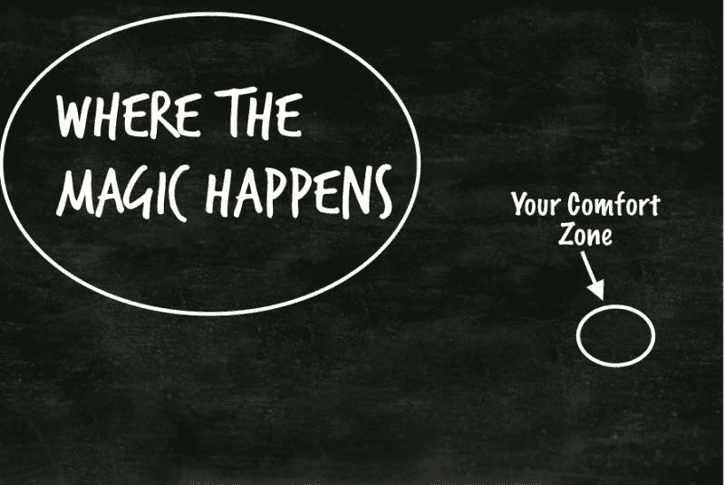

# 在不舒服中变得舒服

> 原文：<https://dev.to/sarahscode/getting-comfortable-with-being-uncomfortable-2ogm>

*注:这是我之前在我的个人网站([https://www.sarahlkatz.com/blog/](https://www.sarahlkatz.com/blog/))上发布的关于我求职的一系列帖子之一，现在交叉发布在这里。对时间线的任何引用可能不再准确。*

我在许多不同的背景下见过这个图像，它总是相关的。舒适地呆在自己的舒适区固然很好，但要真正成长，你需要走出自己的舒适区。走出你的舒适区可以让你学习新的东西，扩展你的技能，帮助你更好地适应变化。这很不舒服，但它非常重要，尤其是在软件开发这样一个技术不断变化的领域。

这就是为什么我努力让自己在不舒服中变得舒服。对我来说，这意味着开始做超出我舒适区的事情。以下是一些例子:

*   练习一些我并不完全适应的技能。上周，我花了一些时间在白板上。本周我花了一些时间尝试学习一点 Ruby，因为我看到一些工作列表提到他们在后端使用 Ruby，我希望至少熟悉语法。下周我计划写一些 SQL 查询，因为最近的一次面试经历告诉我，我对 SQL 的记忆并没有我想象的那么好。我永远不会用尽我不是 100%熟悉的技能，这意味着我永远有机会走出我的舒适区。

*   在我找工作的时候，我不确定我在工作中到底想要什么(上一份工作之后，我更多地意识到我不想要什么，但我没有接触足够多我喜欢的东西，所以我没有很好地意识到我想要什么)，但随着我经历这个过程，我对我想要什么有了更好的认识。我想要的东西之一是一份能让我不断学习新事物的工作。当我阅读职位描述时，我会寻找那些特别提到学习(和教学)机会的职位描述。学习新的东西总是有点不舒服，但这对我自己和我的职业发展以及成为一个更好的开发人员(和人)是非常重要的。

*   申请工作时，我试着接受自己不是完美的候选人。职位描述和公司通常会列出他们希望应聘者具备的技能和技术知识。当我第一次开始申请时，我试着把重点放在那些列出我已经拥有的技能的工作上。但随着我决定更多地关注那些能让我学到新东西的工作，我让自己申请那些我可能不知道所有他们使用的技术，但我对学习它感兴趣的工作。在面试中说“我还没有使用过任何技术，但我很高兴能学习它”肯定会让人不舒服...但是如果我能适应这样做，我在找下一份工作的时候会处于一个非常好的位置。

*   最近我开始尝试参与一些让我害怕的事情。当我第一次从编码训练营毕业时，我试图尽可能多地参加技术会议，但这样的情况让我不知所措。当我的编码训练营的几个校友开始谈论组织一个新的聚会时，我决定参与进来，看看我是否能帮助创造一个开放和友好的环境。这远远超出了我的舒适区，因为这意味着与一群我不认识的人在一个房间里，并参与以前让我感到不舒服的活动，但我知道参与组织这次聚会不仅有助于我的社交技能，而且有助于为我们所有的聚会参与者创造一个安全的环境。

一个警告:有太多的时间在你的舒适区之外。这条线在哪里取决于个人，你必须找到自己的极限。对我来说，这意味着我要在熟悉的环境中度过大部分时间(如果可能的话，我倾向于在我的公寓里用我的笔记本电脑度过大部分时间)，每天花几个小时做一些非常低调的事情(比如看电视或阅读)，尽可能让自己为潜在的不舒服的情况做好准备。

记住缓解不适也很重要。如果你试图从只做舒服的事情到一夜之间花 95%的时间在你的舒适区之外，那几乎是不可能的。你不会知道如何处理它。慢慢来。慢慢开始让自己走出舒适区。每周增加一两件不舒服的事情(或者任何适合你的轻松步调)。提醒你自己，有时候要离开你的舒适区是一件很困难的事情，但是你做得越多，你就会越舒服。