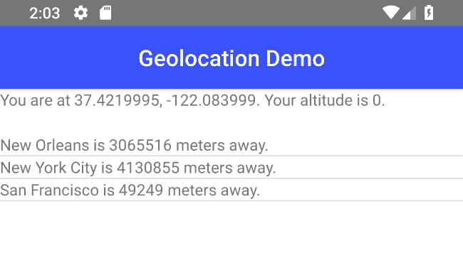

# 获取 NativeScript 中的位置-第 2 部分

> 原文：<https://dev.to/raymondcamden/getting-location-in-nativescript-part-2-231j>

几天前，我写了一篇关于在 NativeScript 中使用地理定位的博客。那篇文章有点短，因为我是在去 NativeScript 开发者日的途中中途停留时写的(这真他妈的酷！)在阿姆斯特丹。现在我在回家的路上，由于风暴造成的混乱而被困在亚特兰大，我想我应该分享一下我之前帖子的快速更新。

虽然我提到过[地理定位插件](https://github.com/NativeScript/nativescript-geolocation)的工作方式非常类似于 web 标准 API，但它确实有一个非常有用的附加功能，我想强调一下——返回两点之间距离的能力。当然，这只是数学，你可以谷歌，复制和粘贴，但把它放入插件真的非常有用。

为了演示这一点，我修改了以前的应用程序，使用一个返回位置列表的服务，每个位置都有经度和纬度。它现在是静态的，但是被设置为异步使用。

```
const api = {

    async getLocations() {

        return new Promise((resolve, reject) => {
            // fake data
            let data = [
                {
                    name:'New Orleans', 
                    location: { 
                        lat:29.95,
                        lng:-90.07
                    }
                },
                {
                    name:'New York City', 
                    location: { 
                        lat:40.73,
                        lng:-73.93
                    }
                },
                {
                    name:'San Francisco', 
                    location: { 
                        lat:37.77,
                        lng:-122.43
                    }
                },
            ];

            resolve(data);
        });
    }

}

module.exports = api; 
```

Enter fullscreen mode Exit fullscreen mode

我把它放在一个`api`文件夹里。接下来，我更新了我的 Home 组件以支持:

*   获取列表
*   获取你的位置
*   用您和该位置之间的距离更新列表

下面是完整的组件:

```
<template>
    <Page class="page">
        <ActionBar class="action-bar">
            <Label class="action-bar-title" text="Geolocation Demo"></Label>
        </ActionBar>

        <GridLayout rows="40,auto">
            <StackLayout row="0">
                <Label v-if="needLocation" text="Looking up your location..." />
                <Label v-if="locationFailure" text="Sorry, I failed! :(" />
                <Label v-if="location" :text="locationDescription" textWrap="true" />
            </StackLayout>
           <ListView for="loc in locations" row="1" height="100%">
                <v-template>
                    <Label :text="loc.label" />
                </v-template>
            </ListView>
        </GridLayout>

    </Page>
</template>

<script>
import * as Geolocation from 'nativescript-geolocation';
import LocationService from '../api/LocationService';

export default {
    data() {
        return {
            needLocation:true,
            locationFailure:false,
            location:null,
            locations:[]
        }
    },
    computed: {
        locationDescription() {
            return `You are at ${this.location.latitude}, ${this.location.longitude}. Your altitude is ${this.location.altitude}.`;
        }
    },
    async created() {

        let locs = await LocationService.getLocations();

        Geolocation.enableLocationRequest(true)
        .then(() => {
            Geolocation.isEnabled().then(isLocationEnabled => {
                if(!isLocationEnabled) {
                    this.needLocation = false;
                    this.locationFailure = true;
                    // potentially do more then just end here...
                    return;
                }

                // MUST pass empty object!!
                Geolocation.getCurrentLocation({})
                .then(result => {
                    this.needLocation = false;
                    this.location = result;

                    let myLocation = new Geolocation.Location();
                    myLocation.longitude = result.longitude;
                    myLocation.latitude = result.latitude;

                    //Now that we know our location, update distance
                    locs.forEach(l => {
                        let thisLocation = new Geolocation.Location();
                        thisLocation.longitude = l.location.lng;
                        thisLocation.latitude = l.location.lat;
                        let dist = Math.floor(Geolocation.distance(myLocation, thisLocation));
                        l.label = `${l.name} is ${dist} meters away.`;
                    });
                    this.locations = locs;

                })
                .catch(e => {
                    console.log('loc error', e);
                });
            });
        });

    }
};
</script>

<style scoped lang="scss">
    // Start custom common variables
    @import '../app-variables';
    // End custom common variables
</style> 
```

Enter fullscreen mode Exit fullscreen mode

这里有几件事我想大声说出来。首先，在我的`ListView`中，我输出我的位置的`label`值。这实际上并不存在，而是添加到我的 Vue 代码的结果中。有多种其他方法可以做到这一点，但目前看来这已经足够简单了。

接下来，注意我的`created`方法现在有了`async`关键字。这让我在里面做类似于`await`调用的事情。我也可以重构获取你的位置的代码，我考虑了一下，但决定现在让我的更改更简单。还有，这几天一直很忙。

为了处理距离，您创建了`Location`对象。你指定经度和纬度。然后你可以这样得到任意两个之间的距离:`Geolocation.distance(firstLocation, secondLocation)`

差不多就是这样。下面是它在 Android 模拟器中的渲染方式。

[](https://res.cloudinary.com/practicaldev/image/fetch/s--CD1oQPNG--/c_limit%2Cf_auto%2Cfl_progressive%2Cq_auto%2Cw_880/https://static.raymondcamden.cimg/2019/04/geo2.png)

不是很令人兴奋，但是你明白了。请注意，该插件还支持一个`watchLocation`方法，将不断检查您的设备位置。当用户移动时，您可以用它来更新列表。

就是这样！我计划发布更多关于简单的 NativeScript 示例的帖子，所以和往常一样，如果你有问题或反馈，请在下面给我留言！