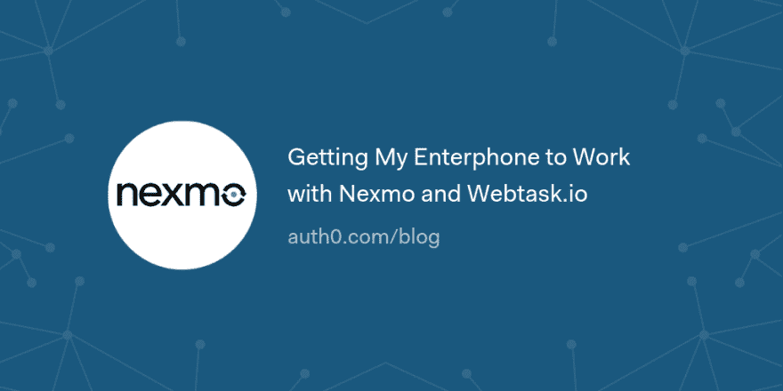

# 让我的手机使用 Nexmo 和 Webtask.io

> 原文：<https://dev.to/auth0/getting-my-enterphone-to-work-with-nexmo-and-webtaskio-4lbn>

我最近搬到了多伦多。搬到大城市意味着我要从一栋房子搬进一栋公寓大楼。第一次，我真的有了一个允许我的客人进入大楼的入口。

我从渥太华地区搬到这里，这意味着我的旧电话号码在技术上是一个长途电话。现在我不想改变我的电话号码，因为我的大多数网络账户都启用了 2FA，这样我就可以使用它了。长途电话费在手机上已经不存在了，但问题是他们在我的大楼里使用的电话系统不能拨打长途电话。

这个系统的另一个限制是我们在系统中只能有一个条目。虽然这对大多数人来说是可以的，但在我作为技术传播者的工作和我作为空姐的妻子之间，很多时候只有我们一个人在家。

考虑到这一点，我们的大楼管理员建议我们买一部基本的座机，只能用于企业电话。

当然，但是那有什么意思呢？

[读读☎️](https://auth0.com/blog/getting-my-enterphone-to-work-with-nexmo-and-webtask/?utm_source=dev&utm_medium=sc&utm_campaign=enterphone_nexmo)

