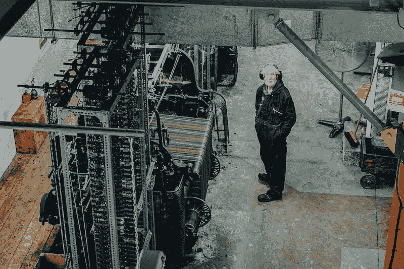

# 坚持流程变更

> 原文：<https://dev.to/ejames_c/getting-process-change-to-stick-11ic>

告诉我你以前是否听过这个故事。你在一家初创公司，它正在成长。在某些时候，工作的痛苦变得太多了。人们会说“这样下去不行了！”在几周内第七次通宵之后。任务被遗漏了。部署由于完全可以预防的原因而出错。你的整个团队都看到了不祥之兆:*我们必须改变流程。*

所以，你做了许多经理在你的位置上做过的事情，你改变了流程！你的人民急切地赞同这些改变，因为事情太痛苦了，不能继续他们的方式。你的工作*会变得更好吗？暂时如此。*

几个月过去了，生意开始好转，然后你——你是一个更聪明、更有经验的经理——嗯，你开始想:我可以预测事情会如何发展。我们现在做的工作是六个月前的两倍，招聘在滞后三个月后开始增加。在四到六个月内，目前的流程将会再次崩溃，因为我们的团队将会翻倍。现在开始改变流程不是更好吗？

然而，这一次，团队对这个想法不太满意。他们看不到你看到的即将到来的变化，因为他们没有你的背景。“我不认为这是一个好主意，”粗暴的亚当说。(每个团队都有一个粗暴的亚当)。他给出了理由。一半的队员看起来不相信。

你是做什么的？强行通过？你如何让你的团队接受你想要实现的改变？你如何做到这一点，而不显得像一个总的工具？

## 镜头一:哪里痛？

 
我发现了三种看待过程变化的有价值的方法，我认为值得一谈。第一种方法是通过痛苦的透镜来看待过程变化:变化前的痛苦*，变化*前的痛苦*，变化*后的痛苦*。*

在上面的第一个场景中，在流程改变之前有很多痛苦。这通常使得发起改变变得非常容易:每个人都处于如此糟糕的状态，以至于他们愿意尝试任何事情来让它尽快停止，任何事情都可以。

然而，在第二种情况下，做出改变的痛苦压倒了维持现状的痛苦。人们不相信，因为他们认为改变工作流程时必须经历的暂时痛苦是不合理的。要让他们动起来，你还得做更多的工作。

最后，如果在转换之后，过程变化导致了新的痛苦*，那么你可能会发现自己已经叛变了。你必须*始终*监控任何过程变化以发现初期问题；不这样做有三个风险:首先，它会危及你的团队在未来尝试新的过程变化的意愿，第二，它可能会导致普遍的工作场所不愉快，第三，它可能会导致你的团队的产出显著下降——这意味着你没有做好你的工作。*

我不想低估这三个副作用的风险。假设你是一名设计师，你习惯使用软件工具 [Sketch](https://www.sketchapp.com/) 工作。你来上班，你的老板告诉你，你必须切换到一个新的内部工具套件，没有适当的解释。这些工具不如 Sketch，但是你的老板无视你的抱怨，还提醒你一年中最忙的时候到了，你要抓紧时间掌握新工具。

你会有什么感觉？可怕，就是这样。你在工作中度过的每一个小时都将是极度紧张的。如果几周过去了，什么都没有改变，如果你觉得你的老板没有倾听你的担忧，那么你很有可能会辞职。至少，您会不信任自上而下授权的未来过程变更；你的工作成果也会受到严重影响。

作为一名经理，要设身处地为下属着想。你不会喜欢你的老板对你的工作生活做出剧烈的改变，如果她看起来没有在听你说话，你会不高兴。因此，在进行流程变革时，不要做这些事情。相反…

## 镜头二:告诉他们之前、之中、之后的事情和原因

第二个透镜是进行过程改变的基本公式。它包括三个步骤:

1.  在改变流程之前，告诉他们将要发生什么，以及为什么。这是你可能会遇到阻力的部分，取决于改变前和改变中痛苦的相对程度。仔细倾听，如果抱怨是合理的，就做出调整。稍后会有更多的介绍。
2.  在改变的过程中，花大量的时间来促使行动坚持下去。同时，仔细听*—通过你定期安排的[一对一](https://managementforstartups.com/articles/one-on-ones-starter-guide/)，也许！—查看流程变化是否会导致新的问题。如果是的话，通过宣布你注意到了什么，你将要改变什么，以及为什么，来调整过程变化。*
**   在过程改变发生后，花少量的时间监控你的团队的输出，以及这种改变的潜在问题。一旦人们接受它为“这里做事的方式”，你可能会停止。*

 *这里有几个简短的注释。

首先，为什么在你改变之前解释事情如此重要？好吧，站在你上司的角度想想。一般来说，人们不喜欢随机变化。他们喜欢事情是可预测的。给他们提个醒，并解释为什么你认为这是必要的，这是一种让他们对自己的环境拥有控制权的方式。至少，他们知道将要发生什么，所以他们可以预见到他们的工作可能发生的变化。

二、第一步遇到阻力怎么办？

一般来说，提议的过程改变越痛苦，你要克服的阻力就越大。这里你有三个工具可以使用:首先，你可以渲染你想要避免的未来痛苦。一个通情达理的团队应该被你的陈述说服，尤其是即将到来的痛苦直接影响到他们的时候。第二，你可以找到减少你的提案痛苦的方法——也许是要求对你建议的流程进行调整。我发现这样的说法:“这些都是很好的关注点，我们如何才能在减少困难的同时避免痛苦呢？”这是从我的团队中引出建设性批评的好方法。第三，也是最后一点，你可以依靠你的职位权力来推动事情的进展。最后一个选项显然是核选项，原则上我认为你不应该经常使用它。但我也相信有些情况下值得使用你的权威；在这些情况下，痛苦是如此模糊，以至于很难说服您的团队。

我知道这在理论上听起来很荒谬，所以这里有一个具体的例子:我曾经利用我的职位权力为我们的销售人员推动了一项流程变革。如果销售人员希望进行一些定制，他或她需要填写描述业务环境的表格，而不仅仅是描述功能本身。这是因为销售人员经常填写像“在这里放一个按钮”这样的建议——考虑到他们缺乏设计或产品经验，这是一个可怕的想法。我强迫他们违背自己的意愿去做这件事；我的论点从未让他们信服，部分原因是他们没有动力去考虑我们产品未来的工程成本。

最后一个问题。在实施之前，你应该花多少时间来设计你的过程改变，获得认同，和你的团队讨论等等？

## 镜头三:可逆和不可逆的决定

 
第三个镜头是问自己过程变化是否可逆。如果是的话，那么你最好进入第二步——实现！—同时让你的团队明白，如果事情不顺利，你随时可以回到以前的样子。

这个想法的最初形式来自亚马逊首席执行官杰夫·贝索斯。在 2015 年的股东信中，贝佐斯写道:

> 有些决定是重要的、不可逆转的或几乎不可逆转的——单行道——这些决定必须有条不紊地、谨慎地、缓慢地作出，并经过深思熟虑和磋商。如果你走过去，不喜欢你在另一边看到的，你就无法回到你之前的地方。我们可以称之为 1 型决策。
> 
> 但大多数决定不是这样的——它们是可变的、可逆的——它们是双向的。如果你做了一个次优的第二类决定，你不需要忍受那么长时间的后果。你可以重新开门，然后回去。第二类决策可以而且应该由高判断力的个人或小团体迅速做出。
> 
> 随着组织变得越来越大，似乎有一种在大多数决策中使用重要的 1 型决策过程的趋势，包括许多 2 型决策。这样做的最终结果是缓慢、不充分的风险规避、未能进行充分的实验，并因此减少了发明。我们必须找出如何对抗这种趋势。
> 
> *相反的情况就没那么有趣了，无疑存在一些生存偏差。任何习惯性地使用轻量级第二类决策过程来做出第一类决策的公司在变大之前就已经灭绝了。

这条常识性的规则告诉我们，在引入流程变更的三步模板的第一步中，我们应该花费多少时间来考虑。

我想我从来没有听到过像贝佐斯所说的那样简洁的表达，但我确实认为当你做决定时，区别是非常明显的。我花了不超过几天的时间来推动我们的代码审查的过程变更，但我花了将近两个月的时间来制定我们的薪酬结构的变更。

## 外卖

当进行过程变更时，最糟糕的情况是它失败得如此严重，以至于您的团队自动地将未来的变更与不好的事情联系起来。

最好的情况是当一个过程变化顺利进行，你作为一个负责任的、专注的产出管理者从你的下属那里赢得印象分。

这三个镜头背后的关键思想是简单地通过你下属的眼睛看事情。想象一下，作为一个个体贡献者，一个过程的改变会如何扰乱你的工作。想象一下，如果事情变得很糟糕，没有反馈回路来纠正这些变化，那么从高到低的改变是多么糟糕的感觉。想象一下，如果你的经理一次又一次地指示改变，而从来没有评估每一次改变是否正确，你会感到多么无能为力。

当谈到评估和执行潜在的破坏性过程变更时，这三个方面对我帮助很大。我用它们来改变我们的部署流程，将代码审查引入整个工程组织，为我们的工程师创造新的晋升途径，并改变整个越南办事处的薪酬。

我希望这三个镜头能像帮助我一样帮助你。过程变化通常是令人恐惧的。毕竟，人们不喜欢改变，新的、未经证实的过程可能会以许多不同的方式出错。但是，做得好的话，他们不一定要可怕。有了这些镜头，我希望你会得到很好的照顾。

*这篇文章最初发表在[创业管理](https://managementforstartups.com/articles/getting-process-change-to-stick/)上，附带一个[播客插曲](https://managementforstartups.com/articles/19-introducing-process-change/)。点击这里订阅未来更新[，或者如果你喜欢的话给它一个赞！](https://managementforstartups.com/articles/newsletter/)**