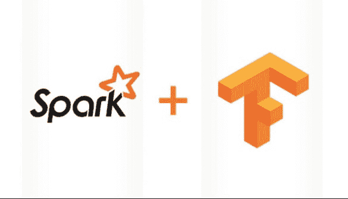
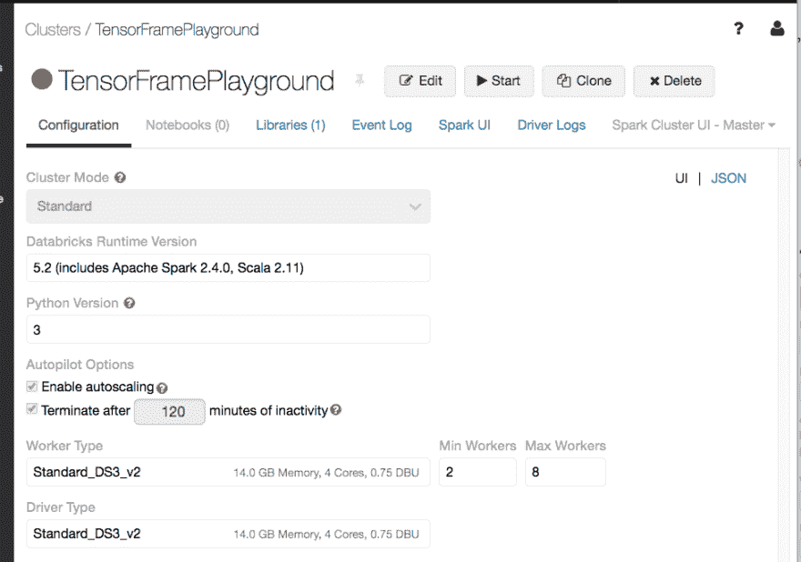
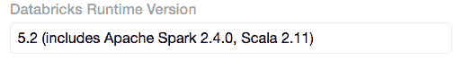
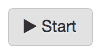
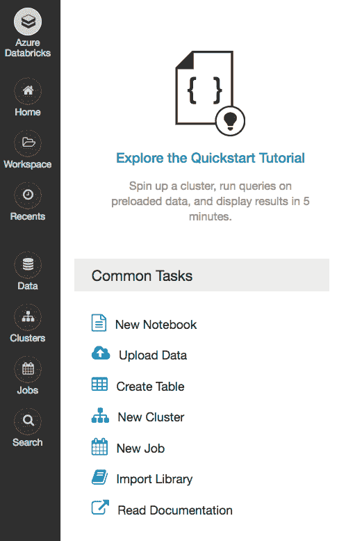
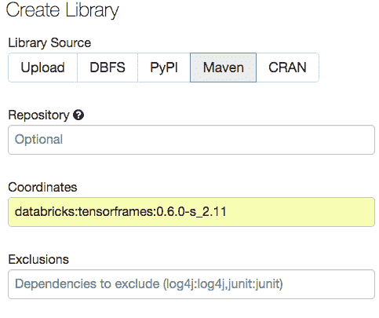
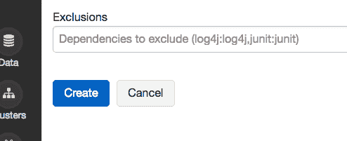
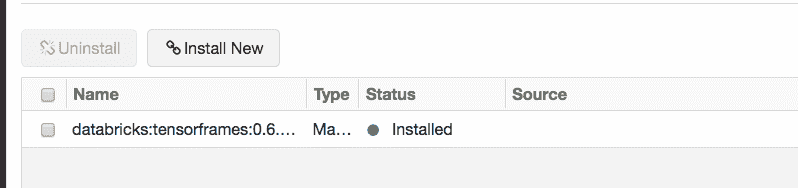
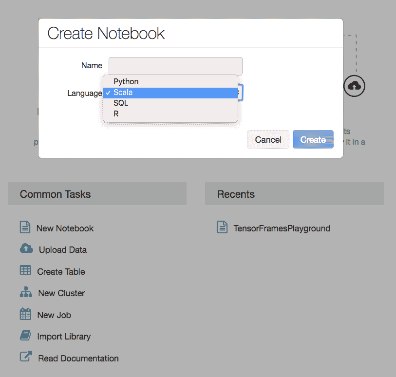
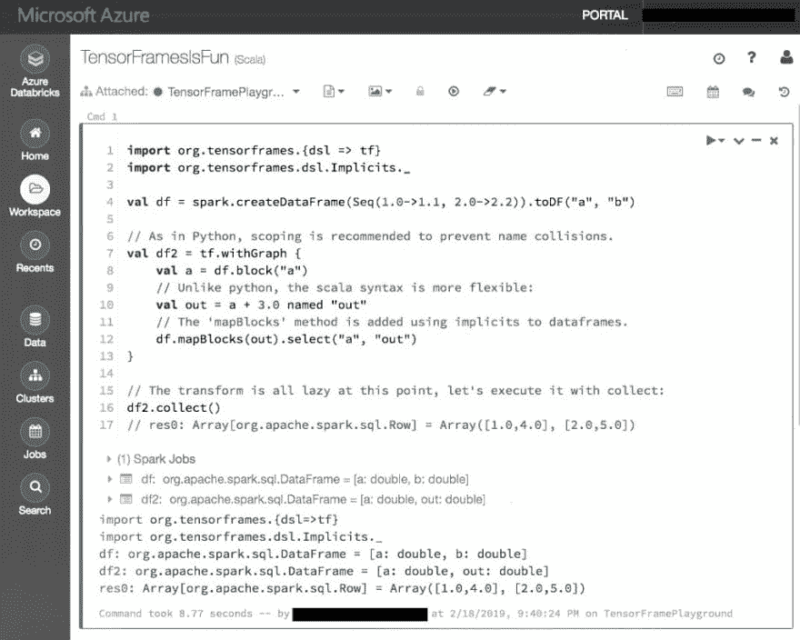

# Azure Databricks 上的 Apache Spark 和 TensorFlow 入门

> 原文：<https://dev.to/azure/getting-started-with-apache-spark-and-tensorflow-on-azure-databricks-47po>

#### 现在在 Apache Spark framework 上可以使用 TensorFlow，但是如何开始呢？看这个！

### TL；速度三角形定位法(dead reckoning)

你有没有想过写一个用 AI 的 app？请跟随我，在这篇短文结束时，您将会到达那里。



大数据是一个庞大的主题，包含许多领域和专业知识。一路从 DevOps，数据工程师到数据科学家，AI，机器学习，算法开发者等等。我们都在与海量数据作斗争。当我们处理大量数据时，我们需要最好的头脑和工具。这就是**阿帕奇火花**和**张量流**的 ***神奇*** 组合发生的地方，我们称之为**张量框架**。

Apache Spark 接管了大数据世界，提供答案并支持数据工程师变得更加成功，而数据科学家则不得不设法绕过 Spark 提供的机器学习库 Spark MLlib 的限制。

但是现在，Apache Spark 用户可以使用 TensorFlow 了。这些工具的结合使数据科学家的工作更高效、更准确、更快速。从研究到开发再到生产，比以往任何时候都要快。

[](https://i.giphy.com/media/lRnUWhmllPI9a/giphy.gif)

在我们开始之前，让我们先整理一下术语:

*   **Tensor Flow** 是 Google 创建的一个用于高性能数值计算的开源机器学习框架。它附带了对 AI 的强大支持:机器学习和深度学习。
*   **Azure Databricks** 是一个基于 Apache Spark 的分析平台，针对**微软 Azure** 云服务平台进行了优化。Azure Databricks 还充当软件即服务(SaaS) /大数据即服务(BDaaS)。
*   TensorFrames 是一个 Apache Spark 组件，它使我们能够在 Spark 集群上创建自己的可扩展 TensorFlow 学习算法。

### -1-工作区:

首先，我们需要创建工作区，我们正在使用 Databricks 工作区，这里有一个[教程](https://docs.microsoft.com/azure/azure-databricks/quickstart-create-databricks-workspace-portal?WT.mc_id=devto-blog-adpolak)用于创建它。

### -2-集群:

有了工作空间之后，我们需要创建集群本身。让我们使用[本](https://docs.microsoft.com/azure/azure-databricks/quickstart-create-databricks-workspace-portal?WT.mc_id=devto-blog-adpolak)教程创建我们的 spark 集群，确保您的集群中有以下配置:

*   Apache Spark 的工作版本(2.4 或更高版本)
*   Java 8+
*   (可选)python 2.7+/3.6+如果要使用 python 接口。
*   (可选)python TensorFlow 包(如果要使用 python 接口)。关于如何获得 TensorFlow 的最新版本，请参见[官方说明](https://www.tensorflow.org/install/)。
*   (可选)如果要使用 python 接口，pandas >= 0.19.1

配置:



使用 Databricks 运行时版本或更高版本:



按 start 启动集群



### -3-导入库:

在 **Azure Databricks** 下，进入**常见任务**，点击**导入库**:



TensorFrame 可以在 [maven 资源库](https://mvnrepository.com/artifact/databricks/tensorframes/0.2.9-s_2.11)上找到，所以选择 maven 标签。在坐标下，插入您选择的库，现在，它将是:

```
databricks:tensorframes:0.6.0-s_2.11
```



点击**创建**按钮。



点击**安装**。

你会看到这个:



嘣。您的 Databricks 集群上有 TensorFrame。

[](https://i.giphy.com/media/ZtMkorgeyRu5q/giphy.gif)

### -4-笔记本:

我们使用笔记本作为我们的代码笔记本，在那里我们可以编写代码并直接在我们的 Spark 集群上运行它。

现在我们有了一个正在运行的集群，让我们运行一个笔记本:

点击**新笔记本**,选择你喜欢的编程语言(这里我们选择了 Scala)



这是 scala 代码在带有 TensorFrames 的笔记本门户上的外观:



代码示例来自于 [Databricks git 仓库](https://github.com/databricks/tensorframes/blob/master/README.md)。

### -结尾-

现在一切都已启动并运行，他们将如何处理 tensorflow？

# 请评论！

评论一下，让我知道你的想法。你的评论让我每天都在进步，变得更好。谢谢你，❤️