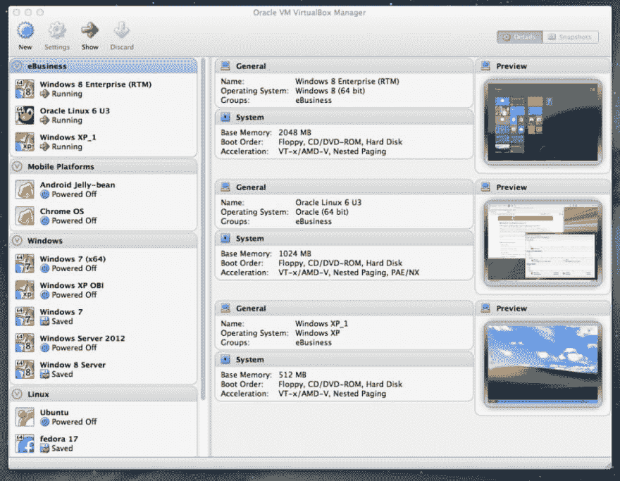
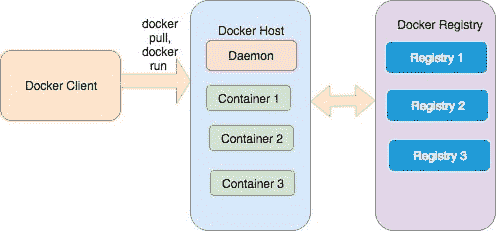
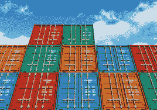
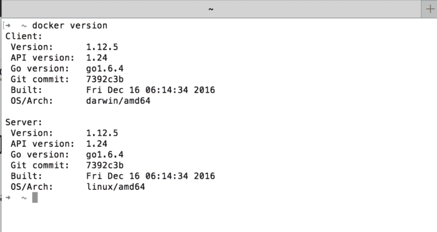
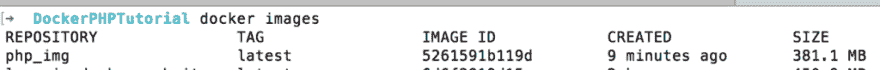
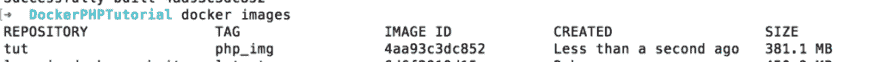
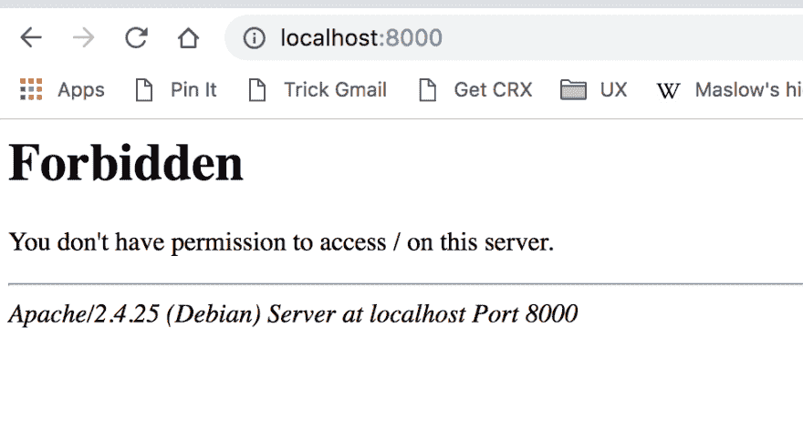
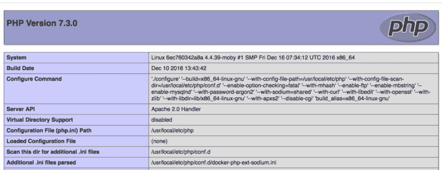

# Docker 入门

> 原文：<https://dev.to/kadnan/getting-started-with-docker-1f7a>

## 简介

在这篇文章中，您将了解 Docker 是什么，以及它如何帮助您不仅保持开发环境的有序性，而且可以移植到任何操作系统的机器上。这是这个系列的第一部分。请继续阅读！

## Docker 是什么？

> Docker 是一个执行操作系统级虚拟化的计算机程序，也称为“容器化”。[6]它于 2013 年首次发布，由 Docker，Inc .开发[7]
> 
> <cite>维基百科</cite>

[](https://res.cloudinary.com/practicaldev/image/fetch/s--jiiATJBh--/c_limit%2Cf_auto%2Cfl_progressive%2Cq_auto%2Cw_880/http://blog.adnansiddiqi.me/wp-content/uploads/2018/12/virtualbox-1024x795.png)

## 历史

Docker 并不是第一个这样的尝试。早些时候，我们看到了类似 VMWare 和 Oracle 的 VirtualBox 的尝试。我记得当我在 2007 年为一家公司工作时，我必须管理包含 **IBM Websphere** 和 **FileNet** 的 **VMWare** 的不同副本，这些副本的最小大小为 60GM。您还需要一台具有良好资源(当时大约有 4GB 内存)的机器来平稳运行它。尽管如此，这还是非常乏味的，因为您要在您的*主机* ( *运行 VMWare 本身的机器)*中导入整个操作系统及其资源。几年后，[流浪汉](https://en.wikipedia.org/wiki/Vagrant_(software))来到市场。通过在现有的 VirtualBox 上提供一个包装器，称为“流浪者盒子”,让开发者通过终端而不是通过 GUI 途径登录，从而提高了可移植性和灵活性。尽管如此，它在便携性方面并没有太大帮助。它确实解决了隔离开发环境的问题，但代价是使用了太多的资源。事情就是这样运作的，然后码头工人就诞生了。

Docker 解决了几个主要问题:

*   在 Linux 容器的帮助下实现虚拟化，这使得它非常轻量级，对资源的需求更少。
*   提供一种在远程机器上部署整个容器的机制，从而消除了臭名昭著的开发者的借口:*但是它在我的机器上工作！*让部署整个系统(数据库连接、服务器、库等，因为它们在开发人员的机器上工作)。
*   因为容器是隔离的环境，所以它允许开发者使用现有软件的最新版本，甚至是与他们自己的主机操作系统不兼容的软件。例如，在 Windows 机器上的开发人员可以在 Docker 容器中运行只适用于 Windows 的服务器。
*   通过为一个服务器运行多个容器来模拟开发人员的可伸缩场景。
*   在单台机器上实现和测试[微服务架构](https://en.wikipedia.org/wiki/Microservices),无需担心资源问题。
*   为无缝部署创建工作流。

可能还有更多！

## Docker 架构及其工作原理

整个 docker 环境是基于客户机-服务器架构的。运行在您机器上的 docker 客户机与 docker 守护进程`dockerd`交互并执行操作。docker 客户机和守护进程不必驻留在同一台机器上。docker 客户端也可以与远程守护程序进行交互。该图描述了整个系统流程。

[](https://res.cloudinary.com/practicaldev/image/fetch/s--6uw202X_--/c_limit%2Cf_auto%2Cfl_progressive%2Cq_auto%2Cw_880/http://blog.adnansiddiqi.me/wp-content/uploads/2018/12/DockerArch2.jpg)

#### 图像

图像是一个模板，它由如何创建容器的指令组成。把它想象成一份包含如何使用配料做菜的说明的食谱。每个映像都基于通常属于操作系统的*基础*映像。例如，您下载了一个 Java 映像，它本身可以基于一个基本的`ubuntu`映像。您可以通过创建一个名为`Dockerfile`的文件来创建自己的图像，该文件包含一组制作图像的指令。假设你是公司的技术主管，负责为初级员工或新员工提供一个发展环境。古老而传统的方法是，你要求网络人员或新员工在你的机器上安装某些软件，如 Git、AWS 客户端等。这个过程可能会很慢，因为您必须访问每个人，并为远程服务器配置他的客户端工具。最重要的是你创建了一个`Dockerfile`,把开发者应该拥有的一切放进去。对他来说，在几分钟内建立一个形象，让一切运转起来，需要什么。

<figure>[](https://res.cloudinary.com/practicaldev/image/fetch/s--bkgXT-pt--/c_limit%2Cf_auto%2Cfl_progressive%2Cq_auto%2Cw_880/http://blog.adnansiddiqi.me/wp-content/uploads/2018/12/containers.jpeg) 

<figcaption>海运集装箱

</figcaption>

</figure>

#### 容器

容器是图像的运行实例。你可以把它想象成在菜谱的帮助下准备的一道菜。所以无论你在`Dockerfile`中放入什么，你都可以在你的容器中看到它的输出。集装箱的概念来源于海运集装箱，集装箱里装着不同的货物，可以从一个地方运到另一个地方。docker 容器中的应用程序遵循类似的方法，使开发人员的生活更加轻松。

#### 注册表

Docker 注册表实际上是存储图像的存储库。你可以有一个像 [Docker Hub](https://hub.docker.com) 这样的公共注册中心，也可以有一个与你的组织相关的图片的私有注册中心。当你执行 docker 命令如`run`、`pull`或`build`时，它实际上从远程注册表下载图像。

## 安装

Docker 可用于 Windows、Linux 和 Mac，您可以从[这里](https://www.docker.com/get-started)下载。我在 Mac 上，所以除了使用 OSX 版本的教程之外别无选择，但我非常确定它类似于[的 Windows](https://docs.docker.com/docker-for-windows/install/#start-docker-for-windows) 版本。安装后，转到终端或 Shell 并运行以下命令:

`docker version`

[](https://res.cloudinary.com/practicaldev/image/fetch/s--GBPifoDO--/c_limit%2Cf_auto%2Cfl_progressive%2Cq_auto%2Cw_880/http://blog.adnansiddiqi.me/wp-content/uploads/2018/12/docker_version_command-1024x544.png)

你会看到一个不同的版本，因为你可以看到我的一个是相当旧的，不能升级，由于我的 OSX 限制。不管怎样，如果你能看到类似的东西，这意味着一切都很好。我们继续吧。很好！请继续阅读。

目标是建立一个与 php 和 MySQL 相关的开发环境，这样你就可以创建基于 PHP 的 web 应用程序。你愿意用最新版本的 PHP 和 MySQL。对于本教程，我将选择 PHP 7.3.x 和 MySQL8。你想在 Github 上保存你的代码，所以你必须安装 Git。

## 创建 Dockerfile 文件

我已经在上面简要介绍了`Dockerfile`是关于什么的，所以是时候开始创造我们自己的了。在此之前，创建一个名为`DockerPHPTutorial`的文件夹，并在其中创建一个名为`src`的子文件夹，它将保存所有与你的应用程序相关的源代码。确保`Dockerfile`在根文件夹中。文件夹结构将类似于下面给出的:

**。**

index.php├──

└──**src**

└──

现在是时候开始寻找我们需要的 PHP 图像了。为此，我将前往 Docker Hub 网站搜索 PHP。我会选择 T2 官方形象。

如果你向下滚动一点，你会发现一个标题**支持的标签和各自的 Dockerfile 链接**，在那里你可以找到你需要的图像。我会选择 **7.3-apache (Ctrl+F 搜索)**，因为除了 PHP 之外，我还需要安装 Apache web 服务器。毕竟我还要跑网站！如果你点击它的[链接](https://github.com/docker-library/php/blob/a280ab8e8790052338ce59a1fee739df8f831f16/7.3/stretch/apache/Dockerfile)，你会发现它是另一个`Dockerfile`。我在上面讨论过图像可以用基本图像来开发。如果你访问它的 Dockerfile 文件，你会发现图像本身是从 *Debian Stretch* 开发的，我是怎么找到它的？我发现了一行文字`FROM debian:stretch-slim`,它告诉我们 **7.3-apache** 图像是基于 Debian Stretch 的。如果你继续往下读，你会发现安装 PHP 和 Apache 的命令，以及如何让它运行。

所以，`Dockerfile`的第一行是`FROM php:7.3-apache`，它最终调用`docker pull`命令。如果你只提到`docker pull php`，它就会拉出标签为`:latest`的图片。点击[此](https://docs.docker.com/engine/reference/commandline/pull/)链接了解更多信息。

```
FROM php:7.3-apache COPY src/ /var/www/html/ EXPOSE 80 
```

Enter fullscreen mode Exit fullscreen mode

第二行用于从主机的`src`文件夹中复制数据。为什么是`/var/www/html`？您将在设置文档根目录的 PHP 图像的 Dockerfile 中找到答案。下一个是`EXPOSE`，它记录了你想暴露哪个端口。如果你没有提到端口，那么容器将监听所有端口。一切就绪，是时候运行构建它了:

```
docker build -t php\_img . 
```

Enter fullscreen mode Exit fullscreen mode

在`docker build`之后，你使用`-t`开关来设置你的图像的标签，在这种情况下，它被设置为 *php_img* 。在那之后你提到了`Dockerfile`的路径，在这种情况下它是在当前目录中，因此只提到了`.`。要了解其他可用选项，请访问此处的参考资料。

好的，一旦构建完成，您可以通过在终端中运行命令`docker images`来验证它。

[](https://res.cloudinary.com/practicaldev/image/fetch/s--78bDD-hi--/c_limit%2Cf_auto%2Cfl_progressive%2Cq_auto%2Cw_880/http://blog.adnansiddiqi.me/wp-content/uploads/2018/12/docker_images_command-1024x82.png)

注意*库*和**标签**一栏，可以看到*库*部分下的 **php_img** 和**标签**部分下的*最新*。Docker 建议您以**名称:标签**格式设置名称。因此，当您运行类似`docker build -t tut:php_img .`的构建命令时，它将如下所示:

[](https://res.cloudinary.com/practicaldev/image/fetch/s--ZQhVi65g--/c_limit%2Cf_auto%2Cfl_progressive%2Cq_auto%2Cw_880/http://blog.adnansiddiqi.me/wp-content/uploads/2018/12/docker_images_command1-1024x72.png)

现在 **tut** 在*库*下，php_img 在标签部分下。当你在 Repo:tag 格式下没有提及时，那么它使用主图像标签。在这种情况下**最新**的 *PHP* 图片。

它是构建的，但不是运行的。这类似于编译一个程序。当你构建时，只是创建一个二进制文件，而不是执行它。你必须运行它。这里也一样。您只构建了一个映像，您仍然需要运行它，为此您需要运行`docker run`命令。

```
docker run -p 80:80 tut:php\_img 
```

Enter fullscreen mode Exit fullscreen mode

当我运行它时，我得到了这个！

[](https://res.cloudinary.com/practicaldev/image/fetch/s--xz1_t-Kv--/c_limit%2Cf_auto%2Cfl_progressive%2Cq_auto%2Cw_880/http://blog.adnansiddiqi.me/wp-content/uploads/2018/12/apache_error.png)

哎哟！怎么回事！似乎是文件权限问题。结果是，镜像卷没有映射到我们的主机路径。如果你用的是 OSX，可能也是 windows，Docker 只允许安装一些选择性的文件夹。点击 Docker 图标，进入首选项>文件共享，添加应用程序文件所在文件夹的绝对路径:

[](https://res.cloudinary.com/practicaldev/image/fetch/s--0A1SZxnm--/c_limit%2Cf_auto%2Cfl_progressive%2Cq_auto%2Cw_880/http://blog.adnansiddiqi.me/wp-content/uploads/2018/12/docker_pref.png)

您还必须更改您的`docker run`命令:

`docker run -p 8000:80 -v /Development/PetProjects/DockerPHPTutorial/src:/var/www/html/ tut:php_img`

所以首先安装卷，然后使用`-v`开关将本地文件夹映射到 docker 镜像文件夹。哦，在你进入浏览器之前，不要忘记在`src/`文件夹下创建一个文件`index.php`。我只是把`phpinfo()`放进去。如果一切顺利，下面的画面应该足以让你拍拍自己的背了。

<figure>[](https://res.cloudinary.com/practicaldev/image/fetch/s---T-q1HqO--/c_limit%2Cf_auto%2Cfl_progressive%2Cq_auto%2Cw_880/http://blog.adnansiddiqi.me/wp-content/uploads/2018/12/docker_phpinfo-1024x395.png) 

<figcaption>网页内参
</figcaption>

</figure>

## 结论

在这篇文章中，你学习了如何安装和设置 docker，并使其可用于构建基于 PHP 的网站。你应该对建立自己的 docker 镜像感到满意，即使它不是基于 PHP 的。在下一篇文章中，我将讨论 Docker compose 以及如何使用`docker-compose.yml`文件来组织和运行多个基于服务的容器。

阅读第二部分[在 docker 中创建你的第一个 PHP/MySQL 应用程序](http://blog.adnansiddiqi.me/create-your-first-php-mysql-application-in-docker/)