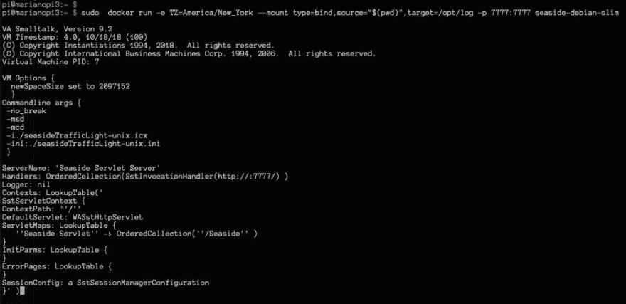
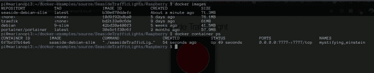
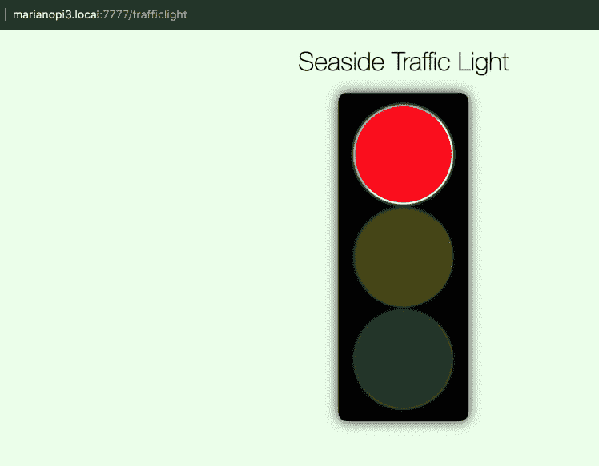
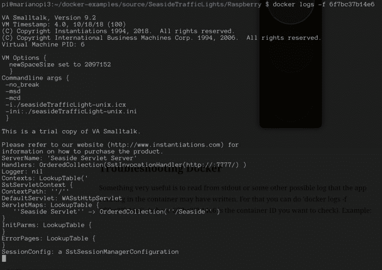
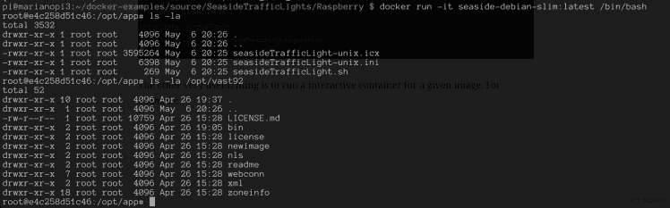

# Docker 和 Smalltalk 入门！

> 原文：<https://dev.to/martinezpeck/getting-started-with-docker-and-smalltalk-4po1>

## 什么是 Docker 和 Linux 容器？

Linux 容器是一种已经存在了很长时间的虚拟化方式。与运行起来笨重的传统“虚拟机”如 VMWare、VirtualBox 等相比，容器是轻量级的，小得多，并且它们共享主机的内核。也就是说，可以在主机的 Linux 内核中运行和控制 X 个独立的小型 Linux 系统(容器)。这些容器能够运行“应用程序”(web 服务器、数据库、域应用程序、邮件服务器、监控工具等等)。这产生了硬件资源、控制等的更好的优化。

Docker 走得更远，给了我们一个管理运行在容器上的应用程序的工具。它简化了创建、部署和维护容器的任务。让我们(Smalltalkers)觉得好笑的是，Docker 又引入了“形象”这个概念(嘿，Docker 别偷我们的，那个词是我们的！！！！).你猜怎么着？这是同样的想法。它基本上是运行一些指令来构建和运行应用程序的可执行结果。然后，当 Docker 运行该映像时，它“变成”一个(或多个)容器。

这里很好地总结了我刚才试图解释的内容。

液体错误:内部

## 为什么 Docker 与 Smalltalk 相关？

Docker 的一些特性对我们来说并不奇怪。然而，还是有不少:

*   轻松部署。
*   能够将相同的“基础架构”复制到多个位置(测试、生产等),而不管运行的主机是什么。
*   更好的优化硬件资源。
*   缓解水平缩放。每个物理节点可以运行 N 个容器，一个“云”中可以有 M 个节点(详见下文)。
*   允许流行的“基础设施作为代码”(尽管我更喜欢称之为“基础设施作为配置文件”)。
*   您的部署/构建是可复制的，代码版本化，等等。
*   现有的软件(网络服务器、数据库、工具等)有很多 Docker 定义，所以你不必安装所有的，只需从现有的镜像开始。
*   背后的大玩家( [RedHat OpenShift](https://www.openshift.com/) 、 [Google Kubernetes](https://cloud.google.com/kubernetes/) 等)
*   许多其他人…

显然，我认为答案(“为什么相关？”)在很大程度上取决于你向谁提问:开发人员、系统管理员还是开发人员。

## 如何对 Smalltalk 应用进行 Dockerize？

你必须做的第一件事是为你的应用程序创建一个 Docker 文件，指定你的 Docker 映像/容器需要的所有东西。通常，你不是从零开始，而是从现有的图像开始。Dockerhub 是现存最大的图片库。当然，还有其他的。

几周前，一些来自[实例](https://twitter.com/instantiations)的客户询问如何使用 Docker 和 [VASmalltalk](https://www.instantiations.com/products/vasmalltalk/index.html) 。因此，在一些人的帮助下(感谢朱利安·马斯特里和诺贝特·施莱默！)从社区中，我们在 github 上获得了一些[现成的例子。](https://github.com/vasmalltalk/docker-examples)

> 马里亚诺马丁内斯佩克[@马丁内斯佩克](https://dev.to/martinezpeck)琢磨着怎么跟 [@Docker](https://twitter.com/Docker) 上一个 [@Raspberry_Pi](https://twitter.com/Raspberry_Pi) ？看看 forum.world.st/ANN-Running-VA…的。感谢 [@Noschvie](https://twitter.com/Noschvie) 和 Julian Maestri 的帮助！[@实例化](https://twitter.com/instantiations)2019 年 03 月 04 日下午 17:57[](https://twitter.com/intent/tweet?in_reply_to=1102629181551230977)[](https://twitter.com/intent/retweet?tweet_id=1102629181551230977)[](https://twitter.com/intent/like?tweet_id=1102629181551230977)

github 上的例子是一个模拟交通灯的[海边](https://github.com/SeasideSt/Seaside) web 应用程序。这是一个非常简单的例子，但足以展示几个特性。[注意`.icx`图像大小只有 3.5MB](https://github.com/vasmalltalk/docker-examples/blob/master/source/SeasideTrafficLights/Raspberry/app/seasideTrafficLight-unix.icx) ，它允许堆栈转储、远程调试等(以后文章的主题)。

web 应用程序在端口`7777`下运行，因此您可以通过类似的方式从 web 浏览器访问它:[http://yourhostname.local:7777/trafficlight](http://yourpihostname.local:7777/trafficlight)

更有趣的是，我们的主机(运行 Docker 的地方)并不是一台普通的装有 Linux 的 PC，而是一台运行 Raspbian Linux 的 Raspberry Pi 3B+)。反正所有细节的切入点都是[这里](https://github.com/vasmalltalk/docker-examples/tree/master/source/SeasideTrafficLights/Raspberry)。

如您所见，有多个`docker\*`文件。这是因为我们尝试了不同的操作系统和风格。我们目前使用的是 [debian_slim_Dockerfile](https://github.com/vasmalltalk/docker-examples/blob/master/source/SeasideTrafficLights/Raspberry/debian_slim_Dockerfile) ，看起来是这样的:

```
FROM debian:9-slim

# Comment build and run commands
# docker build -f ./debian_slim_Dockerfile -t seaside-debian-slim .
# docker run -e TZ=America/New_York --mount type=bind,source="$(pwd)",target=/opt/log -p 7777:7777 seaside-debian-slim

LABEL version="0.2.0"
LABEL maintainer="mpeck@instantiations.com"
LABEL description="VAST SeasideTrafficLight example"

# Install VASmalltalk Dependencies
RUN apt-get update \ && apt-get install --assume-yes --no-install-recommends libc6 libssl-dev locales \ && apt-get clean \ && rm --recursive --force /var/lib/apt/lists/* /tmp/* /var/tmp/* \ && echo en_US.ISO-8859-1 ISO-8859-1 >> /etc/locale.gen \ && locale-gen

# set working directory
WORKDIR /opt/app

ADD ./vast92 /opt/vast92
ADD ./app /opt/app

RUN mkdir /opt/log

EXPOSE 7777

# Start application 

CMD ["./seasideTrafficLight.sh"] 
```

Enter fullscreen mode Exit fullscreen mode

本文件的要点:

1.  `FROM debian:9-slim`定义我们从哪个图像开始。在这种情况下，debian:9-slim 可以在 Dockerhub 上自动找到。
2.  我们安装 VASmalltalk 依赖项并生成必要的`$LOCALE`。
3.  我们将目录`vast92` (VASmalltalk 虚拟机)和`app`从主机复制到容器中
4.  我们只需启动 bash 脚本`./seasideTrafficLight.sh`。

bash 脚本非常简单，只需调用 Smalltalk VM 并传递图像和 ini 文件作为参数:

```
#!/bin/sh

cd /opt/app

export LANG=en_US.iso88591
export VAST_ROOT="/opt/vast92"
export LD_LIBRARY_PATH="${VAST_ROOT}/bin:$LD_LIBRARY_PATH"
$VAST_ROOT/bin/esnx -no_break -msd -mcd -i./seasideTrafficLight-unix.icx -ini:./seasideTrafficLight-unix.ini

cp *.sdf /opt/log 
```

Enter fullscreen mode Exit fullscreen mode

## 现在如何用 Docker 运行？

显而易见的第一步是安装 Docker。谷歌是你的朋友。

好了，我们有 Docker 文件和 Docker 工作。我们现在要干嘛？第一步是从 Dockerfile 文件中“构建”一个映像，第二步是运行它(这意味着容器正在运行)。你可以这样做:

```
cd $HOME
git clone https://github.com/vasmalltalk/docker-examples.git
cd docker-examples/source/SeasideTrafficLights/Raspberry/
docker build -f ./debian_slim_Dockerfile -t seaside-debian-slim .
docker run -e TZ=America/New_York --mount type=bind,source="$(pwd)",target=/opt/log -p 7777:7777 seaside-debian-slim 
```

Enter fullscreen mode Exit fullscreen mode

仅此而已。您应该已经创建了一个映像并启动了一个运行它的容器。

**非常重要的一点:** Docker 容器不是持久化的。这是什么意思？无论您在容器中写入了什么，只要容器一关闭，就会被擦除/丢失。增加“坚持”的方法有很多，但这很大程度上取决于你需要什么。

确认我们步骤的有用命令是`docker images`和`docker containers ps`。见下图:

[](https://res.cloudinary.com/practicaldev/image/fetch/s--RZkSYaxJ--/c_limit%2Cf_auto%2Cfl_progressive%2Cq_auto%2Cw_880/https://marianopeck.files.wordpress.com/2019/05/screen-shot-2019-05-06-at-5.28.30-pm.png%3Fw%3D748)

**重要提示:**注意容器的大小只有 71MB。我认为这是一个很好的起点。

很明显你会看到交通灯亮起:

[](https://res.cloudinary.com/practicaldev/image/fetch/s--jhEDHCzB--/c_limit%2Cf_auto%2Cfl_progressive%2Cq_auto%2Cw_880/https://marianopeck.files.wordpress.com/2019/05/screen-shot-2019-05-06-at-5.29.43-pm.png%3Fw%3D748)

## 故障排除和 Docker 提示

一个非常有用的方法是从 stdout 或者容器中运行的应用程序可能写的其他日志中读取数据。为此，您可以执行`docker logs -f 6f7bc37b14e6`(其中`6f7bc37b14e6`是您想要检查的容器 ID)。示例:

[](https://res.cloudinary.com/practicaldev/image/fetch/s--RlQ6StzQ--/c_limit%2Cf_auto%2Cfl_progressive%2Cq_auto%2Cw_880/https://marianopeck.files.wordpress.com/2019/05/screen-shot-2019-05-06-at-5.33.06-pm.png%3Fw%3D748)

另一件非常有用的事情是为给定的图像运行一个交互式容器。例如:

[](https://res.cloudinary.com/practicaldev/image/fetch/s--XZTjnMHx--/c_limit%2Cf_auto%2Cfl_progressive%2Cq_auto%2Cw_880/https://marianopeck.files.wordpress.com/2019/05/screen-shot-2019-05-06-at-5.35.01-pm.png%3Fw%3D748) 所以…基本上你可以在你的容器里面打开一个交互式的 bash！！！！这很有用。

这里有一个最有用的 Docker 命令列表，以防你想进一步探索(比如如何停止和移除容器等)。

## 下一步？

使用常规的`docker`命令，您实际上可以一次运行**一个**容器，并且在一个**单个**节点中运行。但是，这样做的好处是可以将 X 个容器拆分到 Y 个节点上，对吗？所以……下面是我关于这个话题的下一篇文章的预告:

液体错误:内部

希望你喜欢，

## [更新:关于这个话题请看下篇帖子！](https://dev.to/martinezpeck/step-2-single-node-docker-swarm-and-smalltalk-46i0)