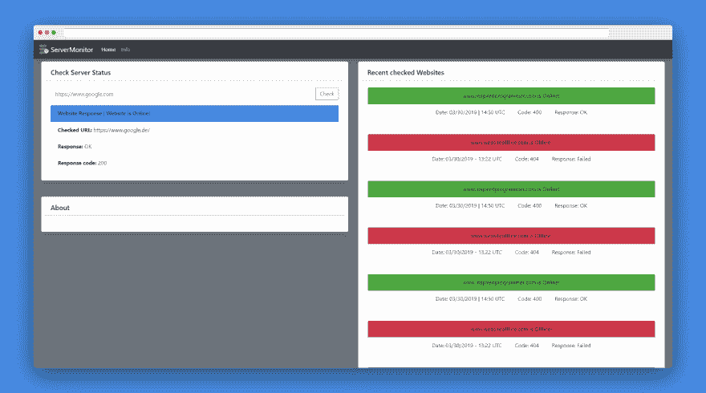
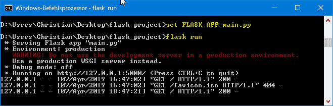
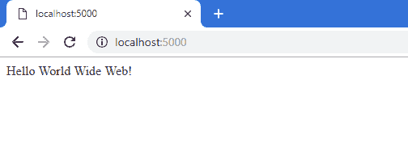

# Flask 入门-“你好万维网！”

> 原文：<https://dev.to/chrislutz/getting-started-with-flask-hello-world-wide-web-3gm0>

创建网络应用可能是你一生中能做的最酷的事情之一。；原因很明显。
你可以创造一些有意义的东西，每个人都可以使用。

对于一些工作，你可能会创建这样的东西:
[](https://res.cloudinary.com/practicaldev/image/fetch/s--mhXf-Itt--/c_limit%2Cf_auto%2Cfl_progressive%2Cq_auto%2Cw_880/https://thepracticaldev.s3.amazonaws.com/i/x6hflc63am2q50lj1lll.png)

关注我，在不久的将来获得更多关于 [ServerMonitor](https://github.com/ChristianLutzCL/Website-Monitoring) 的信息。

我们开始吧！

* * *

# 简介

Flask 是一个基于 Werkzeug 和 Jinja2 的轻量级 Python web 框架。轻量级意味着 Flask 只有最基本的特性来创建你自己的 web 应用程序。与 Django 不同，其他所有东西，比如管理面板，都必须从头开始构建。

对于开始使用 Python 进行 web 开发的人来说，这很有意义。在你能构建一个网络应用之前，你不需要学习很多框架的东西。

# 创建您的项目

创建一个文件夹，存放您的 Flask 项目。您可以在 Windows 上的 CMD 中执行此操作。

```
mkdir flask_project 
```

然后，使用
打开您创建的文件夹

```
cd flask_project 
```

# 安装

通过 PIP 安装 flask 非常容易。
简单地键入...

```
pip install Flask 
```

...安装烧瓶模块。

# 设置应用程序

安装完 Flask，我们要做一个 Python 文件。我将把它命名为‘main . py’

这个文件将包含 Flask 运行的所有基本代码。

```
from flask import Flask
app = Flask(__name__)

@app.route("/")
def hello_www():
    return "Hello World Wide Web!" 
```

### 代码解释

首先，我们用:
从 Flask 中导入我们安装的 Flask 模块

```
from flask import Flask 
```

然后，我们定义变量“app”并给它赋值“Flask(_*name*_)”:

```
app = Flask(__name__) 
```

之后，我们可以用
创建我们的第一条路线

```
@app.route("/") 
```

为了让它工作，我们需要一些返回值，将显示在我们的网页上。

为此，我们键入:

```
def hello_www():
    return "Hello World Wide Web!" 
```

最后，我们将返回一个字符串“Hello World Wide Web！”。

# 运行您的应用程序

创建并保存代码后，我们希望看到结果。
为此，您首先需要以这种方式为 Flask 定义您的 Python 文件:

```
set FLASK_APP=main.py 
```

如果这样做了，你可以用
启动你的网络应用

```
flask run 
```

[](https://res.cloudinary.com/practicaldev/image/fetch/s--TOR7fmSh--/c_limit%2Cf_auto%2Cfl_progressive%2Cq_auto%2Cw_880/https://thepracticaldev.s3.amazonaws.com/i/zst1ov6ur9gw19gvqr91.png)

前往 [http://localhost:5000](http://localhost:5000) 或 [http://127.0.0.1:5000](http://127.0.0.1:5000) ，查看您的结果:

[](https://res.cloudinary.com/practicaldev/image/fetch/s--QHUvteE1--/c_limit%2Cf_auto%2Cfl_progressive%2Cq_auto%2Cw_880/https://thepracticaldev.s3.amazonaws.com/i/mcyx6yg1b2ty1tzaz7wg.png)

恭喜你！您已经创建了您的第一个 web 应用程序。

如果你想更深入地探索烧瓶世界，请访问 http://flask.pocoo.org/。

### 感谢阅读！