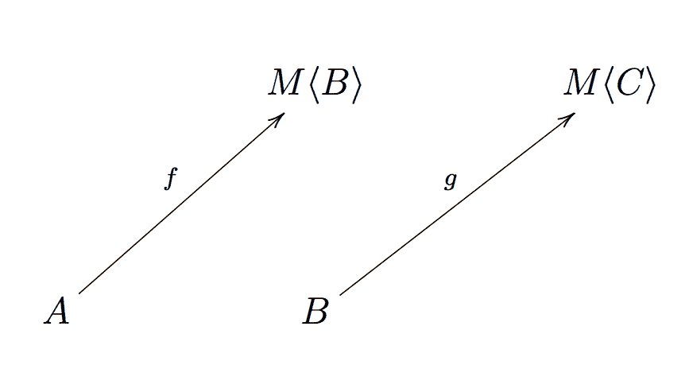
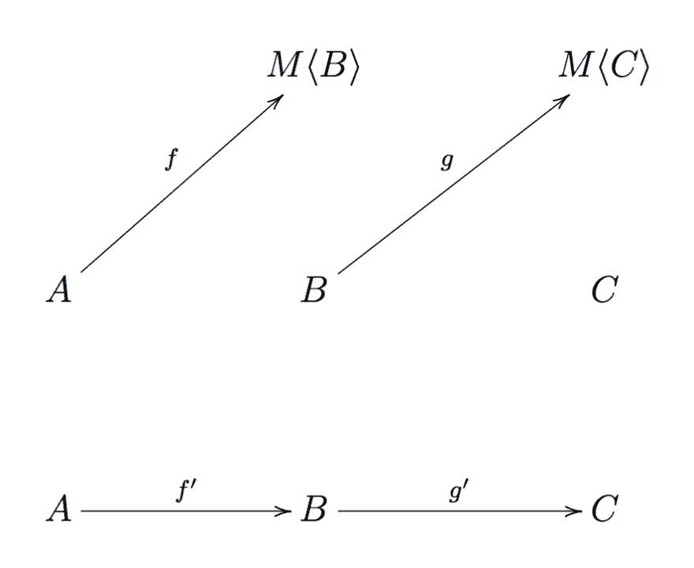
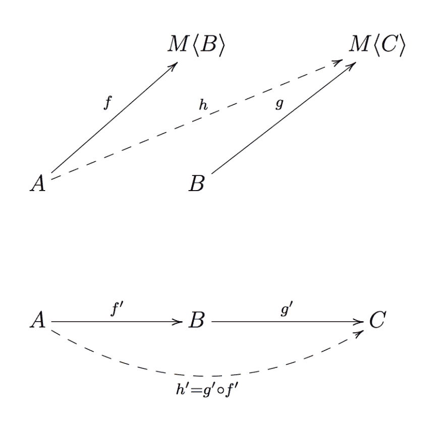
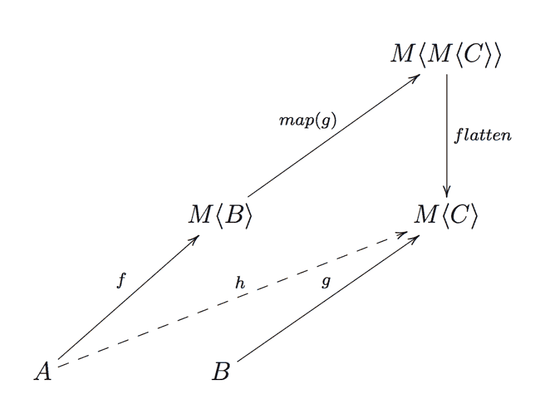
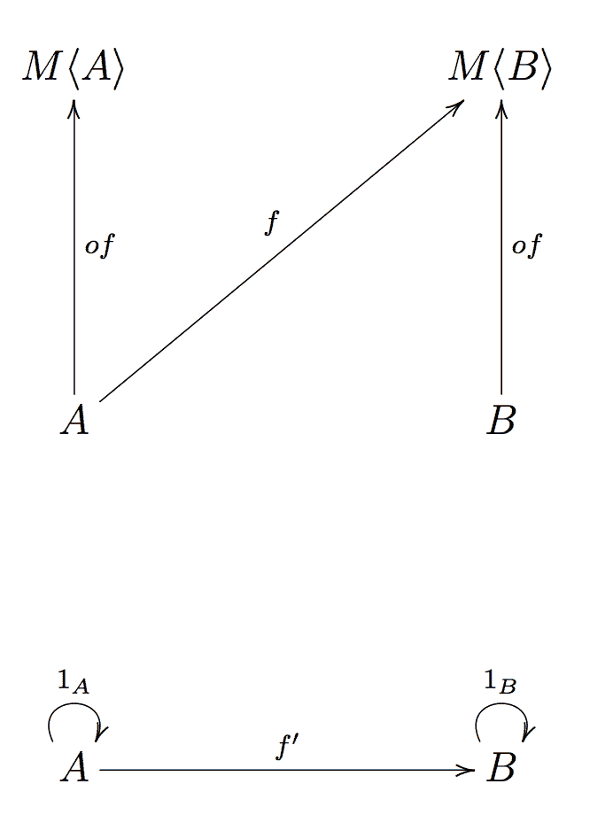

# fp-ts 入门:Monad

> 原文：<https://dev.to/gcanti/getting-started-with-fp-ts-monad-6k>

在[的最后一篇](https://dev.to/gcanti/getting-started-with-fp-ts-applicative-1kb3)文章中，我们看到，只要`M`接受一个适用的仿函数实例，通过提升`g`，我们可以用一个纯`n`的程序`g`组成一个有效的程序`f: (a: A) => M<B>`

| 程序 | 程序 | 作文 |
| --- | --- | --- |
| 纯的 | 纯的 | `g ∘ f` |
| 有效的 | pure, `n` -ary | `liftAn(g) ∘ f` |

<center>where `liftA1 = lift`</center>

然而，我们必须解决最后一个问题:如果两个程序都有效呢？

```
f: (a: A) => M<B>
g: (b: B) => M<C> 
```

Enter fullscreen mode Exit fullscreen mode

这样的`f`和`g`的“成分”是什么？

为了处理最后一种情况，我们需要比`Functor`更强大的东西，因为它很容易导致嵌套上下文。

# 问题:嵌套上下文

为了更好地解释为什么我们需要更多的东西，让我们看一些例子。

**例子** ( `M = Array`)

假设我们想要检索一个 Twitter 用户的追随者的追随者:

```
interface User {
  followers: Array<User>
}

const getFollowers = (user: User): Array<User> => user.followers

declare const user: User

const followersOfFollowers: Array<Array<User>> = getFollowers(user).map(getFollowers) 
```

Enter fullscreen mode Exit fullscreen mode

这里有问题，`followersOfFollowers`的类型是`Array<Array<User>>`，但我们想要的是`Array<User>`。

我们需要**展平**嵌套数组。

`fp-ts`导出的`flatten: <A>(mma: Array<Array<A>>) => Array<A>`函数派上用场

```
import { flatten } from 'fp-ts/Array'

const followersOfFollowers: Array<User> = flatten(getFollowers(user).map(getFollowers)) 
```

Enter fullscreen mode Exit fullscreen mode

不错！其他数据结构呢？

**例子** ( `M = Option`)

假设我们想计算一个数字列表头的倒数

```
import { Option, some, none, option } from 'fp-ts/Option'
import { head } from 'fp-ts/Array'

const inverse = (n: number): Option<number> => (n === 0 ? none : some(1 / n))

const inverseHead: Option<Option<number>> = option.map(head([1, 2, 3]), inverse) 
```

Enter fullscreen mode Exit fullscreen mode

Opss，我又做了一次，`inverseHead`有类型`Option<Option<number>>`但是我们想要`Option<number>`。

我们需要**展平**嵌套的`Option` s.

```
import { isNone } from 'fp-ts/Option'

const flatten = <A>(mma: Option<Option<A>>): Option<A> => (isNone(mma) ? none : mma.value)

const inverseHead: Option<number> = flatten(option.map(head([1, 2, 3]), inverse)) 
```

Enter fullscreen mode Exit fullscreen mode

所有那些`flatten`功能...这不是巧合，引擎盖下有一个功能模式。

事实上，所有这些类型构造函数(以及许多其他类型)都承认一个**单子实例**和

> `flatten`是单子最奇特的操作

那么什么是单子呢？

单子通常是这样呈现的...

# 定义

单子有三个定义:

(1)一个类型构造函数`M`，它允许一个[仿函数](https://dev.to/gcanti/getting-started-with-fp-ts-functor-36ek)实例

(2)具有以下签名
的函数`of`

```
of: <A>(a: A) => HKT<M, A> 
```

Enter fullscreen mode Exit fullscreen mode

(3)具有以下签名
的函数`flatMap`

```
flatMap: <A, B>(f: (a: A) => HKT<M, B>) => ((ma: HKT<M, A>) => HKT<M, B>) 
```

Enter fullscreen mode Exit fullscreen mode

**注意**:回想一下`HKT`类型是表示泛型类型构造函数的`fp-ts`方式，所以当你看到`HKT<M, X>`时，你可以想到应用于类型`X`(即`M<X>`)的类型构造函数`M`。

函数`of`和`flatMap`需要遵守三个定律:

*   `flatMap(of) ∘ f = f` ( **左身份**)
*   `flatMap(f) ∘ of = f` ( **右身份**)
*   `flatMap(h) ∘ (flatMap(g) ∘ f) = flatMap((flatMap(h) ∘ g)) ∘ f` ( **关联性**)

其中`f`、`g`、`h`均为有效函数，`∘`为常用函数组合。

# 还好但是...为什么？

当我第一次看到这个定义的时候，我的第一反应是困惑。

所有这些问题都在我脑海里打转:

*   为什么会有这两种特殊的操作，为什么会有这些类型？
*   为什么叫“平面地图”？
*   为什么是法律？它们是什么意思？
*   但最重要的是，我的`flatten`在哪里？

本帖将尝试回答每个问题。

让我们回到我们的问题:两个有效函数(也称为 **Kleisli arrows** )的组成是什么？

[](https://res.cloudinary.com/practicaldev/image/fetch/s--42hP0aU4--/c_limit%2Cf_auto%2Cfl_progressive%2Cq_auto%2Cw_880/https://thepracticaldev.s3.amazonaws.com/i/gom0mol0h57jurvmy9n1.png)

<center>(two Kleisli arrows, what's their composition?)</center>

我都不知道它是什么类型的。

等待...我们已经遇到了一个关于合成的抽象概念。你还记得我说过的[类别](https://dev.to/gcanti/getting-started-with-fp-ts-category-4c9a)吗？

> 类别抓住了构图的本质

我们可以把我们的问题变成一个范畴问题:我们能找到一个范畴来模拟克莱斯利箭的构成吗？

# 克莱里范畴

让我们试着建立一个只包含有效函数的类别 *K* (名为**克莱斯利类别**):

*   **对象**是 *TS* 类别的相同对象，即所有的打字稿类型。
*   **态射**是这样构建的:每当 *TS* 中有一个克莱斯利箭头`f: A ⟼ M<B>`时，我们就在 *K* 中画一个箭头`f': A ⟼ B`

[](https://res.cloudinary.com/practicaldev/image/fetch/s--HSu-fN2C--/c_limit%2Cf_auto%2Cfl_progressive%2Cq_auto%2Cw_880/https://thepracticaldev.s3.amazonaws.com/i/zz2xubsrhpizvq4slxxp.png)

<center>(above the *TS* category, below the *K* construction)</center>

那么 *K* 中的`f'`和`g'`会是什么构成呢？这就是下图中标有`h'`的虚线箭头

[](https://res.cloudinary.com/practicaldev/image/fetch/s--HMd3QDqf--/c_limit%2Cf_auto%2Cfl_progressive%2Cq_auto%2Cw_880/https://thepracticaldev.s3.amazonaws.com/i/339yozksu42ql1mfbsxf.png)

<center>(above the composition in the *TS* category, below the composition in the *K* construction)</center>

既然`h'`是从`A`到`C`的箭头，那么在`TS`中从`A`到`M<C>`应该有对应的功能`h`。

所以对于 *TS* 中的`f`和`g`的组合来说，一个很好的候选仍然是一个具有以下签名的有效函数:`(a: A) => M<C>`。

我们如何构建这样一个函数呢？好吧，我们试试！

# 我们在其中一步步构建作文

单子定义的要点(1)说`M`允许一个函子实例，所以我们可以将函数`g: (b: B) => M<C>`转化为函数`lift(g): (mb: M<B>) => M<M<C>>`(这里我使用它的同义词`map`)

[](https://res.cloudinary.com/practicaldev/image/fetch/s--AZ_N1BYX--/c_limit%2Cf_auto%2Cfl_progressive%2Cq_auto%2Cw_880/https://thepracticaldev.s3.amazonaws.com/i/tawvpqf52nxtrr3gv4jh.png)

<center>(where `flatMap` comes from)</center>

现在我们陷入了困境:在仿函数实例上没有合法的操作能够**将`M<M<C>>`类型的值**展平为`M<C>`类型的值，我们需要一个额外的`flatten`操作。

如果我们能定义这样的操作，那么我们就能得到我们所寻找的组合

<center>`h = flatten ∘ map(g) ∘ f`</center>

但是等等，`flatten ∘ map(g)`是 **flatMap** ，名字就是这么来的！

<center>`h = flatMap(g) ∘ f`</center>

我们现在可以更新我们的“成分表”

| 程序 | 程序 | 作文 |
| --- | --- | --- |
| 纯的 | 纯的 | `g ∘ f` |
| 有效的 | pure, `n` -ary | `liftAn(g) ∘ f` |
| 有效的 | 有效的 | `flatMap(g) ∘ f` |

<center>where `liftA1 = lift`</center>

那`of`呢？嗯，`of`来源于 *K* 中的同态射:对于 *K* 中的每个同态射 1 <sub>A</sub> ，从`A`到`M<A>`(即`of: <A>(a: A) => M<A>`)都应该有一个对应的函数。

[](https://res.cloudinary.com/practicaldev/image/fetch/s--sIGarPNM--/c_limit%2Cf_auto%2Cfl_progressive%2Cq_auto%2Cw_880/https://thepracticaldev.s3.amazonaws.com/i/12810n5g8u9us00ic75m.png)

<center>(where `of` comes from)</center>

# 法则

最后一个问题:法律从何而来？它们只是把 *K* 中的范畴法则翻译成 *TS* :

| 法律 | *K* | *TS* |
| --- | --- | --- |
| 左侧标识 | 1 <sub>B</sub> ∘ `f'` = `f'` | `flatMap(of) ∘ f = f` |
| 正确的身份 | `f'` ∘ 1 <sub>一</sub> = `f'` | `flatMap(f) ∘ of = f` |
| 结合性 | `h' ∘ (g' ∘ f') = (h' ∘ g') ∘ f'` | `flatMap(h) ∘ (flatMap(g) ∘ f) = flatMap((flatMap(h) ∘ g)) ∘ f` |

# 单子在`fp-ts`

在`fp-ts`中，`flatMap`函数由一个名为`chain`的变体建模，它基本上是带有重新排列的参数
的`flatMap`

```
flatMap: <A, B>(f: (a: A) => HKT<M, B>) => ((ma: HKT<M, A>) => HKT<M, B>)
chain:   <A, B>(ma: HKT<M, A>, f: (a: A) => HKT<M, B>) => HKT<M, B> 
```

Enter fullscreen mode Exit fullscreen mode

注意`chain`可以从`flatMap`派生而来(反之亦然)。

现在，如果我们回到显示嵌套上下文问题的例子，我们可以通过使用`chain`
来修复它们

```
import { array, head } from 'fp-ts/Array'
import { Option, option } from 'fp-ts/Option'

const followersOfFollowers: Array<User> = array.chain(getFollowers(user), getFollowers)

const headInverse: Option<number> = option.chain(head([1, 2, 3]), inverse) 
```

Enter fullscreen mode Exit fullscreen mode

# 结论

函数式编程提供了用效果来组合函数的通用方法:函子、应用函子和单子都是抽象，为组合不同类型的程序提供了原则性的工具。

TLDR:函数式编程实际上是关于组合的