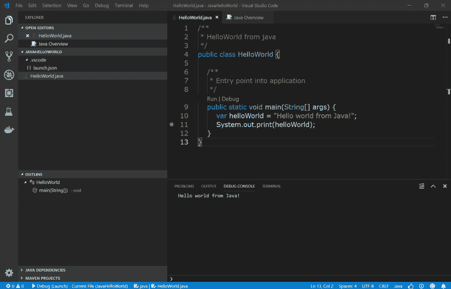

# Java 入门

> 原文：<https://dev.to/kritner/getting-started-with-java-2kj3>

我已经很多年没有用 Java 做过任何实质性的事情了。我想尝试写一系列的文章来感受一下 Java 生态系统。

## 你好世界

从最简单的事情开始。Hello world 以及试用 VSCode w/ Java。

这些步骤大部分来自 https://code.visualstudio.com/docs/java/java-tutorial，所以这将是它的翻版，我只是想把它写下来，这样我会学得更好。

### 安装 OpenJdk

Oracle 在 Java SDK(？)-我不会假装理解这一点，但这听起来像是利用[开放 JDK](https://adoptopenjdk.net/) 是要走的路线。

### 安装 VSCode 和扩展

从[https://code.visualstudio.com](https://code.visualstudio.com)安装 VSCode。安装后，安装 VSCode 扩展(Control + Shift + X):

*   Java 的语言支持
*   Java 调试器
*   Java 测试运行程序
*   Maven for Java
*   Java 依赖查看器
*   Java 扩展包

最后，安装[maven](https://maven.apache.org/)——我想从 CLI 使用它。

### 写一些代码

我需要了解 Java 项目和类似项目是如何工作的，但是现在，一个简单的 hello world 应该足够了。

```
public class HelloWorld {
  public static void main(String[] args) {
    var helloWorld = "Hello world from Java!";
    System.out.print(helloWorld);
  }
} 
```

控制 F5 那个坏男孩然后得到输出！

[](https://res.cloudinary.com/practicaldev/image/fetch/s--YjL8nN2Y--/c_limit%2Cf_auto%2Cfl_progressive%2Cq_auto%2Cw_880/https://thepracticaldev.s3.amazonaws.com/i/a0r4obk71cg5nd4jh454.PNG)

注意，我最初确实有一些 VSCode 输出错误——一个与缺少类路径有关，另一个抱怨无法创建 launch.json 文件。

丢失的类路径似乎与我正在使用一个原始的。java 文件，当我重新启动 vs code/ghost 时，第二个错误得到了解决。

下一次，我希望能够深入到 Java 的一些样板文件和仪式中，这样我可以更好地理解如何让一个项目从头开始运行；或者修改已经存在的项目。

[摄十二](https://unsplash.com/photos/mk7zhx5lFbc)在 [Unsplash](https://unsplash.com/) 上。