# Laravel 望远镜入门——它能为你做什么？

> 原文：<https://dev.to/bnevilleoneill/getting-started-with-laravel-telescope-what-can-it-do-for-you-19ib>

### Laravel 望远镜入门——它能为你做什么？

[](https://res.cloudinary.com/practicaldev/image/fetch/s--neh1DiO7--/c_limit%2Cf_auto%2Cfl_progressive%2Cq_auto%2Cw_880/https://cdn-images-1.medium.com/max/1024/1%2Aya66uWi8Ug21w5CLpIOvgA.png)

在构建 web 应用程序时，几乎不可能避免遇到 bug。这可能从打字错误到忘记分号或未定义的功能。但最重要的是，您希望了解应用程序中正在发生的一切，它们是如何以及何时发生的。访问这些信息可以让您更好地控制缩小 bug 和识别改进应用程序的机会。

Laravel 望远镜给了你这种力量。这是 Laravel 最近推出的一个令人惊叹的调试助手，它使开发变得轻而易举，不仅允许您监控和调试应用程序的各个方面，还允许您访问通常无法直接访问的大量信息。

Laravel Telescope 提供了对进入应用程序的请求、异常、日志条目、数据库查询、排队作业、邮件、通知、缓存等的深入了解。它还展示了应用程序的不同部分如何协同工作。您可以找出哪些页面工作正常，以及当向某个页面发出请求时运行了哪些查询。

在这篇文章中，我们将涵盖望远镜的惊人功能，如何设置它，它能为你做什么。

[](https://logrocket.com/signup/)

### 以前的替代品

如果您对 Laravel 中的调试并不陌生，那么您可能在过去使用过以下工具来满足您的调试需求。

#### 发条

[时钟](https://github.com/itsgoingd/clockwork)让您深入了解 PHP 应用程序运行时，包括请求数据、应用程序日志、数据库查询、缓存使用、执行可视化等等。

发条提供了一个 [Chrome](https://chrome.google.com/webstore/detail/clockwork/dmggabnehkmmfmdffgajcflpdjlnoemp) 或 [Firefox](https://addons.mozilla.org/en-US/firefox/addon/clockwork-dev-tools/) 扩展，或者一个 web UI 和一个用于收集数据的服务器端组件，可以轻松地与任何 PHP 项目集成，包括对主要框架的开箱即用支持。

#### Laravel Debugbar

Laravel Debugbar 在浏览器底部添加一个小条，显示调试信息(如查询次数)。有了 concertive，可以很容易地进行不必要的数据库请求，因此 Debugbar 有助于识别性能不佳的代码。它显示在浏览器底部的开发人员控制台旁边。

#### Laravel 日志浏览器

[Laravel 日志查看器](https://github.com/rap2hpoutre/laravel-log-viewer)允许您在浏览器中以漂亮的 HTML 表格形式查看存储/日志文件中的日志。这些日志可以在/logs 中找到。

### Laravel 望远镜是如何工作的？

Laravel Telescope 提供了一个非常强大的用户界面，供您查看、监控和调试应用程序的各个方面。从请求到终端中运行的命令，甚至是调度的作业。它通过多个观察器来实现这一点，这些观察器被配置为监控这些事情。

这些观察器旨在收集有关进入应用程序的每个请求的信息，提供对数据库查询、执行时间、遇到的异常、事件、队列、命令等的深入了解。

### 安装

Laravel 望远镜是在最新的 Laravel 版本 5.7 中引入的，需要最低的 Laravel 5.7.7 版本才能工作。在撰写本文时，Laravel 的版本是 5.7.14。

一旦您的 Laravel 应用程序准备就绪，您就可以通过运行:
通过 composer 安装望远镜

```
composer require laravel/telescope 
```

Enter fullscreen mode Exit fullscreen mode

您还可以在安装期间使用- dev 标志指定是否希望它只在您的开发环境中工作。为此，您必须运行:

```
composer require laravel/telescope --dev 
```

Enter fullscreen mode Exit fullscreen mode

完成后，您可以发布望远镜资产并运行迁移:

```
php artisan telescope:install

php artisan migrate 
```

Enter fullscreen mode Exit fullscreen mode

Laravel 已经为您准备了两个迁移，users 表和 password_resets 表。运行迁移时，还会创建三个表来处理望远镜操作，即 telescope_entries、telescope_entries_tags 和 telescope_monitoring。

### 特性

现在，我们已经安装并设置了 telescope，访问您项目的/telescope，您将直接进入 Telescope 仪表板，左侧的选项卡列出了突出显示功能的页面。

[](https://res.cloudinary.com/practicaldev/image/fetch/s--gGgPGB1Z--/c_limit%2Cf_auto%2Cfl_progressive%2Cq_auto%2Cw_880/https://cdn-images-1.medium.com/max/462/0%2AZt4eRIz78JZgYTpf.png)

上面列出的每个功能在 Telescope 中都有自己的页面和观察器。现在，我们将浏览一下他们每个人让我们监视的内容以及他们提供的详细信息。

### 请求

这个特性页面列出了进入应用程序的所有 HTTP 请求以及发出请求的时间。它还通过单击每个条目右侧的眼睛图标来提供每个请求的附加信息。

[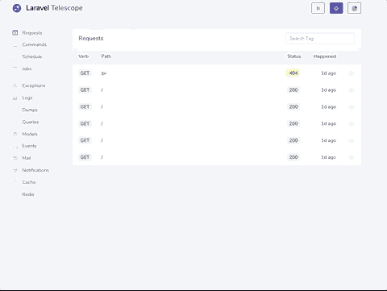](https://res.cloudinary.com/practicaldev/image/fetch/s--4sMyrDy0--/c_limit%2Cf_auto%2Cfl_progressive%2Cq_66%2Cw_880/https://cdn-images-1.medium.com/max/480/0%2ANnXIwQWplUKjatQK.gif)

对于每个请求，您还可以查看来自其他观察者的相关数据。例如，我运行了一个快速查询来获取主页上的所有用户，它显示在请求中，同时显示了该查询花费的时间。这些附加信息不仅限于查询，还可以显示由请求触发的任何其他观察器的信息。

[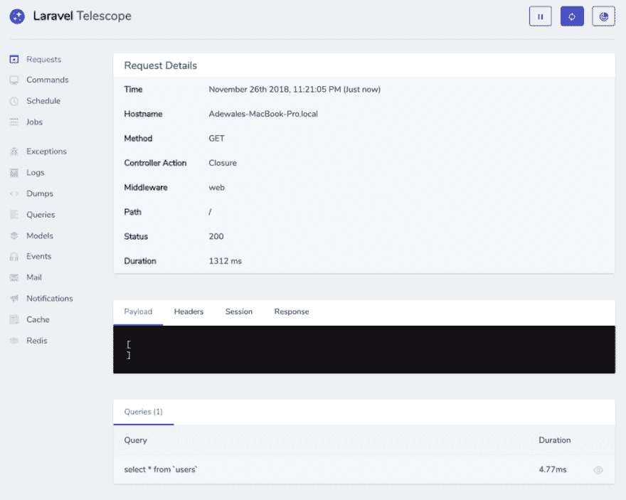](https://res.cloudinary.com/practicaldev/image/fetch/s--wxBb5DQk--/c_limit%2Cf_auto%2Cfl_progressive%2Cq_auto%2Cw_880/https://cdn-images-1.medium.com/max/1024/0%2ABpgLjVgKSBiylUfn.png)

### 命令

Telescope 不仅限于浏览器中的动作或请求，还包括终端中运行的 Artisan 命令。commands 页面列出了终端中运行过的所有命令，并使用退出代码显示它们是否成功。当命令成功时，退出代码通常为 0，如果遇到另一个结果，则返回 1 到 255 之间的任何值。如下所示的一个例子显示了我们之前配置望远镜时在终端中运行的 php artisan migrate 命令的细节。

[](https://res.cloudinary.com/practicaldev/image/fetch/s--69AufNT---/c_limit%2Cf_auto%2Cfl_progressive%2Cq_auto%2Cw_880/https://cdn-images-1.medium.com/max/1024/0%2A6GJlm_5R53MXUs3r.png)

### 日程安排

Laravel 提供了调度器，允许您在 Laravel 内部定义这些条目，而不是为您需要在服务器上调度的每个任务提供多个 cron 条目。schedule 页面列出了已经运行的这些计划任务的所有命令，提供了有关发生时间和 cron 计划的信息。如果您有一个命令，使用 Laravel 的 php artisan inspire 每隔一段时间提供一条鼓舞人心的消息，那么您可以跟踪每次执行该计划的状态。

[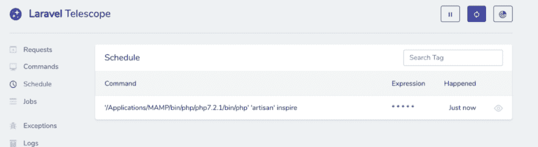](https://res.cloudinary.com/practicaldev/image/fetch/s--MEWJIC7M--/c_limit%2Cf_auto%2Cfl_progressive%2Cq_auto%2Cw_880/https://cdn-images-1.medium.com/max/1024/0%2A87gZ_X_-ibmg9Art.png)

### 岗位

“作业”页面还列出了所有已运行的作业及其结果状态。与处理 Laravel powered Redis 队列的 Horizon 相比，Telescope 适用于 Laravel 中包含的所有队列驱动程序。在作业详细信息页面上，您可以看到尝试次数、超时、队列和运行的作业的类名等。这里我有一个 SendWelcomeEmail 作业，每当新用户注册时都会触发它。我能够看到它失败了，然后找出失败的原因。

[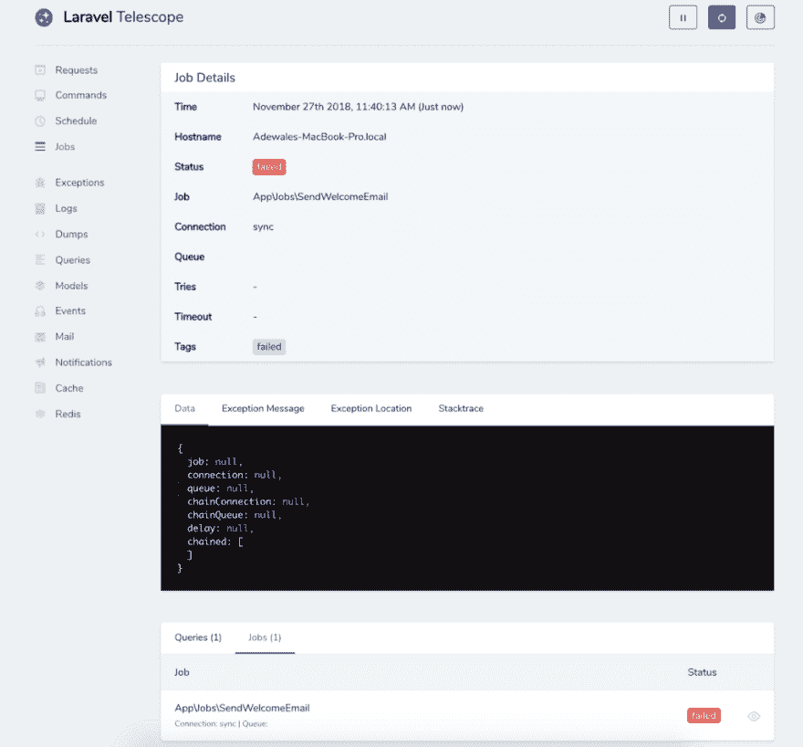](https://res.cloudinary.com/practicaldev/image/fetch/s--8j2FjqE1--/c_limit%2Cf_auto%2Cfl_progressive%2Cq_auto%2Cw_880/https://cdn-images-1.medium.com/max/1024/0%2AW7MXYTMe7Z_IoMmz.png)

### 异常情况

有了望远镜，观察异常变得容易了。“异常”页面列出了所有异常及其发生的次数。

[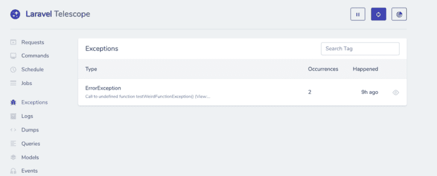](https://res.cloudinary.com/practicaldev/image/fetch/s--cA44BjCq--/c_limit%2Cf_auto%2Cfl_progressive%2Cq_auto%2Cw_880/https://cdn-images-1.medium.com/max/1024/0%2AYT3ZAx0S50rM4eOq.png)

转到详细信息页面，它会向您显示确切的错误消息，代码中的哪一行导致了错误，甚至是完整的堆栈跟踪，它的格式非常简洁，看起来很有趣😀。

[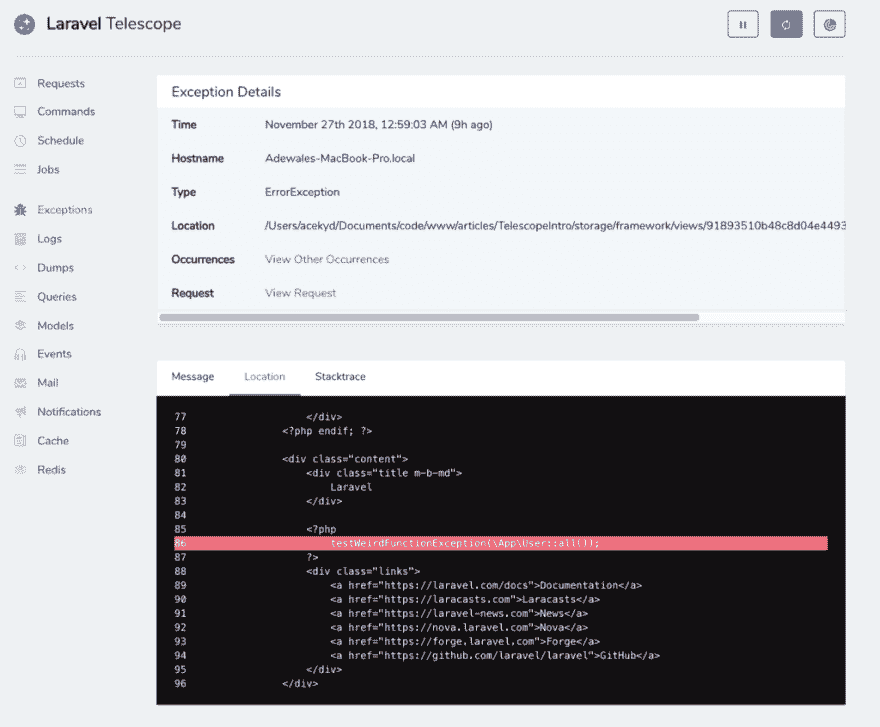](https://res.cloudinary.com/practicaldev/image/fetch/s--nPV0Ng32--/c_limit%2Cf_auto%2Cfl_progressive%2Cq_auto%2Cw_880/https://cdn-images-1.medium.com/max/1024/0%2A3z4EtXcL-bxyxuDq.png)

### 日志

“日志”页面显示了日志消息列表，以及每条消息的级别和发生时间。像所有其他页面一样，个人详细信息页面显示更多信息，包括您可能传递的任何上下文数据。这完全胜过必须在存储/日志中的文本文件中查找日志信息。

[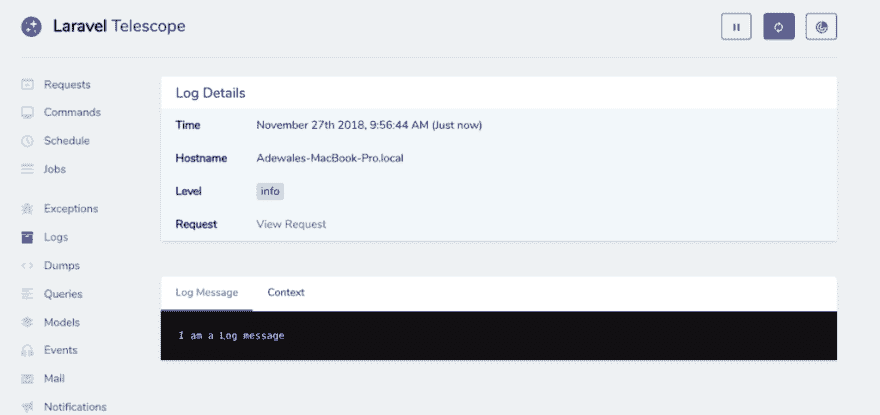](https://res.cloudinary.com/practicaldev/image/fetch/s--xza4bZYq--/c_limit%2Cf_auto%2Cfl_progressive%2Cq_auto%2Cw_880/https://cdn-images-1.medium.com/max/1024/0%2ATpYAPbfaaHnifAzE.png)

### 转储

大多数时候，当面对 bug 时，我只想使用 dump()方法在屏幕上看到变量或对象的当前状态或任何其他信息。这样做通常会导致页面格式有点失真，但是使用 Telescope，如果您在代码中使用 dump()方法，并且在 Telescope 中打开了 Dumps 页面，您的页面将正常显示，而数据输出将显示在 Dumps 页面中。

[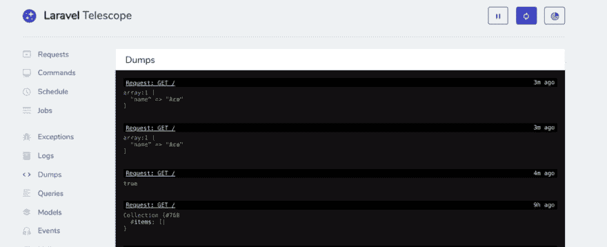](https://res.cloudinary.com/practicaldev/image/fetch/s--MPNuzVhy--/c_limit%2Cf_auto%2Cfl_progressive%2Cq_auto%2Cw_880/https://cdn-images-1.medium.com/max/1024/0%2AicoWa6JtdmnQrALs.png)

然而，我注意到转储的一个行为是，如果您试图转储一个直接输出值的函数，转储页面将只显示返回值，而输出仍然会显示在您的页面上。例如:

```
function ace() {

    echo "Adewale";

    return false;

}

dump(ace()); 
```

Enter fullscreen mode Exit fullscreen mode

将在转储页面上显示为:

[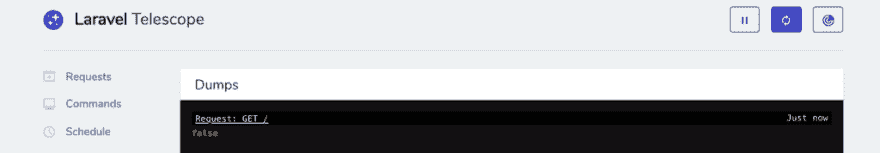](https://res.cloudinary.com/practicaldev/image/fetch/s--kMr7aK3K--/c_limit%2Cf_auto%2Cfl_progressive%2Cq_auto%2Cw_880/https://cdn-images-1.medium.com/max/1024/0%2ACioF7FZLR4TfiXba.png)

### 查询

查询页面的工作方式很像上面提到的 Debugbar。它列出了你所有的数据库查询，花了多长时间，哪些请求等等。您可以很容易地使用这个页面来设置一个基准，确定哪些查询曾经被认为很慢，然后花费了超过特定时间。您也可以在 config/telescope.php 中进行设置。在下面的图片中，我可以看到 select * from 'users '查询运行了三次，每次持续时间不同。

[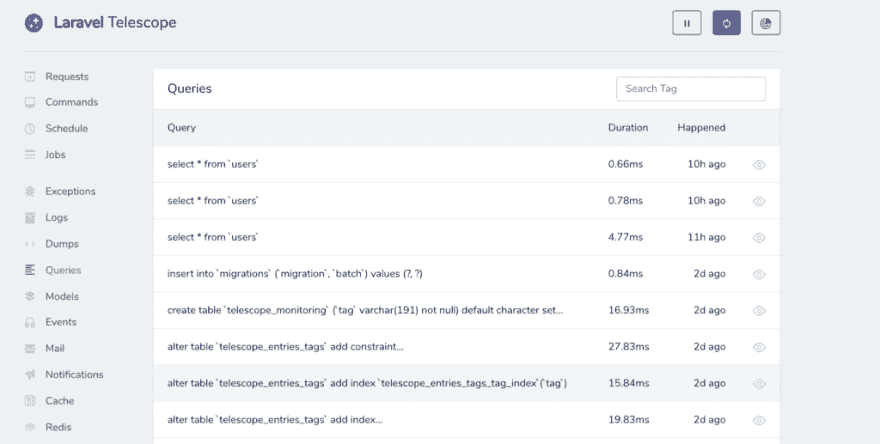](https://res.cloudinary.com/practicaldev/image/fetch/s--OIFviUio--/c_limit%2Cf_auto%2Cfl_progressive%2Cq_auto%2Cw_880/https://cdn-images-1.medium.com/max/1024/0%2ApSlfoKV9gbQZeNz_.png)

### 型号

模型页面跟踪所有与模型相关的活动。Laravel 默认提供用户模型。举个例子，在用户模型上采取的每一个动作都会显示在这个页面上。当你创建一个新的用户，甚至更新用户资料，这一切都显示出来。

[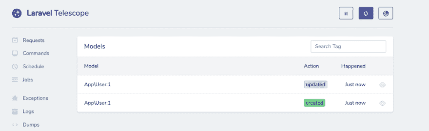](https://res.cloudinary.com/practicaldev/image/fetch/s--4JBeNatA--/c_limit%2Cf_auto%2Cfl_progressive%2Cq_auto%2Cw_880/https://cdn-images-1.medium.com/max/1024/0%2AkdKhAb-1K3_qV0ZL.png)

[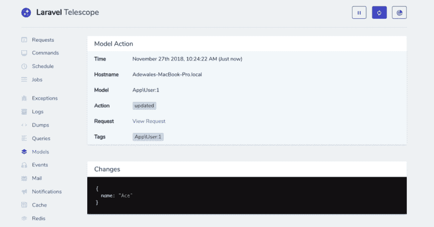](https://res.cloudinary.com/practicaldev/image/fetch/s--qXxa7Hw_--/c_limit%2Cf_auto%2Cfl_progressive%2Cq_auto%2Cw_880/https://cdn-images-1.medium.com/max/1024/0%2Al4xviQrWfFUhJt66.png)

### 事件

“事件”页面显示了您所有事件的列表，以及附加信息。包括时间、听众以及哪些事件是用标签广播的。

[](https://res.cloudinary.com/practicaldev/image/fetch/s--yuo9azQB--/c_limit%2Cf_auto%2Cfl_progressive%2Cq_auto%2Cw_880/https://cdn-images-1.medium.com/max/1024/0%2A5a2F7r0KQHd8DlAM.png)

### 邮件、通知、缓存和 redis

邮件页面还显示了所有已发送邮件的列表，邮件发送给了谁，发送时间，主题，甚至邮件的预览。

“通知”页面显示通知列表、创建通知的渠道、时间以及通知的接收人。

缓存页面显示缓存命中、未命中、更新等的列表。您可以看到触发它的请求以及更多内容。

redis 页面也非常类似于缓存页面。它显示了花费的时间、发生的时间以及触发它的请求。

### 附加配置

Telescope 发布了一个位于 config/telescope.php 的配置文件，您可以使用它来配置各种观察器选项和路径。这些配置中的每一个都带有对其用途的描述，便于理解其用途。

如上所述，望远镜在你的应用程序中默认打开/telescope，但是你可以把它改成任何适合你的。

Telescope 还允许您指定谁可以在生产中访问它，这是通过在 telescope 服务提供商中指定电子邮件列表来完成的。

```
// app/Providers/TelescopeServiceProvider.php

...

/\*\*

_\* Register the Telescope gate._

_\*_

_\* This gate determines who can access Telescope in non-local environments._

_\*_

_\* @return void_

\*/

protected function gate() {

    Gate::define('viewTelescope', function ($user) {

        return in\_array($user->email, [

            //

        ]);

    });

} 
```

Enter fullscreen mode Exit fullscreen mode

### 生产中该不该用望远镜？

是的，你可以在生产中使用望远镜。它有内置的授权工具来保护私人数据，你甚至可以改变路径如上所述的东西。对于其他保护技术，您可以过滤掉监视或存储的数据，安排删除旧条目的作业，还可以选择要启用或禁用的观察器。

### 结论

Telescope 让我们对 Laravel 应用程序中发生的事情有了深入的了解和全面的了解，您应该开始在您的所有项目中使用它。

### Plug: [LogRocket](https://logrocket.com/signup/) ，一款适用于网络应用的 DVR

<figure>[](https://logrocket.com/signup/)

<figcaption></figcaption>

</figure>

LogRocket 是一个前端日志工具，可以让你回放问题，就像它们发生在你自己的浏览器中一样。LogRocket 不需要猜测错误发生的原因，也不需要向用户询问截图和日志转储，而是让您重放会话以快速了解哪里出错了。它可以与任何应用程序完美配合，不管是什么框架，并且有插件可以记录来自 Redux、Vuex 和@ngrx/store 的额外上下文。

除了记录 Redux 操作和状态，LogRocket 还记录控制台日志、JavaScript 错误、堆栈跟踪、带有头+正文的网络请求/响应、浏览器元数据和自定义日志。它还使用 DOM 来记录页面上的 HTML 和 CSS，甚至为最复杂的单页面应用程序重新创建像素级完美视频。

免费试用。

* * *