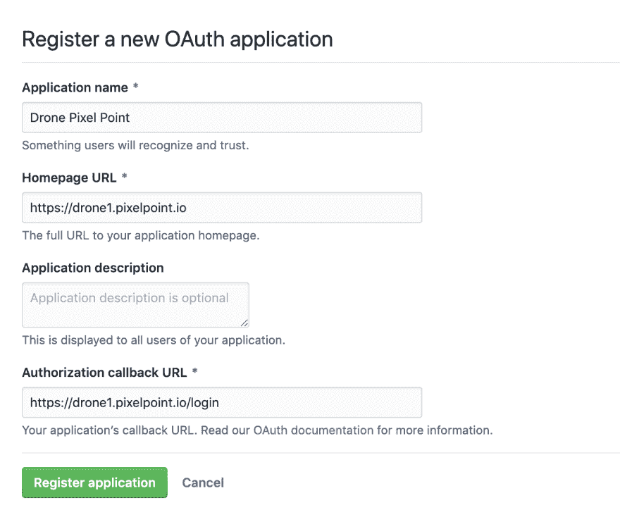
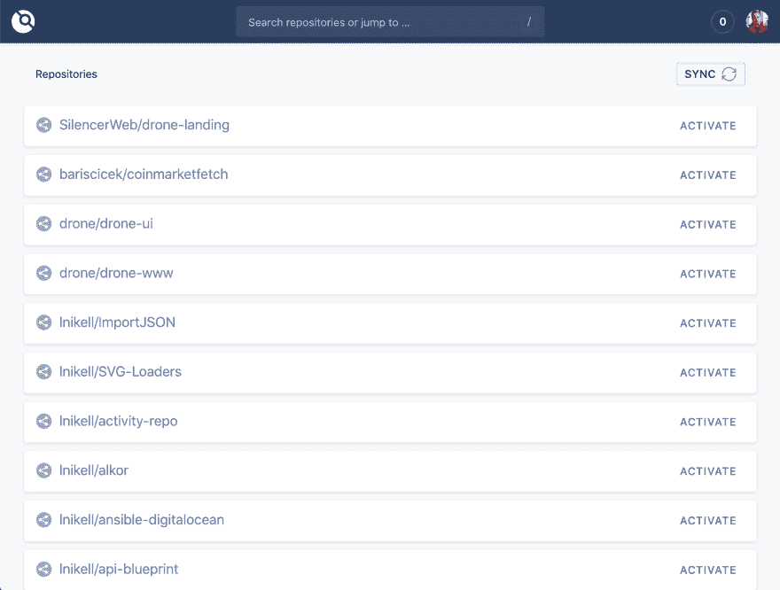
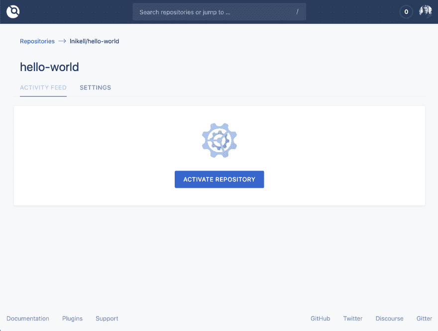
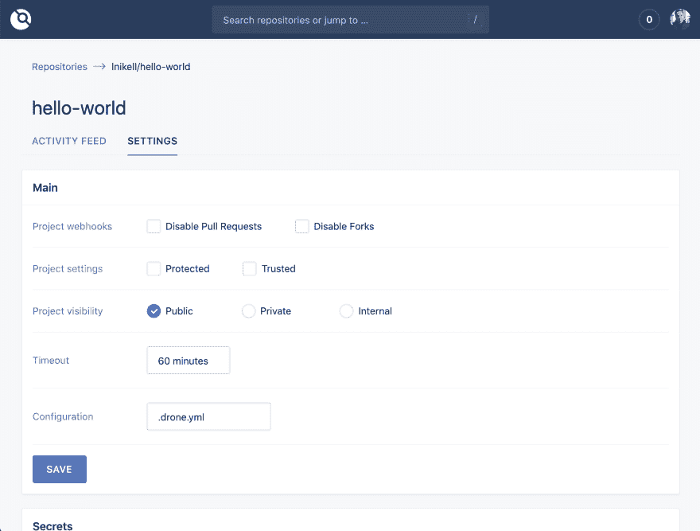
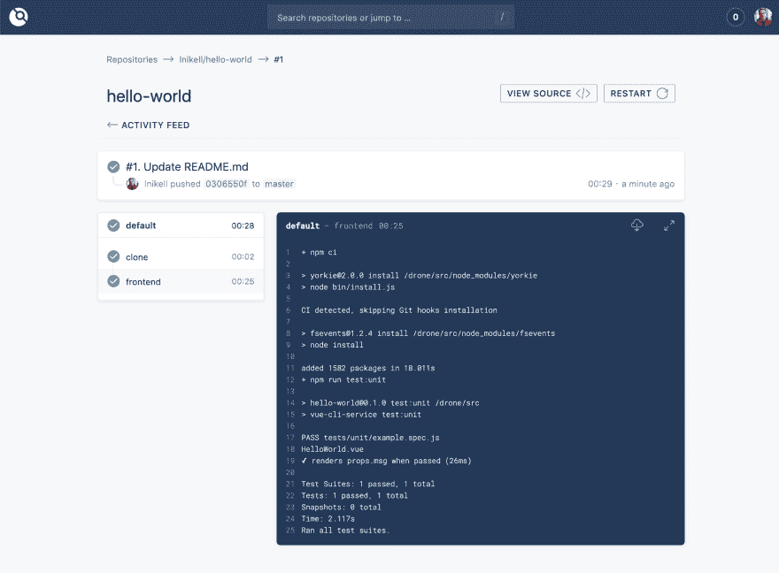

# 开源无人机 CI 入门

> 原文：<https://dev.to/alex_barashkov/getting-started-with-open-source-drone-ci-4pgc>

如果你正在建立你的副业项目或创业公司，并希望避免在 Travic CI(每月 69 美元)等流行的商业解决方案上花费太多钱，你可以在你的笔记本电脑、AWS free tier 或任何其他服务器上使用你自己的自托管 [Drone CI](https://drone.io) 。

无人机 CI 功能:

*   多平台支持
*   基于 Yaml 的配置
*   多管道和复杂构建步骤逻辑支持
*   基于 Docker
*   自由的
*   Github、Gitlab、Bitbucket 支持

我们将在一台主机上使用 Github 运行 Drone CI，但是您也可以使用多机配置或 Kubernetes，以及不同的 VCS 提供商。点击了解更多信息[。](https://docs.drone.io/)

### 获取主机

为了这个测试的目的，我们使用 AWS EC2 自由层实例，但是您可以使用任何您想要的。要使用我们的方法，请遵循以下步骤:

*   转到 AWS 页面；
*   将您的 SSH pub 密钥添加到 EC2 页面上的密钥对部分(通过 SSH 访问您的实例)；
*   在 AWS 上新建一个 Ubuntu 18.04 自由层实例；
*   允许实例的安全组使用 80 和 443 端口；如果它是一个新帐户，使用 launch-wizard-1，或者在 EC2 实例的描述中找到它。

### 安装 Docker

你只需要 Docker 开始使用无人机。只需按照这里的说明。通过运行“docker -v”检查您是否正确安装了所有东西。

```
root@ip-172-31-23-205:~# docker -v
Docker version 18.09.3, build 774a1f4 
```

Enter fullscreen mode Exit fullscreen mode

### 创建 OAuth 应用程序

我们使用 Github 作为例子，但是您也可以在 Gitlab、Bitbucket、Gitea 和 Gogs 上运行它。更多信息[此处](https://docs.drone.io/)。

*   前往[https://github.com/settings/developers](https://github.com/settings/developers)并登录您的个人账户(如果您有)，如果您没有，请创建一个账户。
*   点击“新建 oAuth 应用程序”。
*   按照下面的例子填写表格。

[](https://res.cloudinary.com/practicaldev/image/fetch/s--0Z48MBDd--/c_limit%2Cf_auto%2Cfl_progressive%2Cq_auto%2Cw_880/https://thepracticaldev.s3.amazonaws.com/i/n5nc8wsqnld22wf582k6.png)

您可以使用您的服务器的 IP 或为其分配一个域来正确填写此表单。如果这样做，您可以在接下来的步骤中使用客户端 ID 和客户端密码。

### 安装无人机

这很简单，只需使用下面的:

```
docker pull drone/drone:1 
```

Enter fullscreen mode Exit fullscreen mode

其次是:

```
 --volume=/var/run/docker.sock:/var/run/docker.sock \
  --volume=/var/lib/drone:/data \
  --env=DRONE_GITHUB_SERVER=https://github.com \
  --env=DRONE_GITHUB_CLIENT_ID=652d1he1a62b6336bf0 \
  --env=DRONE_GITHUB_CLIENT_SECRET=c8990176a4bfywe55ekj8c3cf6d0ffccb8e3a213e \
  --env=DRONE_RUNNER_CAPACITY=2 \
  --env=DRONE_SERVER_HOST=drone1.pixelpoint.io \
  --env=DRONE_SERVER_PROTO=https \
  --env=DRONE_TLS_AUTOCERT=true \
  --env=DRONE_USER_FILTER=lnikell \
  --env=DRONE_USER_CREATE=username:lnikell,admin:true \
  --publish=80:80 \
  --publish=443:443 \
  --restart=always \
  --detach=true \
  --name=drone \
  drone/drone:1 
```

Enter fullscreen mode Exit fullscreen mode

使用这种配置，Drone 使用 Let's Encrypt 生成 SSL 证书，然后让我们使用 https 访问 Drone UI。您的用户帐户将拥有管理员权限(DRONE_USER_CREATE)，您应该失去该权限以锁定其他任何人对服务器的访问(DRONE_USER_FILTER)。你可以在这里找到其他变量[的解释。](https://docs.drone.io/installation/github/single-machine/#configuration-reference)

您的实例现在应该已经启动并运行了，只需登录并使用它！

[](https://res.cloudinary.com/practicaldev/image/fetch/s--3z4i2YYx--/c_limit%2Cf_auto%2Cfl_progressive%2Cq_auto%2Cw_880/https://thepracticaldev.s3.amazonaws.com/i/25ms3gmxexw230i0ai2e.png)

### 定义你的管道

准备好 Drone CI 实例后，就该激活存储库并创建管道了。首先，使用搜索栏找到存储库并激活它。

[](https://res.cloudinary.com/practicaldev/image/fetch/s--mjjolgb6--/c_limit%2Cf_auto%2Cfl_progressive%2Cq_auto%2Cw_880/https://thepracticaldev.s3.amazonaws.com/i/xk86ugkzrzf53cj9d5mo.png)

在“设置”页面上，您可以更改项目可见性设置、添加机密(构建步骤所需的敏感信息)或添加 cron 作业。

[](https://res.cloudinary.com/practicaldev/image/fetch/s--Naaa8ksN--/c_limit%2Cf_auto%2Cfl_progressive%2Cq_auto%2Cw_880/https://thepracticaldev.s3.amazonaws.com/i/ob9jkb816b370bnz85rc.png)

在 Drone 中定义构建步骤和管道是一个简单的过程。只需添加到您的 repository .drone.yml 文件，并使用 yaml 语法来描述步骤。这里有一个简单的例子:

```
 kind: pipeline
name: default

steps:
- name: frontend
  image: node
  commands:
  - npm ci
  - npm run test:unit 
```

Enter fullscreen mode Exit fullscreen mode

上面的例子在这里也可以:[https://github.com/lnikell/hello-world/tree/master](https://github.com/lnikell/hello-world/tree/master)
现在，当你推送到资源库时，会触发无人机 CI 上的新构建。

[](https://res.cloudinary.com/practicaldev/image/fetch/s--yO6mV_mm--/c_limit%2Cf_auto%2Cfl_progressive%2Cq_auto%2Cw_880/https://thepracticaldev.s3.amazonaws.com/i/d1kv2a723xfs18v9oo3b.png)

但是根据项目的复杂程度，您可以做更多的事情。以下是该流程可用于的一些典型情况:

*   发送时差通知
*   部署到 Kubernetes
*   将图像推送到 Docker 注册表
*   运行测试所需的数据库或其他服务实例
*   运行多个管道和使用多平台

Drone 是一个日常助手，当我们的团队运行测试和部署代码时，它大大提高了稳定性、灵活性和易用性。有关无人机 CI 的更多信息，请访问[https://drone.io/](https://drone.io/)并查看我们关于[我们如何让无人机 1.0 变得更好的故事](https://dev.to/alex_barashkov/how-did-we-make-open-source-ci-better-15b0)。