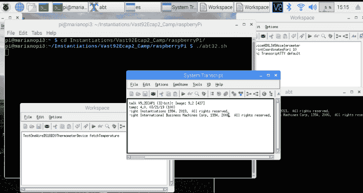

# Raspberry Pi 和 Smalltalk 入门

> 原文：<https://dev.to/martinezpeck/getting-started-with-raspberry-pi-and-smalltalk-47oa>

在[之前的一篇文章](https://dev.to/martinezpeck/why-is-smalltalk-a-good-fit-for-iot-and-edge-computing-2c91)中，我描述了为什么我个人认为 Smalltalk 非常适合物联网。当我们谈论物联网时，我们可以触及数百万个话题:SBC(单板计算机)、传感器、安全、协议、边缘计算、GPIOs、AI、ML 等等……但有一块板[改变了世界](https://www.techrepublic.com/article/inside-the-raspberry-pi-the-story-of-the-35-computer-that-changed-the-world/)是树莓派。

你可以在很多网站上读到为什么树莓派是一个[游戏改变者。](http://linuxgizmos.com/raspberry-pi-3-b-wins-hacker-board-reader-survey/)但现在重要的是，它是一款适合您手握的 SBC，可以拥有 4 个 CPU 内核(ARM)、1GB RAM、HDMI、4 个 USB、视频、音频、Wi-Fi、蓝牙、40 GPIOs，所有这些只需 35 美元。这样的主板有足够的能力完美运行 Linux。[你甚至可以在那里运行码头集装箱！！](https://dev.to/martinezpeck/getting-started-with-docker-and-smalltalk-4po1)

液体错误:内部

显然，到这个时候，Raspberry 并不孤单，也有大量的主板存在:Pine64，BananaPi，ODROID-N2，仅举几例。每天都有新的。他们通常关注不同的事情:便宜、人工智能、桌面替代、专门为集群设计等。

然而，它们中的大多数都提供了相似的功能:

*   ARM / ARM 64 处理器(只有少数其他可能有 Intel 或 RISC-V)。
*   运行一些给定的 32 位或 64 位 Linux 发行版(尽管一些主板也可以与 Windows 10 IoT 一起工作)。
*   为通用输入输出提供多个 GPIOs(大多数情况下，40 个引脚)。通常在 3.3v 到 5.v 之间，并非所有主板都提供 GPIOs。
*   实现一些在 GPIOs 上使用的协议(UART、I2C、单线、SPI 等)。

### Smalltalk(或任何其他语言)需要什么来运行和利用这些板？

第一个显而易见的是，该语言的虚拟机(VM)必须是针对 ARM / ARM 64(而不是 x86 / x64)编译的。不仅仅是虚拟机，还有虚拟机所依赖的每一个第三方库。此外，虚拟机可能对 CPU 架构有一些假设，比如一些只在 x86 上工作的实时编译器。

第二件显而易见的事情是，这样的 VM 应该可以在 Linux 中工作，并且很可能可以在任何最常见的发行版中工作:Raspbian、Armbian、Ubuntu、Debian 等等。这个 Linux 必须是 ARM 编译版本的发行版。

最后，这种语言(本例中是 Smalltalk)必须具有一些能够使用 GPIOs 的功能。这对于传感器和所有可能连接到 SBC 的设备都非常重要。对于 Smalltalk 这样的高级语言，一种常见的方法是通过 FFI(外部函数接口)封装一个第三方 C 库，该库已经处理了这个问题以及所有相关的协议(单线、I2C、SPI、UART 等)。外面有很多库: [pigpio](http://abyz.me.uk/rpi/pigpio/) ， [wiringpi](http://wiringpi.com/) 等等。

### VASmalltalk 的具体架构是什么？

新的 VASmalltalk VM(从 VA 9.1 开始)从头开始设计，具有可移植性、高性能和可维护性。

考虑到这一点，VM 是使用 LLVM 和 libffi 构建的。LLVM 支持许多不同的目标体系结构，所以 VASmalltalk 最终可以以 RISC-V、WebAssembly 或任何其他它们支持的 CPU 体系结构为目标，只需付出相对较小的努力。

液体错误:内部

事实上，我们只花了很少的时间就将 VM 编译到 ARM 上，还花了其他几个小时为 ARM 64 (aarch64)进行编译。

液体错误:内部

对于 Linux 依赖性本身，VASmalltalk VM 只依赖于 glibc(如果 headfull，则依赖于 motif)，这在几乎所有 Linux 上都可用。所以它很有可能在任何 Linux 中都可以开箱即用。它也支持 ARM 和 ARM 64，所以它应该工作在 Linux 的任何一个位元。

最后，对于 GPIO，VASmalltalk 有一个针对 [pigpio](http://abyz.me.uk/rpi/pigpio/) 的 FFI 绑定，它允许您获取传感器数据，上下拉动引脚，并实现大多数已经提到的协议。

液体错误:内部

## 给我看看！！

下面解释的关于如何开始使用 VASmalltalk、Linux 和 ARM 的过程对于所有设备和 Linux 风格都是非常相似的。为了这篇文章的目的，我需要选择一个，所以我选择了最常见的:Raspberry Pi(可以是任何型号)+ [Raspbian](https://www.raspbian.org/) 。后者是专门为 Raspberry Pi 定制的 Debian OS，也是最常用和被接受的。

在撰写本文时，VASmalltalk 的 ARM 版本只能通过 [ECAP(早期客户访问计划)版本](https://www.instantiations.com/ecap/)获得。一个 ECAP 版本是一个压缩文件，你可以把它解压到任何你想解压的地方，所有的东西都是独立的。在 Windows 上，没有比这更进一步的步骤了。在 Linux 上，您必须确保安装了依赖项。请注意，他只在 ECAP 版本中出现，因为 VASmalltalk 确实提供了常规。黛比和。稳定版本的 rpm 安装程序和那些自动安装依赖项的程序。

下面是我通常在新的 Raspbian 上使用的脚本。并非所有的脚本都是强制性的…只是其中的一部分:

```
#!/bin/sh

# Remove some stuff I normally don't use to free resources
sudo apt-get remove --purge --assume-yes \
  scratch* \
  libreoffice* \
  wolfram-engine \
  sonic-pi \
  minecraft-pi

# Lets update before installing
sudo apt-get update

# Basic tooling I like to have an all my Linuxes
sudo apt-get install --assume-yes \
  vim \
  tmux \
  htop \
  iotop \
  autocutsel \
  avahi-daemon \
  i2c-tools \
  netatalk \
  libnss-mdns \
  xrdp \
  curl

# Fix VNC issue https://www.raspberrypi.org/forums/viewtopic.php?f=28&t=230779&p=1413648#p1413648
sudo apt-get install --assume-yes haveged
sudo update-rc.d haveged defaults

# Install pigpio (needed to use GPIO from VASmalltalk)
sudo apt-get install --assume-yes \
  pigpio \
  python-pigpio \
  python3-pigpio
cd $HOME
wget https://raw.githubusercontent.com/joan2937/pigpio/master/util/pigpiod.service
sudo cp pigpiod.service /etc/systemd/system/
sudo systemctl enable pigpiod
rm pigpiod.service

# Install RPI Monitor --- useful tool for monitoring status of the Pi
sudo apt-get install apt-transport-https ca-certificates dirmngr
sudo apt-key adv --recv-keys --keyserver keyserver.ubuntu.com 2C0D3C0F
sudo wget http://goo.gl/vewCLL -O /etc/apt/sources.list.d/rpimonitor.list
sudo apt-get update
sudo apt-get install rpimonitor

# Install VA Dependencies for running headless (esnx)
sudo apt-get install --assume-yes --no-install-recommends \
  libc6 \
  locales \

# Install VA Dependencies for running headfull and VA Environments tool
sudo apt-get install --assume-yes --no-install-recommends \
  libc6 \
  locales \
  xterm \
  libxm4 \
  xfonts-base \
  xfonts-75dpi \
  xfonts-100dpi

# Only necessary if we are using OpenSSL from Smalltalk
sudo apt-get install --assume-yes --no-install-recommends \
  libssl-dev 

# Generate locales
sudo su
echo en_US.ISO-8859-1 ISO-8859-1 >> /etc/locale.gen
echo en_US.ISO-8859-15 ISO-8859-15 >> /etc/locale.gen
locale-gen
exit

# Cleanup
sudo apt-get clean
sudo apt-get autoremove 
```

Enter fullscreen mode Exit fullscreen mode

bash 脚本应该非常清楚我在做什么以及为什么做。如你所见，适应其他发行版也很容易。你也可以在这里看到如何为 VASmallalk 和 ARM [制作 Docker 图像。](https://dev.to/martinezpeck/getting-started-with-docker-and-smalltalk-4po1)

一旦你解压了 ECAP，你需要做的就是进入那个目录，在`/raspberryPi/`下运行`./abt32.sh`。这将带来完整的 VASmalltalk Unix IDE:

[](https://res.cloudinary.com/practicaldev/image/fetch/s--pVHlAWrm--/c_limit%2Cf_auto%2Cfl_progressive%2Cq_auto%2Cw_880/https://marianopeck.files.wordpress.com/2019/05/screen-shot-2019-05-25-at-4.15.16-pm.png%3Fw%3D748)

### 树莓派入门技巧、窍门和建议

如果这是你第一次尝试树莓派，以下是一些建议:

*   购买一个已经附带电源、已经格式化的 microSD 卡并安装了 [NOOBS](https://www.raspberrypi.org/blog/introducing-noobs/) 的套件(如 Canakit 或类似的)。NOOBS 是一个软件，在引导时(在 Pi 上)，允许你拿起一个操作系统并安装在同一个运行的 SD 中。
*   如果你从其他地方得到了 SD，我建议使用“SD 卡格式化程序”软件(或类似的)来确保 SD 被正确格式化以适应 NOOBS。然后，下载并把 NOOBS 放到 SD 中，启动 Pi，最后安装 Raspbian。
*   我推荐从 Raspbian Linux 开始(NOOBS 的默认选择)。
*   如果你想买 SD 分离我建议，至少，UHS-1 类 10 型。
*   确保有一个 micro SD 转 SD 适配器或一个能够读取 micro SD 的 USB 读卡器。

最后，如果你想知道我的 10 大物联网设备，请参见下面的推文。虽然，我必须说我已经有新的小工具应该添加在那里！！

液体错误:内部

### 结论

这篇文章应该让你知道如何在 ARM-Linux 驱动的单板计算机上开始使用 VASmalltalk。我个人试过几个设备(Pi Zero W，Pi 3B+，Rock64)和很多 OS(Raspbian，Raspbian Lite，Ubuntu Server 18.04，Armbian 等)。所有的程序都很相似。

在接下来的文章中，我将展示如何从 VASmalltalk 访问 GPIO，如何组装和包装特定的传感器，如何在远程宝石上透明地保存数据，独特的调试功能，等等。

敬请期待！