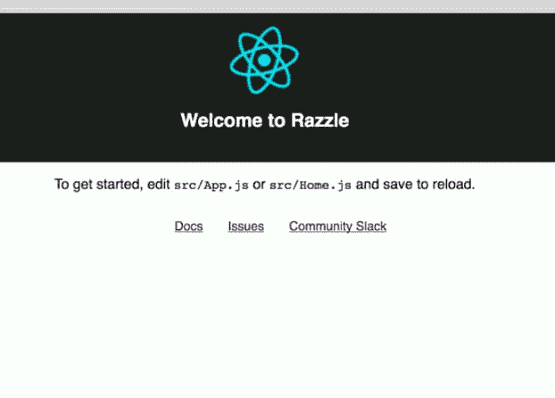
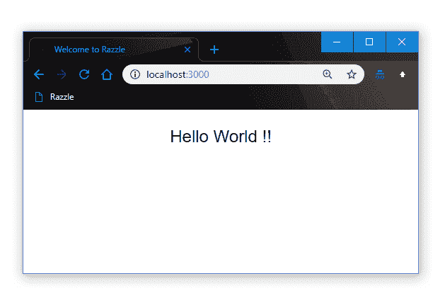
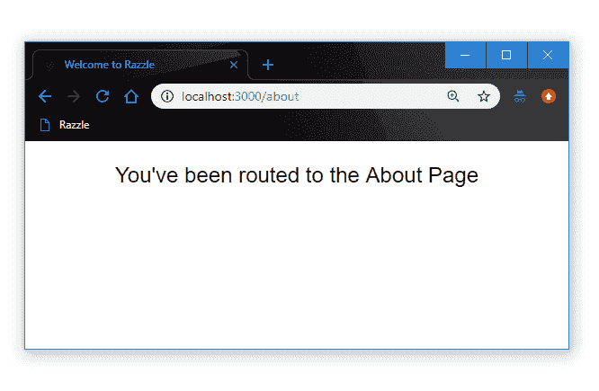

# Razzle 入门:React 的替代 SSR 框架

> 原文：<https://dev.to/progresstelerik/getting-started-with-razzle-an-alternative-ssr-framework-for-react-n4k>

Razzle 是一个工具，它将 SSR 的所有复杂配置抽象成一个单一的依赖项。了解如何在服务器渲染 React 应用程序中开始使用 Razzle。

设置通用的 React 应用程序很困难，而且配置处理起来也不简单。有一些现有的解决方法，比如使用 Next.js 这样的框架，派生一个样板文件，或者自己设置。

所有这些现有的选择都有它们的陷阱，在某些情况下，会给你带来更多意想不到的问题。这就是 Razzle 的用武之地。Razzle 是一个工具，它将 SSR 所需的所有复杂配置抽象成一个单一的依赖项，为您提供`create-react-app`的体验，但随后将应用程序关于框架、路由和数据获取的其余架构决策留给您。

通过这种方法，Razzle 不仅可以与 React 一起工作，还可以与 Reason、Elm、Vue、Angular 一起工作，最重要的是，它可以与接下来发生的任何事情一起工作。在这篇文章中，我们将看看如何开始使用 Razzle，并探索它带来了什么功能。

## 安装

要在您的系统上安装 Razzle，只需运行命令:

```
$ npm install -g create-razzle-app 
```

这将全局安装 Razzle。

因为 Razzle 的操作就像非常流行的`create-react-app`构造一样，你可以通过运行`create-razzle-app`命令:
以同样的方式创建一个新的 Razzle 应用

```
 $ create-razzle-app my-app 
```

现在运行应用程序，导航到应用程序目录并运行 npm start:

```
 $ cd my-app
    $ npm start 
```

这应该会在`localhost:3000`上打开您的应用程序，您应该会在浏览器上看到默认的欢迎页面，如下所示:

[](https://res.cloudinary.com/practicaldev/image/fetch/s--L9a1nht0--/c_limit%2Cf_auto%2Cfl_progressive%2Cq_auto%2Cw_880/https://d2mxuefqeaa7sj.cloudfront.net/s_21304C2417DF567667A1767761B871AD1CDD72B25F1C5309744159D41504022B_1542907862106_Screen%2BShot%2B2018-11-22%2Bat%2B6.17.08%2BPM.png)

就这样，你得到了一个带有 SSR 的 React 应用，无需任何配置，就像 CRA 一样。

## 狂欢基础

**创建自定义组件**

让我们演示一下如何在刚刚设置的 Razzle 应用程序中创建自定义组件。打开`src`目录下的`Home.js`文件，用代码
更新

```
 import React from 'react';
    import logo from './react.svg';
    import './Home.css';
    class Home extends React.Component {
      render() {
        return (
          <div className="Home">
            <p> Hello World !!</p>
          </div>
        );
      }
    }
    export default Home; 
```

当你保存的时候，浏览器会自动重新加载，你应该可以看到你的 Hello World 页面，就像我的一样:

[](https://res.cloudinary.com/practicaldev/image/fetch/s--h0JhoC6H--/c_limit%2Cf_auto%2Cfl_progressive%2Cq_auto%2Cw_880/https://d2mxuefqeaa7sj.cloudfront.net/s_21304C2417DF567667A1767761B871AD1CDD72B25F1C5309744159D41504022B_1542970330065_razzle.png)

**路线和导航**

Razzle 的一个很棒的特性是它默认使用`React Router 4`，不像 Next.js，因此，有了 Razzle，处理导航和路线就轻而易举了。因为我们已经有了一个定制的`Home`组件，让我们看看如何创建一个新的组件并在其中显示更多的定制内容。我们将创建一个`About.js`页面，设置如下:

```
 import React from 'react';
    import './Home.css';
    class About extends React.Component {
      render() {
        return (
          <div>
            <p> You've been routed to the About Page </p>
          </div>
        );
      }
    }
    export default About; 
```

为了路由到我们刚刚创建的页面，让我们像这样更新我们的`App.js`文件:

```
 import React from 'react';
    import Route from 'react-router-dom/Route';
    import Switch from 'react-router-dom/Switch';
    import Home from './Home';
    import './App.css';
    import About from './About';
    const App = () => (
      <Switch>
        <Route exact path="/" component={Home} />
        <Route exact path="/about" component={About} />
      </Switch>
    );
    export default App; 
```

看到这有多简单了吗？是啊，你做到了。现在，当您导航到`localhost:3000/about`时，您将被转到我们的`About`页面:

[](https://res.cloudinary.com/practicaldev/image/fetch/s--XGW0zvYO--/c_limit%2Cf_auto%2Cfl_progressive%2Cq_auto%2Cw_880/https://d2mxuefqeaa7sj.cloudfront.net/s_065F0C67591AA8FE07865625677290B25D18FF36DA635824410DF962968CC340_1542978495778_about.PNG)

现在我们有了一个小的 Razzle 应用程序，我们可以扩展它来做我们想做的事情——将其构建成一个成熟的网络应用程序，构建你的下一个 Airbnb，等等。

## 拉兹命令

就像 CRA 一样，Razzle 有大量有用的命令，可以让你加快开发速度，无缝地使用终端。这里有一些你可能会觉得有用的:

**开始命令**

```
 $ npm start 
    $ yarn start 
```

这两个命令都将在开发模式下运行项目。一旦命令被执行并且服务器正在运行，您就可以在`http://localhost:3000`查看您的应用程序。如果您进行编辑，页面将重新加载。

**构建命令**

```
 $ npm run build
    $ yarn build 
```

这些命令将用于生产的应用程序构建到构建文件夹中。构建被缩小，并且文件名包括散列。一旦命令执行，您的应用程序就可以部署了！

**生产命令**

```
 $ npm run start:prod
    $ yarn start:prod 
```

该命令将在生产环境中运行编译后的应用程序。您可以在`http://localhost:3000`再次查看正在运行的应用程序。

## 更多特性

像其他现代框架一样，Razzle 带有通用的热模块重载，所以无论何时你进行编辑，客户端和服务器都会更新。没有恼人的重启必要。鉴于应用程序是在服务器上呈现的，这是一件很棒的事情。

**跨所有框架通用**

Razzle 运行两个 webpack 实例。一个处理客户端包，另一个处理服务器，这使它能够在所有可用的框架上运行，因为它基本上处理 webpack，不一定特别需要做出反应。

这种功能也是它具有未来感的原因，因为它可以轻松适应未来出现的任何新框架，而无需进行重大的突破性更改。

**熟悉度**

Razzle 附带了 ES6 JavaScript goodies(通过`babel-preset-razzle`)和与 [create-react-app](https://github.com/facebookincubator/create-react-app) 相同的 CSS 设置，这使得它非常容易使用。你可以用 Razzle 做很多事情

## 结论

Razzle 是 React 的另一个 SSR 框架，几乎是任何其他可用的或即将出现的 JavaScript 框架。有像 Next.js 这样的框架，也有同样的`react-server`，但是所有这些都没有完全解决与服务器渲染相关的问题。

Razzle 是对这些现有技术的改进，因为它不仅提供了更多的简单性和灵活性，还使服务器呈现任何 JavaScript 应用程序成为可能，而不管它最初构建在什么框架上。要深入了解 Razzle 并发现更多令人敬畏的功能，请深入查看 [Razzle 文档](https://github.com/jaredpalmer/razzle)。

* * *

## 了解更多关于使用 React 构建应用的信息

想了解更多关于使用 React 创建优秀应用的信息吗？查看 React 的[剑道 UI，React 的完整 UI 组件库允许您快速构建高质量、响应迅速的应用程序。它包括你需要的所有组件，从网格和图表到时间表和刻度盘。了解更多关于如何](https://www.telerik.com/kendo-react-ui)[开始 KendoReact](https://dev.to/progresstelerik/kendoreact-getting-started-blog-series-355-temp-slug-8937918) 的信息。